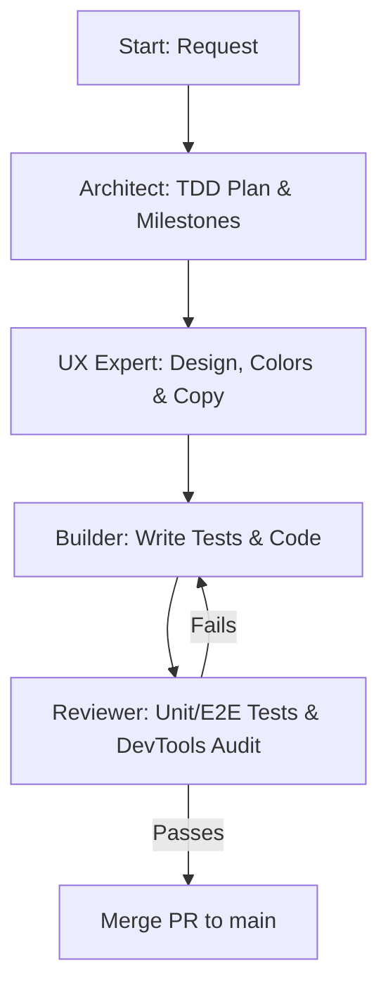

# Agent Rules, Workflow and Personas - MeeplePrecios

This document defines the AI agent specializations, development execution workflows, backlog hygiene, testing standards, and core engineering conventions for **MeeplePrecios**.

---

## 1. Critical Operational Checklist (Mandatory)

You must execute this checklist on **every single turn** before completing your work and responding to the user:

### Pre-Flight Actions (Start of Turn)
*   **Polish & Refine Priority:** Always prioritize polishing, simplifying, and perfecting existing codebase features rather than adding new ones or creating unnecessary UI bloat.
*   **Mandatory Sprint Alignment Gate:** Before initiating ANY new sprint, creating feature branches, or picking up backlog issues, you **MUST** first stop and explicitly ask the user for confirmation on whether the proposed issues remain relevant or if they prefer to work on other priorities/refinements instead.
*   **Backlog & Persona Gate (Pre-Flight):** When receiving a feature request, bug report, or sprint planning prompt, you **MUST** immediately audit the request against the Three-Point Compliance Filter (Persona Atomicity, Scope Atomicity, Agile Syntax). Never begin coding or create a compound backlog item. If multiple personas or features are detected, proactively divide them or launch the `backlog_auditor` skill before proceeding.
*   **Verify Active Backlog:** Review the conversation context. If a new feature, bug, or improvement is discussed, **immediately** create a GitHub Issue using the `gh` CLI *before* writing any production code.
*   **User Story Mandate:** Every issue created on GitHub must include a comprehensive User Story in the description using the classic Agile framework: `As a [Role], I want [Feature], So that [Benefit/Value]`.
*   **Feature Branch Mandate (`AGENTS.md 2.3`):** Never commit work directly to `main`. Immediately checkout a dedicated feature branch matching the active issue: `git checkout -b feature/issue-<num>-<title>`.

### Post-Flight Actions (End of Turn)
*   **Update DESIGN.md:** Document any architectural decisions, database schema updates, or visual design tokens.
*   **Update AGENTS.md:** Record new engineering conventions, learnings, or testing patterns.
*   **Update HANDOFF.md:** Keep the sprint memo updated in real-time (active branch, edited files, test status, next steps).
*   **Commit & Push Feature Branch:** Stage all changes, commit with conventional commit message, and push the active feature branch to remote (`git push -u origin feature/issue-<num>-<title>`). Do not push directly to `main`.
*   **Open PR & Merge Sprint Deliverables:** Open a Pull Request linking the completed issue (`gh pr create --title "..." --body "Closes #<num>"`). Once verification passes 100% cleanly (`npm run verify`), **merge the Pull Request and feature branch directly into `main`** using `gh pr merge <num> --merge --delete-branch` (or `git checkout main && git pull origin main && git merge <branch> && git push origin main && git branch -d <branch>`) to conclude the sprint without leaving stale open PRs or dangling branches.

> [!IMPORTANT]
> **Any turn completed without executing this checklist and feature branch workflow is considered incomplete and invalid. No exceptions.**

---

## 2. Backlog Hygiene & Branching Conventions

### 2.1 The Atomic User Story Mandate (One Persona per Issue)
*   **Single-Persona Focus:** Never combine multiple user personas (e.g., Admin vs. End User, Buyer vs. Seller, Store Owner vs. Player) into a single GitHub Issue, User Story, or Pull Request.
*   **Single-Feature Scope:** Never lump unrelated feature requests, global UI refactors, and backend architectural changes into one omnibus task. Every issue must represent a single, testable chunk of value delivered to exactly one persona.
*   **Classic Agile Formula:** Every issue or task created in the backlog must define its objective using the classic Agile syntax:
    > `As a [Target Persona / Role], I want [Specific Feature / Action], so that [Measurable Benefit / Value].`

### 2.2 Proactive Request Division Protocol
When receiving user feedback, feature ideas, or multiple requirements in a single prompt:
1.  **Audit & Deconstruct:** Immediately analyze the prompt to identify how many distinct user personas and discrete features are involved.
2.  **Divide or Consult:**
    *   If ideas clearly span different personas or unrelated systems, do **not** write implementation code right away. Instead, proactively break them down into separate, individual issues in the backlog/issue tracker.
    *   If there is ambiguity about whether two items belong together, stop and explicitly ask the user: *"These ideas touch different user personas/systems. Should I split them into separate atomic issues before proceeding?"*
3.  **Execute One at a Time:** Work sequentially. Focus on one issue, branch from `main`, write tests first (TDD), implement the code, pass verification, open a single-focused Pull Request linking the issue (`Closes #<num>`), merge, and only then proceed to the next atomic issue.

### 2.3 Backlog Traceability & Documentation Sync
*   **1-to-1 Mapping:** Every feature or fix branch must map 1-to-1 to an existing issue (e.g., `feature/issue-<number>-<slug>` or `fix/issue-<number>-<slug>`).
*   **Living Documentation:** Keep any project tracking files (like `backlog.md`, `DESIGN.md`, or `HANDOFF.md`) updated in real-time so that completed stories, active sprints, and pending tasks never drift out of sync with the codebase.

### 2.4 Four-Phase Backlog Auditing Pipeline & Compliance Matrix
When auditing existing backlogs or onboarding new sprint requirements, execute this four-phase pipeline:
1.  **Phase 1: Automated Inventory & Parsing:** Query all active/open backlog items via `gh issue list --state open --json number,title,body,labels` or parse local backlog documents to build a complete inventory.
2.  **Phase 2: Three-Point Compliance Filter:** Evaluate every backlog item against three strict criteria:
    *   *Persona Atomicity:* Does the story serve exactly one user persona/role (Player vs. Partner vs. Admin)?
    *   *Scope Atomicity:* Can this item be implemented and verified independently without bundling unrelated refactors or systems?
    *   *Agile Syntax Compliance:* Does the description strictly match `As a [Role], I want [Action], so that [Benefit]`?
3.  **Phase 3: Actionable Remediation Workflows:** For any item failing Phase 2:
    *   *Compound Issues:* Split into multiple atomic user stories, each assigned to a single persona and numbered independently.
    *   *Omnibus Features:* Deconstruct large multi-component epics into modular, test-first slices.
    *   *Engineering Chores:* Transform internal chores or technical tasks into developer user stories (e.g., `As a Developer, I want [Technical Refactor], so that [System Quality/Performance Benefit]`).
4.  **Phase 4: Prevention Guardrails:** Ensure no branch is created and no code is written until every active backlog issue passes 100% of the Three-Point Compliance Filter.

### 2.5 Automated Workspace Skills & Tools
All AI agents working within this workspace **must** utilize our modular skills located in `.agents/skills/` at their designated triggers:
*   **[`backlog_auditor`](file:///Users/joseluiszapata/Documents/GitHub/elmeeple-stores/.agents/skills/backlog_auditor/SKILL.md):** Automatically intercept and audit user requirements or GitHub issues for single-persona compliance.
*   **[`github_issue_solve`](file:///Users/joseluiszapata/Documents/GitHub/elmeeple-stores/.agents/skills/github_issue_solve/SKILL.md):** Automate issue assignment, branch setup, and TDD planning.
*   **[`ux_expert`](file:///Users/joseluiszapata/Documents/GitHub/elmeeple-stores/.agents/skills/ux_expert/SKILL.md):** Enforce UX audit principles, cognitive laws, sentence case, and visual design tokens.
*   **[`document_sync`](file:///Users/joseluiszapata/Documents/GitHub/elmeeple-stores/.agents/skills/document_sync/SKILL.md):** Audit and synchronize `HANDOFF.md`, `DESIGN.md`, and `AGENTS.md` before closing a turn.
*   **[`github_issue_complete`](file:///Users/joseluiszapata/Documents/GitHub/elmeeple-stores/.agents/skills/github_issue_complete/SKILL.md):** Automate full verification (`npm run verify`), commit messaging, PR opening, and merging.

---

## 3. AI Agent Personas

### 3.1 The Architect (Planning & Milestones)
*   **Objective:** Translate complex requirements into small, ordered execution steps ready for TDD verification.
*   **Constraints:** Does not write production code. Drafts structured execution plans detailing affected files and the specific tests to be written first.

### 3.2 The UX Expert (Product Design & Copywriting)
*   **Objective:** Audit layouts, typography, navigation paths, and copy consistency to deliver a premium, low-friction user experience.
*   **Visual Guidelines:** Minimalist layout, highly legible typography, brand palette (Blanco Roto, Carbón, Malva, Turquesa, Coral). **Wise Strategic Emoji Guidance:** Emojis (e.g., 🇲🇽, 🎲, ⭐, 📦) may be used thoughtfully across user-facing components and documentation to add warmth and clarity without cluttering functional data tables.

### 3.3 The Builder (TDD & Implementation)
*   **Objective:** Write tests first (TDD), implement the minimal code required to pass them, and refactor for cleanliness.
*   **Constraints:** Never commits directly to `main`. Works on the branch `feature/issue-<num>-<title>`. Adheres to Tailwind CSS v4 guidelines and Supabase RLS.

### 3.4 The Reviewer (QA & Code Quality)
*   **Objective:** Evaluate unit and E2E tests, validate Supabase RLS policies, and run visual audits using Chrome DevTools MCP.
*   **Constraints:** Does not implement features. Focuses on test coverage, regression prevention, and mobile/desktop viewport audits.

---

## 4. Workflow Loop & Execution

---

## 5. Engineering Conventions & Lessons Learned

### 5.1 XML/CSV Feed Processing and Sync
*   **Handling Large Feeds:** Processing XML feeds containing thousands of products can exhaust server memory or cause serverless function timeouts.
    *   *Convention:* The cron sync handler must process feeds sequentially. Implement pagination or batching when writing to Supabase, using bulk upsert statements limited to 500 records per batch.
*   **Game Name Matching:** Online shops frequently list the same game with minor naming differences (e.g., *Catan*, *Catan: El Juego*, *Los Colonos de Catan*).
    *   *Convention:* Match games using barcode (EAN/UPC) first. If EAN is unavailable, query `bgg_games_cache` and its `alternate_names` text array using case-insensitive SQL matching.

### 5.3 Test Optimization and Execution (TDD)
*   **JSDOM Memory Bloat with Jest:** Running JSDOM test suites in parallel can exhaust Node memory in sandboxed environments.
    *   *Convention:* Always run Jest tests in serial mode: `npm run test -- --runInBand --forceExit`.
*   **Supabase and Feed Mocks:** Server actions syncing feeds must have robust mocks to prevent live network calls to BoardGameGeek or merchant sites during test runs.

### 5.4 Supabase Empty Array Return Detection & Edition Relationship Filtering
*   **Empty Array Responses from `.single()` or Mock Clients:** Certain mock query clients or edge cases return `{ data: [], error: null }` when calling `.single()` or queries. A simple check `if (error || !data)` fails because `[]` is truthy in JavaScript.
    *   *Convention:* Always guard query returns with `if (error || !data || (Array.isArray(data) && data.length === 0))` before consuming query data or triggering offline fallbacks.
*   **Preventing Unrelated Edition Leaks:** When fetching game editions or siblings from `bgg_games_cache`, loose queries or mock returns can leak unrelated games into version lists.
    *   *Convention:* Always filter returned edition arrays explicitly against the target game ID and its parent/sibling relationships (`e.bgg_id === currentGame.parent_bgg_id || e.parent_bgg_id === currentGame.parent_bgg_id` or `e.parent_bgg_id === bggId`).

### 5.5 E2E Automated Replay & Component Interactivity Conventions (Tactile Toggles)
*   **NextAuth Secrets in Production Builds during Playwright E2E:** When Playwright starts `next start -p 3001` inside `webServer`, NextAuth throws a `MissingSecretError` if `NEXTAUTH_SECRET` is missing in the production environment.
    *   *Convention:* Always provide a fallback string in `route.ts` (`secret: process.env.NEXTAUTH_SECRET || 'fallback-secret'`) and explicitly pass `NEXTAUTH_SECRET` and `NEXTAUTH_URL` inside `playwright.config.ts` (`webServer.command` and `webServer.env`).
*   **Tactile Toggles (`role="switch"`) vs Outer Container Clicks:** Putting empty `onChange={() => {}}` on controlled `<input type="checkbox">` elements or standard checkboxes causes automated `.check()` calls in Playwright (and screen reader interactions) to fail or behave unpredictably when nested inside clickable container cards.
    *   *Convention:* For all boolean toggle controls (like Regional Store Toggles `onlyDomestic` / `domesticOnly`), implement accessible tactile switches using `<input type="checkbox" role="switch" aria-checked={val} />` with styled toggle pills. Always attach state handlers directly to `onChange` and stop click propagation (`onClick={(e) => e.stopPropagation()}`) on inner controls when embedded in clickable wrappers.
*   **Playwright Strict Mode Violations on Multiple Heading Matches:** Combining locators like `resultsSection.or(warningSection)` when both elements render simultaneously causes strict mode errors.
    *   *Convention:* Target unambiguous, singular container elements or use precise `.first()` / scoped locators when validating conditional rendering states.

### 5.5 Server Component Testing & Layout SEO Targeting
*   **Async Server Components in Jest JSDOM & Layout SEO Targeting:** Testing async Server Components like `Home` (`page.tsx`) or dynamic metadata generators (`src/app/layout.tsx`, `src/app/game/[id]/page.tsx`) that query Supabase without mocks can cause 5000ms test timeouts or unhandled rejection warnings during rendering.
    *   *Convention:* Always mock `@supabase/supabase-js` or provide deterministic instant return fallbacks inside Jest suites when rendering async Server Components. For SEO verification (`seo_metadata.test.tsx`), explicitly test exported `metadata` or `generateMetadata` return structures ensuring proper page title templates (`%s | MeeplePrecios`), descriptions, and OpenGraph/Twitter card tags targeting Latin American marketplaces.

### 5.8 Contextual Filter Placement vs Global Header Navigation (US-36)
*   **Redundant Global Toggles vs Contextual UI Filtering:** Placing regional filtering switches (like domestic store toggles `Solo tiendas en mi país`) inside global headers (`Toolbar.tsx`) alongside destination country/currency selectors creates duplicate controls and clutters global navigation when pages also provide localized filtering tables.
    *   *Convention:* Maintain global user preferences (shipping destination country, display currency, active persona role, language) in `Toolbar.tsx`. Place granular content and listing filters (regional domestic store toggles, in-stock availability switches, price sliders) directly within contextual search, catalog, and comparison UI components (`page.tsx`, `CatalogView.tsx`, `StoreOffersComparisonTable.tsx`) using standalone accessible tactile switch components (`RegionalStoreToggle.tsx`).

### 5.9 Sprint Completion & Automated Branch Merging Mandate
*   **Stale Branches vs Continuous Integration:** Leaving completed feature branches unmerged after verification (`npm run verify`) causes branch divergence, documentation drift, and delay in delivering verified value to `main`.
    *   *Convention:* As soon as a sprint issue's deliverables pass 100% of our four-tier verification gate and a Pull Request is opened linking `Closes #<num>`, the Reviewer agent must complete the lifecycle by merging the PR into `main` (`gh pr merge <num> --merge --delete-branch`) and switching the local workspace back to updated `main`.

### 5.10 Automated Sentence Case Governance & UI Harmonization (US-40)
*   **Title Case Inconsistencies vs Google Style Guide:** Mixing Title Case in Spanish or English UI headers (`Compare Store Offers`, `Mejor Precio Actual`, `Puntuación Media`) violates conversational UX standards and editorial consistency across viewports.
    *   *Convention:* All headings (`h1`, `h2`, `h3`), buttons, and table labels must adhere strictly to sentence case per the Google Developer Documentation Style Guide (e.g., `Comparativa de ofertas por tienda`, `★ Mejor precio actual`, `Puntuación media`). Automated regressions are caught by `src/__tests__/sentence_case_style.test.tsx` during `npm run verify`.

### 5.11 Sponsored Featured Store Placement & Priority Sorting Precedence (US-41)
*   **Monetization Visibility vs Pure Price Sorting:** Sorting store offers strictly by ascending total cost buries merchant deals that have opted into sponsored placements when their base price is even slightly higher than the lowest market competitor.
    *   *Convention:* In `StoreOffersComparisonTable.tsx`, always partition and sort comparison offers by `is_featured` descending first, and subsequently by ascending `totalCost`. Featured offers must render a distinct sentence-case badge (`★ Tienda recomendada`) styled with official brand tokens (`#8367C7`/15) and clean inline SVG vectors without raw unicode emojis. Self-serve merchant featuring toggles in `/merchant/dashboard` must use accessible tactile switches (`role="switch"`) and guard against unauthenticated page redirects during E2E walkthroughs.

### 5.12 Single-Market Commercial MVP Scope & Pricing Standardization (US-44)
*   **Multi-Currency Complexity vs Commercial Speed:** Exposing multi-currency dropdowns and live foreign exchange conversion engines (`EUR`, `USD`, `BRL`, `ARS`) during initial commercial launch adds visual clutter and cognitive overhead for local players.
    *   *Convention:* For our primary commercial launch, the platform locks target market scope to Mexico (`MX`) and standardizes all price displays strictly to Mexican Pesos (`MXN $`). The global navigation header (`Toolbar.tsx`) displays a static sentence-case market lock badge (`México · $ MXN`) with clean SVG vector iconography instead of country and currency select dropdowns. All queries and fallback data pools (`queries.ts`, `mockData.ts`) scale prices and shipping rates to realistic MXN figures when querying or returning fallback offers for Mexico.

### 5.13 Streamlined Single-Market Navigation & Hero Cover Art Overhaul (US-49)
*   **Redundant Catalog Navigation vs Direct Homepage Discovery:** Maintaining a separate `/catalog` route and "Catálogo completo" header link duplicates game discovery tools already present on the Homepage (`/`), creating visual clutter and unneeded complexity.
    *   *Convention:* The Homepage (`/`) serves as the single unified discovery portal featuring predictive smart search (`SearchBar`) and live BGG Hotness world trends (`Tendencias BGG`). The global header (`Toolbar.tsx`) retains only brand identity (`MeeplePrecios 🇲🇽`) and direct partner/merchant portals (`Dar de alta tienda`, `Acceso socios`).
*   **Hero Box Art vs Cramped Sidebar Layouts:** Narrow 1-column sidebars on game comparison pages (`/game/[id]`) crush cover imagery and metadata readability.
    *   *Convention:* Standardize all game detail pages on a full-width Hero Cover Box Art header card displaying high-resolution BGG cover images (`<image>`), clear typographic stats, and verified Mexican store deals (`El Duende CDMX`, `La Caravana Gamelab`, `Dungeoneers México`, `Devir México`) in full-width comparison tables below.

### 5.14 High-Performance Feed Parsing, File Caching & Test Isolation
*   **Buffered Batch Upserts for Large XML Feeds:** Executing sequential remote SQL database queries inside large merchant catalog loops causes server/fetch timeout crashes.
    *   *Convention:* Always buffer newly discovered unmatched games in memory (`newGamesToUpsert`) and execute bulk upserts of up to 500 records at a time.
*   **Test Isolation for Shared Filesystem Caches:** Running unit tests that write mock data to catalog cache files on disk corrupts active development/production cache states.
    *   *Convention:* Wrap filesystem cache writes (`saveLocalCatalogCache`) in checks against test mode (`process.env.NODE_ENV !== 'test'`).
*   **Serial Test Mode Enforcement:** Running JSDOM testing workers in parallel results in excessive memory utilization and filesystem race conditions.
    *   *Convention:* Maintain `"test": "jest --runInBand --forceExit"` inside `package.json` to enforce serial test runs.
*   **Strict Catalog Matching Casing & Word Boundaries:** Over-matching titles containing general brand roots (like matching Catan Plus or Dobble Catan to the Catan base game) pollutes listing comparison pricing.
    *   *Convention:* Use `cleanBoardGameTitle` to sanitize store catalog names case-insensitively before matching. Exclude miniature paint `'primer'` entries strictly using word boundaries (`\bprimer\b`) to prevent false-positive exclusions on Spanish words like `primeros`.
*   **Database Write Sequence Integrity:** Inserting store product offers referencing parent game cache rows before parent rows are written to `bgg_games_cache` throws database foreign key errors.
    *   *Convention:* Always write and flush `newGamesToUpsert` items to `bgg_games_cache` prior to executing any `store_games` upserts in the sync catalog loop.
*   **Local Disk Cache Fallback Merging:** Live network crawls encountering Cloudflare blockades (status 429) or connection failures return 0 items. Discarding these stores' offers deletes them from database comparison page displays and local disk caches.
    *   *Convention:* When feed crawls return 0 items, always load the existing disk cache and fall back to reloading the cached store offers. Upsert the cached rows to the database and keep them in the newly saved cache payload to preserve catalog continuity.

### 5.15 PostgREST Nested Selects & Word Boundary Catalog Exclusions (US-59)
*   **PostgREST Nested Relation Selects vs Column Alias Errors:** Requesting non-existent columns (`stores.country`, `store_games.is_featured`) or invalid relation aliases in Supabase queries throws SQL error 42703, causing database queries to fail and trigger unwanted fallbacks to stale/mock data.
    *   *Convention:* Always verify Supabase schema columns before specifying them in `.select()`. Nest relation queries cleanly: `stores (id, name, logo_url, shipping_rates (flat_rate, free_shipping_threshold, destination_country))` rather than requesting unaliased outer joins.
*   **Word Boundary Exclusions for Spanish Catalog Filters:** Plain substring matching on catalog exclusion keywords (like `'funda'`) causes false-positive exclusions on common Spanish words in board game descriptions (such as `fundamentales` in Wingspan's description).
    *   *Convention:* Always use standalone word boundary regexes (`/\bfundas?\b/i`, `/\bprimer\b/i`, `/\bpuzzles?\b/i`) in `isLikelyBoardGame()` to prevent valid board games from being rejected during catalog ingestion.

### 5.16 Systematic Root-Cause & Non-Regression Catalog Integrity Mandate
*   **Root-Cause Investigation vs Surface Hot-Fixes:** When a product cataloguing, matching, or missing game issue is identified, agents must NEVER perform a one-off database edit in isolation.
    *   *Convention:* Always execute a 3-part systemic resolution:
        1. **Root-Cause Analysis:** Diagnose why the issue occurred in code, feed parsing, title cleaning, or database linking (e.g. numeric product handles, missing BGG ID pre-indexing, or unhandled expansion title variants).
        2. **Systemic Engine & Rule Fix:** Update the feed ingestion engine (`feed_parser.ts`), pre-indexed BGG catalog (`MOCK_GAMES`), and automated audit worker (`catalog_audit_worker.ts`) to permanently handle the pattern.
        3. **Non-Regression Test & Audit:** Add test cases to `src/__tests__/catalog_matching_integrity.test.ts` to ensure the fix does not drop valid offers or mis-assign other games, and run `npm run verify` to certify 100% green build.

### 5.17 Spin-Off Game Variant Catalog Isolation & Auto-Creation (US-102)
*   **Spin-Off Variant Leaks vs Base Game Price Tables:** Standalone spin-off variants (e.g. *Spot It! Catan*, *Dobble Catan*) share brand roots with base games (*Catan*), causing naive title matchers to link spin-off store offers to base game comparison pages while discarding spin-offs from search.
    *   *Convention:* Include spin-off keywords (`'spot it'`, `'spot-it'`, `'dobble'`) in `EXCLUSION_EDITION_WORDS` and `EXPANSION_AND_ACCESSORY_WORDS` to prevent matching base game entries, but explicitly preserve them in `NON_GAME_EXCLUSION_WORDS` during auto-creation so that spin-offs generate distinct catalog entries (`bgg_games_cache`) and pages independently.

---

## 6. Four-Tier Testing Standards & Browser Automation

1.  **Unit Tests (Jest & JSDOM):** Validate isolated helpers, currency formatters, and simple React component renders (`npm run test`).
2.  **Integration Tests (Jest & mock-supabase):** Verify server actions, RLS filters, and multi-component state updates.
3.  **Live Browser Audit (DevTools for Agents):** During implementation review, agents must verify visual layouts and interactive user flows on a live running browser (`http://localhost:3001`) using Chrome DevTools MCP tools (`click`, `fill`, `navigate_page`, `take_screenshot`).
4.  **Automated Browser Replay (DevTools / Playwright CLI):** Every live browser flow validated by an agent must be built into standalone automated test scripts (`e2e/*.spec.ts`). These scripts run via DevTools/Playwright CLI (`npm run test:e2e`), allowing developers and continuous integration pipelines to replicate full browser walkthroughs deterministically without invoking an AI agent.
