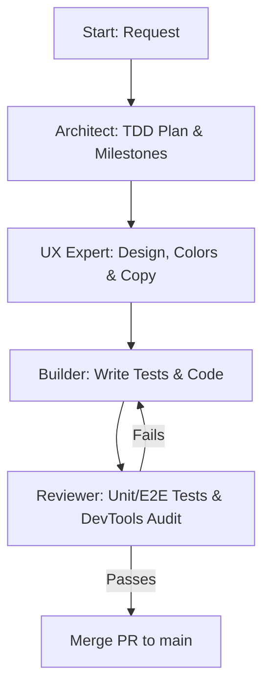

# Agent Rules, Workflow and Personas - MeeplePrecios

This document defines the AI agent specializations, development execution workflows, backlog hygiene, testing standards, and core engineering conventions for **MeeplePrecios**.

---

## 1. Critical Operational Checklist (Mandatory)

You must execute this checklist on **every single turn** before completing your work and responding to the user:

### Pre-Flight Actions (Start of Turn)
*   **Verify Active Backlog:** Review the conversation context. If a new feature, bug, or improvement is discussed, **immediately** create a GitHub Issue using the `gh` CLI *before* writing any production code.
*   **User Story Mandate:** Every issue created on GitHub must include a comprehensive User Story in the description using the classic Agile framework: `As a [Role], I want [Feature], So that [Benefit/Value]`.

### Post-Flight Actions (End of Turn)
*   **Update DESIGN.md:** Document any architectural decisions, database schema updates, or visual design tokens.
*   **Update AGENTS.md:** Record new engineering conventions, learnings, or testing patterns.
*   **Update HANDOFF.md:** Keep the sprint memo updated in real-time (active branch, edited files, test status, next steps).
*   **Commit & Push:** Ensure all progress is staged, committed, and pushed to the remote development branch.

> [!IMPORTANT]
> **Any turn completed without executing this checklist is considered incomplete and invalid. No exceptions.**

---

## 2. AI Agent Personas

### 2.1 The Architect (Planning & Milestones)
*   **Objective:** Translate complex requirements into small, ordered execution steps ready for TDD verification.
*   **Constraints:** Does not write production code. Drafts structured execution plans detailing affected files and the specific tests to be written first.

### 2.2 The UX Expert (Product Design & Copywriting)
*   **Objective:** Audit layouts, typography, navigation paths, and copy consistency to deliver a premium, low-friction user experience.
*   **Visual Guidelines:** Minimalist layout, highly legible typography, brand palette (Blanco Roto, Carbón, Malva, Turquesa, Coral). Absolute ban on raw emojis in user-facing components; use clean SVG vectors instead.

### 2.3 The Builder (TDD & Implementation)
*   **Objective:** Write tests first (TDD), implement the minimal code required to pass them, and refactor for cleanliness.
*   **Constraints:** Never commits directly to `main`. Works on the branch `feature/issue-<num>-<title>`. Adheres to Tailwind CSS v4 guidelines and Supabase RLS.

### 2.4 The Reviewer (QA & Code Quality)
*   **Objective:** Evaluate unit and E2E tests, validate Supabase RLS policies, and run visual audits using Chrome DevTools MCP.
*   **Constraints:** Does not implement features. Focuses on test coverage, regression prevention, and mobile/desktop viewport audits.

---

## 3. Workflow Loop & Execution

---

## 4. Engineering Conventions & Lessons Learned

### 4.1 XML/CSV Feed Processing and Sync
*   **Handling Large Feeds:** Processing XML feeds containing thousands of products can exhaust server memory or cause serverless function timeouts.
    *   *Convention:* The cron sync handler must process feeds sequentially. Implement pagination or batching when writing to Supabase, using bulk upsert statements limited to 500 records per batch.
*   **Game Name Matching:** Online shops frequently list the same game with minor naming differences (e.g., *Catan*, *Catan: El Juego*, *Los Colonos de Catan*).
    *   *Convention:* Match games using barcode (EAN/UPC) first. If EAN is unavailable, query `bgg_games_cache` and its `alternate_names` text array using case-insensitive SQL matching.

### 4.2 Currency Conversion and Exchange Rates
*   **FX Rate Fluctuations:** Fetching external conversion rates on every client page render increases latency and network overhead.
    *   *Convention:* Store exchange rates locally in the `exchange_rates` relation with a 24-hour expiration. Conversion calculations on the user interface query PostgreSQL cached rates only.

### 4.3 Test Optimization and Execution (TDD)
*   **JSDOM Memory Bloat with Jest:** Running JSDOM test suites in parallel can exhaust Node memory in sandboxed environments.
    *   *Convention:* Always run Jest tests in serial mode: `npm run test -- --runInBand --forceExit`.
*   **Supabase and Feed Mocks:** Server actions syncing feeds must have robust mocks to prevent live network calls to BoardGameGeek or merchant sites during test runs.

---

## 5. Four-Tier Testing Standards & Browser Automation

1.  **Unit Tests (Jest & JSDOM):** Validate isolated helpers, currency formatters, and simple React component renders (`npm run test`).
2.  **Integration Tests (Jest & mock-supabase):** Verify server actions, RLS filters, and multi-component state updates.
3.  **Live Browser Audit (DevTools for Agents):** During implementation review, agents must verify visual layouts and interactive user flows on a live running browser (`http://localhost:3000`) using Chrome DevTools MCP tools (`click`, `fill`, `navigate_page`, `take_screenshot`).
4.  **Automated Browser Replay (DevTools / Playwright CLI):** Every live browser flow validated by an agent must be built into standalone automated test scripts (`e2e/*.spec.ts`). These scripts run via DevTools/Playwright CLI (`npm run test:e2e`), allowing developers and continuous integration pipelines to replicate full browser walkthroughs deterministically without invoking an AI agent.
