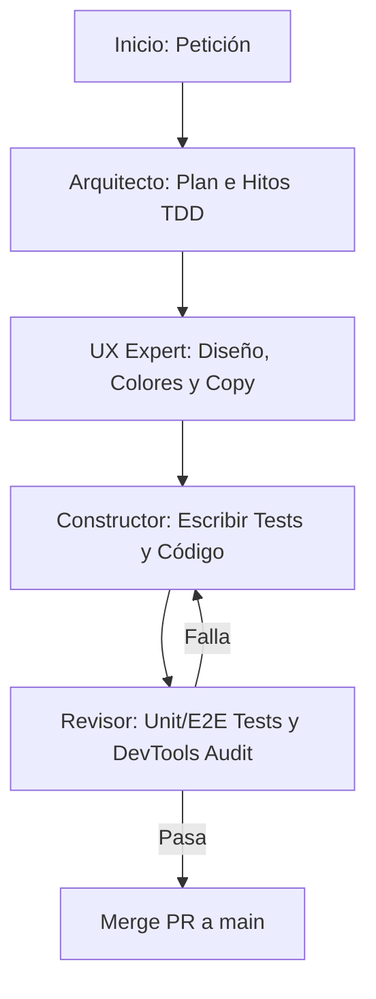

# Reglas de Agentes, Flujo de Trabajo y Personas - MeeplePrecios

Este documento define las especializaciones de los agentes de IA, los flujos de ejecución del desarrollo, la higiene del backlog, los estándares de testing y las convenciones de ingeniería para **MeeplePrecios**.

---

## 1. Checklist Operativo Crítico (Mandatorio)

Debes ejecutar este checklist en **cada turno** antes de dar por completado el trabajo y responder al usuario:

### Acciones Previas (Inicio del Turno)
*   **Verificar Backlog Activo:** Revisa el contexto y los requerimientos. Si se define una nueva funcionalidad o corrección, crea **inmediatamente** un Issue en GitHub utilizando la CLI `gh` *antes* de escribir cualquier código de producción.
*   **Mandato de Historias de Usuario:** Cada issue creado en GitHub debe llevar en su descripción la fórmula de historia de usuario ágil en español: `Como [Rol], Quiero [Funcionalidad], Para [Beneficio/Valor]`.

### Acciones Posteriores (Fin del Turno)
*   **Actualizar DESIGN.md:** Documenta cualquier decisión arquitectónica, cambios en el esquema de base de datos o tokens visuales del sistema.
*   **Actualizar AGENTS.md:** Registra nuevos aprendizajes, convenciones de código o reglas de testing descubiertas.
*   **Actualizar HANDOFF.md:** Mantén al día la bitácora del sprint en tiempo real (rama activa, archivos editados, estado de pruebas, siguientes pasos).
*   **Subir Cambios (Stage, Commit & Push):** Asegura el versionamiento de todo tu progreso en la rama de desarrollo correspondiente.

> [!IMPORTANT]
> **Cualquier turno finalizado sin ejecutar este checklist se considerará incompleto e inválido. Sin excepciones.**

---

## 2. Personas de los Agentes de IA

### 2.1 El Arquitecto (Planificación e Hitos)
*   **Objetivo:** Traducir peticiones complejas en pasos de ejecución pequeños, ordenados y listos para pruebas (TDD) para el Constructor.
*   **Restricciones:** No escribe código de producción. Escribe planes de ejecución estructurados detallando los archivos afectados y las pruebas a programar previamente.

### 2.2 El Experto de UX (Diseño y Copywriting)
*   **Objetivo:** Auditar interfaces, tipografías, flujos de navegación y consistencia del texto (copy) para ofrecer una navegación premium y de baja fricción.
*   **Directrices Estéticas:** Minimalista, tipografía de alta legibilidad, paleta en tonos Blanco Roto, Carbón, Malva, Turquesa y Coral. Baneo absoluto de emojis crudos en componentes visibles; se deben usar iconos SVG limpios.

### 2.3 El Constructor (TDD e Implementación)
*   **Objetivo:** Escribir las pruebas primero (TDD), implementar la solución mínima para que pasen y refactorizar para limpieza de código.
*   **Restricciones:** Nunca commitea directo a `main`. Trabaja en la rama `feature/issue-<num>-<title>`. Adhiere a las directrices de CSS Tailwind v4 y Supabase RLS.

### 2.4 El Revisor (QA y Código)
*   **Objetivo:** Evaluar las pruebas del Constructor, validar políticas de seguridad de Supabase y correr auditorías de interfaz usando Chrome DevTools MCP.
*   **Restricciones:** No implementa features. Revisa cobertura de pruebas y previene regresiones en vistas móviles y de escritorio.

---

## 3. Flujo de Trabajo (Loop de Ejecución)

---

## 4. Convenciones de Ingeniería y Lecciones Aprendidas

### 4.1 Sincronización y Procesamiento de Feeds XML/CSV
*   **Manejo de Feeds Pesados:** La lectura y procesamiento de feeds XML con miles de productos puede agotar la memoria del servidor o causar timeouts en funciones Edge.
    *   *Convención:* El proceso Cron debe correr de manera secuencial, procesando los feeds uno por uno. Se debe implementar paginación o división en lotes (batching) al guardar los datos en Supabase usando inserciones masivas de tipo `upsert` con límite de 500 registros por lote.
*   **Inconsistencias en Nombres de Juegos:** Las tiendas listan el mismo juego con sutiles diferencias (ej. *Catan*, *Catan: El Juego*, *Los Colonos de Catan*).
    *   *Convención:* Al procesar el feed, se busca correspondencia utilizando primero el código de barras (EAN/UPC). Si no se cuenta con EAN, el sistema utiliza un servicio de correspondencia de nombres que busca coincidencias insensibles a mayúsculas sobre la tabla `bgg_games_cache` y los arreglos `alternate_names`.

### 4.2 Conversión de Divisas y Tasas Cambiarias
*   **Fluctuaciones de Divisas:** Realizar consultas a APIs externas de tipo de cambio en cada renderizado incrementa costos de red y retrasa la carga de página.
    *   *Convención:* Almacena las tasas de divisas en la tabla `exchange_rates` con expiración de 24 horas. Las consultas de precios de usuarios utilizan únicamente los datos locales de caché relacional en PostgreSQL.

### 4.3 Optimización y Ejecución de Pruebas (TDD)
*   **Consumo de Memoria de Jest con JSDOM:** Correr pruebas en paralelo puede desbordar la memoria Node en entornos sandboxed.
    *   *Convención:* Ejecutar las pruebas siempre en serie mediante: `npm run test -- --runInBand --forceExit`.
*   **Mock de Supabase y Feeds:** Las Server Actions de sincronización deben contar con mocks detallados para evitar llamadas de red vivas a BGG o servidores externos durante los tests de integración.

---

## 5. Estándares de Testing en Tres Niveles

1.  **Unitario (Jest & JSDOM):** Comprobar utilitarios de conversión cambiaria, formateadores de precios y renders básicos de tarjetas de juego.
2.  **Integración (Jest & mock-supabase):** Validar que las Server Actions de registro de tiendas y procesamiento de XML inserten correctamente en base de datos.
3.  **E2E Walkthroughs (Playwright):** Simular el flujo completo del comprador (cambio de país, conversión de divisas, redirección con enlace de afiliado) y del merchant (onboarding guiado paso a paso con carga de archivo feed).
