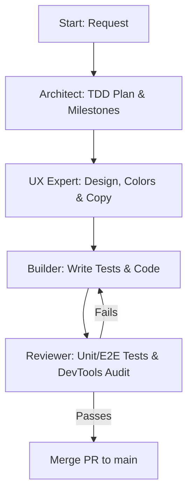

# Agent Rules, Workflow and Personas - MeeplePrecios

This document defines the AI agent specializations, development execution workflows, backlog hygiene, testing standards, and core engineering conventions for **MeeplePrecios**.

---

## 1. Critical Operational Checklist (Mandatory)

You must execute this checklist on **every single turn** before completing your work and responding to the user:

### Pre-Flight Actions (Start of Turn)
*   **Backlog & Persona Gate (Pre-Flight):** When receiving a feature request, bug report, or sprint planning prompt, you **MUST** immediately audit the request against the Three-Point Compliance Filter (Persona Atomicity, Scope Atomicity, Agile Syntax). Never begin coding or create a compound backlog item. If multiple personas or features are detected, proactively divide them or launch the `backlog_auditor` skill before proceeding.
*   **Verify Active Backlog:** Review the conversation context. If a new feature, bug, or improvement is discussed, **immediately** create a GitHub Issue using the `gh` CLI *before* writing any production code.
*   **User Story Mandate:** Every issue created on GitHub must include a comprehensive User Story in the description using the classic Agile framework: `As a [Role], I want [Feature], So that [Benefit/Value]`.
*   **Feature Branch Mandate (`AGENTS.md 2.3`):** Never commit work directly to `main`. Immediately checkout a dedicated feature branch matching the active issue: `git checkout -b feature/issue-<num>-<title>`.

### Post-Flight Actions (End of Turn)
*   **Update DESIGN.md:** Document any architectural decisions, database schema updates, or visual design tokens.
*   **Update AGENTS.md:** Record new engineering conventions, learnings, or testing patterns.
*   **Update HANDOFF.md:** Keep the sprint memo updated in real-time (active branch, edited files, test status, next steps).
*   **Commit & Push Feature Branch:** Stage all changes, commit with conventional commit message, and push the active feature branch to remote (`git push -u origin feature/issue-<num>-<title>`). Do not push directly to `main`.

> [!IMPORTANT]
> **Any turn completed without executing this checklist and feature branch workflow is considered incomplete and invalid. No exceptions.**

---

## 2. Backlog Hygiene & Branching Conventions

### 2.1 The Atomic User Story Mandate (One Persona per Issue)
*   **Single-Persona Focus:** Never combine multiple user personas (e.g., Admin vs. End User, Buyer vs. Seller, Store Owner vs. Player) into a single GitHub Issue, User Story, or Pull Request.
*   **Single-Feature Scope:** Never lump unrelated feature requests, global UI refactors, and backend architectural changes into one omnibus task. Every issue must represent a single, testable chunk of value delivered to exactly one persona.
*   **Classic Agile Formula:** Every issue or task created in the backlog must define its objective using the classic Agile syntax:
    > `As a [Target Persona / Role], I want [Specific Feature / Action], so that [Measurable Benefit / Value].`

### 2.2 Proactive Request Division Protocol
When receiving user feedback, feature ideas, or multiple requirements in a single prompt:
1.  **Audit & Deconstruct:** Immediately analyze the prompt to identify how many distinct user personas and discrete features are involved.
2.  **Divide or Consult:**
    *   If ideas clearly span different personas or unrelated systems, do **not** write implementation code right away. Instead, proactively break them down into separate, individual issues in the backlog/issue tracker.
    *   If there is ambiguity about whether two items belong together, stop and explicitly ask the user: *"These ideas touch different user personas/systems. Should I split them into separate atomic issues before proceeding?"*
3.  **Execute One at a Time:** Work sequentially. Focus on one issue, branch from `main`, write tests first (TDD), implement the code, pass verification, open a single-focused Pull Request linking the issue (`Closes #<num>`), merge, and only then proceed to the next atomic issue.

### 2.3 Backlog Traceability & Documentation Sync
*   **1-to-1 Mapping:** Every feature or fix branch must map 1-to-1 to an existing issue (e.g., `feature/issue-<number>-<slug>` or `fix/issue-<number>-<slug>`).
*   **Living Documentation:** Keep any project tracking files (like `backlog.md`, `DESIGN.md`, or `HANDOFF.md`) updated in real-time so that completed stories, active sprints, and pending tasks never drift out of sync with the codebase.

### 2.4 Four-Phase Backlog Auditing Pipeline & Compliance Matrix
When auditing existing backlogs or onboarding new sprint requirements, execute this four-phase pipeline:
1.  **Phase 1: Automated Inventory & Parsing:** Query all active/open backlog items via `gh issue list --state open --json number,title,body,labels` or parse local backlog documents to build a complete inventory.
2.  **Phase 2: Three-Point Compliance Filter:** Evaluate every backlog item against three strict criteria:
    *   *Persona Atomicity:* Does the story serve exactly one user persona/role (Player vs. Partner vs. Admin)?
    *   *Scope Atomicity:* Can this item be implemented and verified independently without bundling unrelated refactors or systems?
    *   *Agile Syntax Compliance:* Does the description strictly match `As a [Role], I want [Action], so that [Benefit]`?
3.  **Phase 3: Actionable Remediation Workflows:** For any item failing Phase 2:
    *   *Compound Issues:* Split into multiple atomic user stories, each assigned to a single persona and numbered independently.
    *   *Omnibus Features:* Deconstruct large multi-component epics into modular, test-first slices.
    *   *Engineering Chores:* Transform internal chores or technical tasks into developer user stories (e.g., `As a Developer, I want [Technical Refactor], so that [System Quality/Performance Benefit]`).
4.  **Phase 4: Prevention Guardrails:** Ensure no branch is created and no code is written until every active backlog issue passes 100% of the Three-Point Compliance Filter.

---

## 3. AI Agent Personas

### 3.1 The Architect (Planning & Milestones)
*   **Objective:** Translate complex requirements into small, ordered execution steps ready for TDD verification.
*   **Constraints:** Does not write production code. Drafts structured execution plans detailing affected files and the specific tests to be written first.

### 3.2 The UX Expert (Product Design & Copywriting)
*   **Objective:** Audit layouts, typography, navigation paths, and copy consistency to deliver a premium, low-friction user experience.
*   **Visual Guidelines:** Minimalist layout, highly legible typography, brand palette (Blanco Roto, Carbón, Malva, Turquesa, Coral). Absolute ban on raw emojis in user-facing components; use clean SVG vectors instead.

### 3.3 The Builder (TDD & Implementation)
*   **Objective:** Write tests first (TDD), implement the minimal code required to pass them, and refactor for cleanliness.
*   **Constraints:** Never commits directly to `main`. Works on the branch `feature/issue-<num>-<title>`. Adheres to Tailwind CSS v4 guidelines and Supabase RLS.

### 3.4 The Reviewer (QA & Code Quality)
*   **Objective:** Evaluate unit and E2E tests, validate Supabase RLS policies, and run visual audits using Chrome DevTools MCP.
*   **Constraints:** Does not implement features. Focuses on test coverage, regression prevention, and mobile/desktop viewport audits.

---

## 4. Workflow Loop & Execution

---

## 5. Engineering Conventions & Lessons Learned

### 5.1 XML/CSV Feed Processing and Sync
*   **Handling Large Feeds:** Processing XML feeds containing thousands of products can exhaust server memory or cause serverless function timeouts.
    *   *Convention:* The cron sync handler must process feeds sequentially. Implement pagination or batching when writing to Supabase, using bulk upsert statements limited to 500 records per batch.
*   **Game Name Matching:** Online shops frequently list the same game with minor naming differences (e.g., *Catan*, *Catan: El Juego*, *Los Colonos de Catan*).
    *   *Convention:* Match games using barcode (EAN/UPC) first. If EAN is unavailable, query `bgg_games_cache` and its `alternate_names` text array using case-insensitive SQL matching.

### 5.2 Currency Conversion and Exchange Rates
*   **FX Rate Fluctuations:** Fetching external conversion rates on every client page render increases latency and network overhead.
    *   *Convention:* Store exchange rates locally in the `exchange_rates` relation with a 24-hour expiration. Conversion calculations on the user interface query PostgreSQL cached rates only.

### 5.3 Test Optimization and Execution (TDD)
*   **JSDOM Memory Bloat with Jest:** Running JSDOM test suites in parallel can exhaust Node memory in sandboxed environments.
    *   *Convention:* Always run Jest tests in serial mode: `npm run test -- --runInBand --forceExit`.
*   **Supabase and Feed Mocks:** Server actions syncing feeds must have robust mocks to prevent live network calls to BoardGameGeek or merchant sites during test runs.

---

## 6. Four-Tier Testing Standards & Browser Automation

1.  **Unit Tests (Jest & JSDOM):** Validate isolated helpers, currency formatters, and simple React component renders (`npm run test`).
2.  **Integration Tests (Jest & mock-supabase):** Verify server actions, RLS filters, and multi-component state updates.
3.  **Live Browser Audit (DevTools for Agents):** During implementation review, agents must verify visual layouts and interactive user flows on a live running browser (`http://localhost:3001`) using Chrome DevTools MCP tools (`click`, `fill`, `navigate_page`, `take_screenshot`).
4.  **Automated Browser Replay (DevTools / Playwright CLI):** Every live browser flow validated by an agent must be built into standalone automated test scripts (`e2e/*.spec.ts`). These scripts run via DevTools/Playwright CLI (`npm run test:e2e`), allowing developers and continuous integration pipelines to replicate full browser walkthroughs deterministically without invoking an AI agent.
