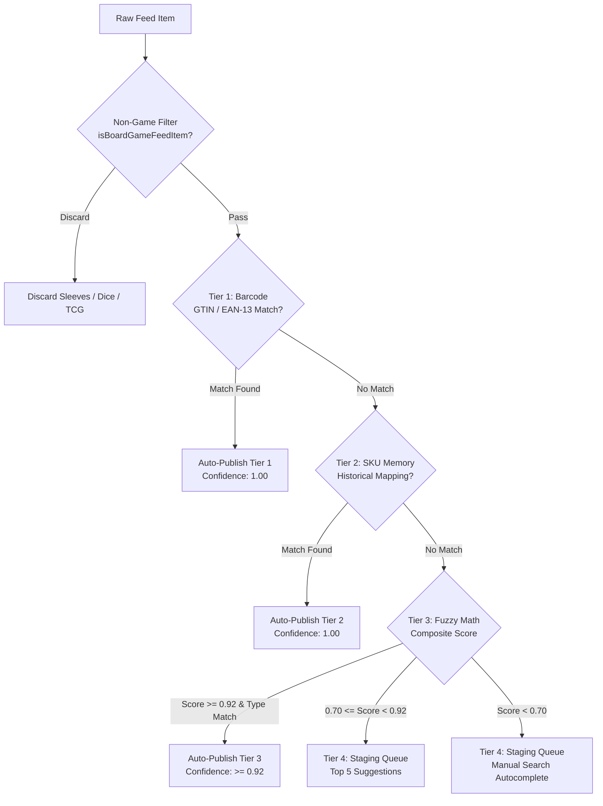
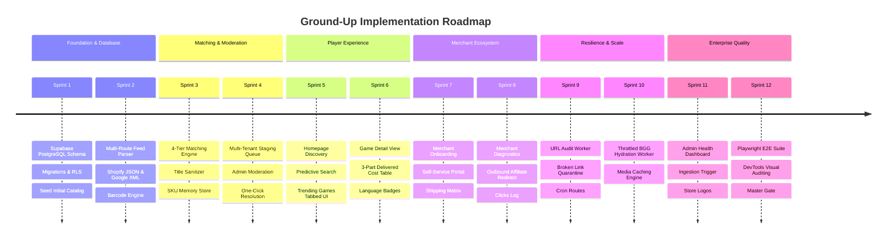

# Complete Ground-Up Engineering Specification & Master Blueprint: MeeplePrecios 🇲🇽

> **Document Type:** Monolithic, Self-Contained System Specification & Implementation Playbook  
> **Author & Persona:** Lead Engineering Architect & Principal Product Manager  
> **Intended Execution Model:** Autonomous AI Coding Agent / Senior Full-Stack Engineering Team  
> **Design Philosophy:** 100% Self-Sufficient. If an engineer or agent is given **ONLY this single file** in an empty directory, they have every requirement, configuration file, architectural rule, database schema, algorithm, tool guide, and sprint roadmap required to construct MeeplePrecios from scratch.

---

# Table of Contents
1. [Executive Summary & Product Vision](#1-executive-summary--product-vision)
2. [Master File Tree & Project Structure](#2-master-file-tree--project-structure)
3. [Environment Configuration & Supporting Files Catalog](#3-environment-configuration--supporting-files-catalog)
4. [DevTools for Agents & Chrome DevTools MCP Guide](#4-devtools-for-agents--chrome-devtools-mcp-guide)
5. [Autonomous Agent Governance & Skills System (`.agents/`)](#5-autonomous-agent-governance--skills-system-agents)
6. [Target Personas & Canonical User Stories Inventory (`US-01` to `US-26`)](#6-target-personas--canonical-user-stories-inventory-us-01-to-us-26)
7. [Unified PostgreSQL Database Schema & Row-Level Security (RLS)](#7-unified-postgresql-database-schema--row-level-security-rls)
8. [The 4-Tier Waterfall Matching Engine & Classifiers](#8-the-4-tier-waterfall-matching-engine--classifiers)
9. [Multi-Route Feed Ingestion Engine & 51 Mexican Stores Registry](#9-multi-route-feed-ingestion-engine--51-mexican-stores-registry)
10. [Complete REST API Contract Inventory](#10-complete-rest-api-contract-inventory)
11. [Frontend Design System, Cognitive UX & Sentence Case Governance](#11-frontend-design-system-cognitive-ux--sentence-case-governance)
12. [Architectural Post-Mortem & Critical Engineering Lessons](#12-architectural-post-mortem--critical-engineering-lessons)
13. [12-Sprint Ground-Up Implementation Roadmap](#13-12-sprint-ground-up-implementation-roadmap)
14. [Master Verification Gate & Quality Assurance Playbook](#14-master-verification-gate--quality-assurance-playbook)

---

# 1. Executive Summary & Product Vision

## 1.1 The Commercial Vision
**MeeplePrecios** is Mexico's premier board game price comparison and catalog discovery engine (`MX` / `$ MXN`). The platform eliminates pricing and inventory fragmentation across the Mexican tabletop hobby by automatically aggregating, parsing, matching, and ranking real-time inventory from 50+ verified independent Mexican tabletop stores (including *Ficha y Dado, Mundo Meeple Store, Roll Games, Con T de Tlacuache, Quantum Boardgames, Alfa y Delta, Bundaba, Geeky Stuff, Amukiri, Catito Games*).

## 1.2 The Core Problem
1. **Price Dispersion:** Tabletop games in Mexico exhibit wide price swings (frequently between \$400 and \$1,200 MXN difference for the exact same title across different stores).
2. **Deceptive List Pricing:** Stores calculate shipping differently. A game priced at \$1,100 MXN with \$150 shipping actually costs more than a store selling it at \$1,200 MXN with free shipping.
3. **Language Confusion:** Tabletop hobbyists care deeply about whether a game is in Spanish (`ES`), English (`EN`), or Multilingual (`MULTI`). Accidental purchases of English editions cause buyer remorse.
4. **Accessory & Expansion Mis-attribution:** Card sleeves, dice, playmats, and expansions often get mistakenly matched to base games on standard search engines.
5. **Dead Links & Ghost Stock:** Deleted store pages lead to HTTP 404 errors and broken affiliate customer journeys.

## 1.3 The Core Value Propositions
* **For Tabletop Players (Compradores):** Rank all offers by the **3-Part Total Delivered Cost Law**, view verified language badges, and click directly to checkout.
* **For Independent Store Owners (Socios / Merchants):** Receive high-intent organic buyer traffic with 0% commission fees, automate catalog syncs via Shopify JSON / Atom XML feeds, and override SKU matches via a self-serve portal.
* **For Platform Administrators:** Automated URL health auditing, dead-link quarantine, throttled BGG metadata enrichment, and multi-tenant staging queue moderation.

## 1.4 The 3-Part Delivered Cost Law
$$\text{Total Delivered Cost} = \text{Base Item Price} + \begin{cases} 0 & \text{if } \text{Base Price} \ge \text{Free Shipping Threshold} \\ \text{Flat Domestic Shipping Fee} & \text{otherwise} \end{cases}$$
Every offer in MeeplePrecios MUST display:
$$\text{Base Price} + \text{Shipping} = \text{Total Cost (\$ MXN)}$$

---

# 2. Master File Tree & Project Structure

When bootstrapping this project from an empty directory, create the following directory structure:

```
.
├── .agents/
│   ├── AGENTS.md                                # AI agent rules, personas, and operating constraints
│   └── skills/
│       ├── backlog_auditor/SKILL.md            # Enforces atomic user story criteria
│       ├── document_sync/SKILL.md              # Synchronizes HANDOFF, DESIGN, and AGENTS docs
│       ├── github_issue_complete/SKILL.md      # Runs verify gate, conventional commit, and merge
│       ├── github_issue_solve/SKILL.md         # Plans TDD and isolates feature branches
│       └── ux_expert/SKILL.md                  # Audits cognitive UX, brand tokens & sentence case
├── .eslintrc.json                              # ESLint Next.js configuration
├── .gitignore                                  # Git ignore definitions
├── .env.example                                # Environment variable templates
├── .env.local                                  # Local development secrets
├── DESIGN.md                                   # UI tokens & database schema quick-reference
├── HANDOFF.md                                  # Active sprint progress tracking memo
├── MASTER_SPECIFICATION.md                     # Canonical project specification
├── COMPLETE_GROUND_UP_SPECIFICATION.md         # THIS ALL-IN-ONE MASTER BLUEPRINT
├── README.md                                   # Project orientation guide
├── next.config.mjs                             # Next.js image domain and compiler configuration
├── package.json                                # Scripts, dependencies, and engines
├── playwright.config.ts                        # Playwright E2E configuration
├── postcss.config.mjs                          # PostCSS Tailwind plugins
├── tailwind.config.ts                          # Brand color tokens and responsive themes
├── tsconfig.json                               # Strict TypeScript configuration with @/* path aliases
├── vitest.config.ts                            # Vitest unit test configuration
├── vitest.setup.ts                             # Vitest environment setup
├── public/                                     # Static assets, store logos, and icons
├── supabase/
│   └── migrations/
│       └── 20260715000000_initial_schema.sql  # Complete PostgreSQL DDL & RLS policies
└── src/
    ├── app/                                    # Next.js App Router
    │   ├── admin/
    │   │   ├── diagnostics/page.tsx            # Feed diagnostics & catalog health view
    │   │   ├── queue/page.tsx                  # Staging queue moderation view
    │   │   └── stores/page.tsx                 # Store management & ingestion triggers
    │   ├── api/
    │   │   ├── admin/
    │   │   │   ├── diagnostics/route.ts        # Admin diagnostics API
    │   │   │   ├── feed-queue/route.ts         # Cross-store queue moderation API
    │   │   │   └── stores/route.ts             # Store settings & ingestion trigger API
    │   │   ├── cron/
    │   │   │   ├── audit-urls/route.ts         # Periodic dead-link audit worker
    │   │   │   ├── process-bgg-queue/route.ts  # Throttled BGG metadata hydration worker
    │   │   │   └── sync-feeds/route.ts         # Daily scheduled feed sync worker
    │   │   ├── merchant/
    │   │   │   ├── mapping/route.ts            # SKU mapping API
    │   │   │   ├── onboard/route.ts            # Store registration API
    │   │   │   ├── queue/route.ts              # Store-isolated staging queue API
    │   │   │   └── shipping/route.ts           # Flat shipping matrix API
    │   │   ├── redirect/route.ts               # Outbound affiliate redirect & click logger
    │   │   └── search/route.ts                 # Predictive search endpoint
    │   ├── game/
    │   │   └── [id]/page.tsx                   # Game detail page & 3-part price comparison table
    │   ├── login/page.tsx                      # Role switcher (Player / Merchant / Admin)
    │   ├── merchant/
    │   │   ├── dashboard/page.tsx              # Merchant portal & SKU self-mapping UI
    │   │   ├── onboard/page.tsx                # Merchant registration form
    │   │   └── shipping/page.tsx               # Shipping matrix configuration form
    │   ├── search/page.tsx                     # Search results page
    │   ├── store/[id]/page.tsx                 # Store profile & catalog listing
    │   ├── globals.css                         # Tailwind directives & custom CSS
    │   ├── layout.tsx                          # Root layout with header, navigation & footer
    │   └── page.tsx                            # Homepage (Hero search, Top 10 BGG & Trending MX tabs)
    ├── components/
    │   ├── Navbar.tsx                          # Navigation bar with branding & search
    │   ├── Footer.tsx                          # Global footer
    │   ├── PriceTable.tsx                      # 3-part comparative pricing table
    │   ├── SearchBar.tsx                       # Predictive autocomplete search input
    │   ├── TactileSwitch.tsx                   # Accessible switch toggle (`role="switch"`)
    │   └── LanguageBadge.tsx                   # High-contrast edition badge (`ES`, `EN`, `MULTI`)
    ├── lib/
    │   ├── db/
    │   │   ├── db.ts                           # Database repository abstraction
    │   │   └── seed-data.ts                    # 51 stores, shipping rates, and initial catalog seed
    │   ├── engine/
    │   │   ├── audit-worker.ts                 # HTTP 404/500 link audit & auto-heal worker
    │   │   ├── bgg-hydrator.ts                 # Throttled BGG XMLAPI2 client
    │   │   ├── feed-ingestion-worker.ts        # Bulk multi-route ingestion worker
    │   │   ├── feed-parser.ts                  # Shopify JSON & Atom XML parsers
    │   │   ├── image-hydrator.ts               # High-res box art scraper
    │   │   └── matching-engine.ts              # 4-tier waterfall matching algorithm
    │   └── supabase/
    │       ├── client.ts                       # Supabase client initializer
    │       └── server.ts                       # Supabase server client with cookie handling
    ├── types/
    │   └── index.ts                            # Canonical TypeScript interfaces
    └── __tests__/                              # Vitest unit and integration test suite
```

---

# 3. Environment Configuration & Supporting Files Catalog

Below are the exact contents for every configuration file required to initialize the project:

### 3.1 `package.json`
```json
{
  "name": "meeple-precios",
  "version": "1.0.0",
  "private": true,
  "scripts": {
    "dev": "next dev -p 3001",
    "build": "next build",
    "start": "next start -p 3001",
    "lint": "next lint",
    "test": "vitest run",
    "test:watch": "vitest",
    "test:e2e": "playwright test",
    "verify": "npm run lint && npm run test && next build"
  },
  "dependencies": {
    "@supabase/supabase-js": "^2.49.1",
    "fast-xml-parser": "^4.5.3",
    "lucide-react": "^0.475.0",
    "next": "^15.1.7",
    "react": "^19.0.0",
    "react-dom": "^19.0.0"
  },
  "devDependencies": {
    "@playwright/test": "^1.50.1",
    "@types/node": "^22.13.4",
    "@types/react": "^19.0.10",
    "@types/react-dom": "^19.0.4",
    "@vitejs/plugin-react": "^4.3.4",
    "autoprefixer": "^10.4.20",
    "eslint": "^9.20.1",
    "eslint-config-next": "^15.1.7",
    "jsdom": "^26.0.0",
    "postcss": "^8.5.2",
    "tailwindcss": "^3.4.17",
    "typescript": "^5.7.3",
    "vite-tsconfig-paths": "^5.1.4",
    "vitest": "^3.0.5"
  }
}
```

### 3.2 `tsconfig.json`
```json
{
  "compilerOptions": {
    "target": "ES2017",
    "lib": ["dom", "dom.iterable", "esnext"],
    "allowJs": true,
    "skipLibCheck": true,
    "strict": true,
    "noEmit": true,
    "esModuleInterop": true,
    "module": "esnext",
    "moduleResolution": "bundler",
    "resolveJsonModule": true,
    "isolatedModules": true,
    "jsx": "preserve",
    "incremental": true,
    "plugins": [
      {
        "name": "next"
      }
    ],
    "paths": {
      "@/*": ["./src/*"]
    }
  },
  "include": ["next-env.d.ts", "**/*.ts", "**/*.tsx", ".next/types/**/*.ts"],
  "exclude": ["node_modules"]
}
```

### 3.3 `next.config.mjs`
```javascript
/** @type {import('next').NextConfig} */
const nextConfig = {
  images: {
    remotePatterns: [
      { protocol: 'https', hostname: 'cf.geekdo-images.com' },
      { protocol: 'https', hostname: 'images.unsplash.com' },
      { protocol: 'https', hostname: 'cdn.shopify.com' },
      { protocol: 'https', hostname: 'www.google.com' },
      { protocol: 'https', hostname: 'fichaydado.com' },
      { protocol: 'https', hostname: 'mundomeeplestore.com' },
      { protocol: 'https', hostname: 'rollgames.mx' },
      { protocol: 'https', hostname: 'tdetlacuache.com' },
      { protocol: 'https', hostname: 'quantumboardgames.com' },
      { protocol: 'https', hostname: 'alfaydelta.com' },
      { protocol: 'https', hostname: 'bundaba.com.mx' },
      { protocol: 'https', hostname: 'geekystuff.com.mx' }
    ],
  },
};

export default nextConfig;
```

### 3.4 `tailwind.config.ts`
```typescript
import type { Config } from 'tailwindcss';

const config: Config = {
  content: [
    './src/pages/**/*.{js,ts,jsx,tsx,mdx}',
    './src/components/**/*.{js,ts,jsx,tsx,mdx}',
    './src/app/**/*.{js,ts,jsx,tsx,mdx}',
  ],
  theme: {
    extend: {
      colors: {
        'blanco-roto': '#F5F0E9',
        'carbon': '#3A3A3A',
        'malva': '#8367C7',
        'turquesa': '#73D8D4',
        'coral': '#FF9E8A',
      },
    },
  },
  plugins: [],
};
export default config;
```

### 3.5 `postcss.config.mjs`
```javascript
/** @type {import('postcss-load-config').Config} */
const config = {
  plugins: {
    tailwindcss: {},
    autoprefixer: {},
  },
};

export default config;
```

### 3.6 `vitest.config.ts`
```typescript
import { defineConfig } from 'vitest/config';
import react from '@vitejs/plugin-react';
import tsconfigPaths from 'vite-tsconfig-paths';

export default defineConfig({
  plugins: [react(), tsconfigPaths()],
  test: {
    environment: 'jsdom',
    globals: true,
    setupFiles: ['./vitest.setup.ts'],
    testTimeout: 20000,
  },
});
```

### 3.7 `vitest.setup.ts`
```typescript
import { afterEach } from 'vitest';

afterEach(() => {
  // Reset any test spies or DOM state
});
```

### 3.8 `playwright.config.ts`
```typescript
import { defineConfig, devices } from '@playwright/test';

export default defineConfig({
  testDir: './e2e',
  fullyParallel: true,
  forbidOnly: !!process.env.CI,
  retries: process.env.CI ? 2 : 0,
  workers: process.env.CI ? 1 : undefined,
  reporter: 'html',
  use: {
    baseURL: 'http://localhost:3001',
    trace: 'on-first-retry',
  },
  projects: [
    {
      name: 'chromium',
      use: { ...devices['Desktop Chrome'] },
    },
  ],
  webServer: {
    command: 'npm run dev',
    url: 'http://localhost:3001',
    reuseExistingServer: !process.env.CI,
  },
});
```

### 3.9 `.eslintrc.json`
```json
{
  "extends": ["next/core-web-vitals", "next/typescript"]
}
```

### 3.10 `.env.example` & `.env.local`
```ini
# Supabase Database Configuration
NEXT_PUBLIC_SUPABASE_URL=http://localhost:54321
NEXT_PUBLIC_SUPABASE_ANON_KEY=your-supabase-anon-key
SUPABASE_SERVICE_ROLE_KEY=your-supabase-service-role-key

# Application & Authentication Secrets
NEXTAUTH_SECRET=fallback-secret-for-development-and-tests
NEXTAUTH_URL=http://localhost:3001

# Scheduled Cron Security Key
CRON_SECRET=your-secure-cron-secret-token
```

---

# 4. DevTools for Agents & Chrome DevTools MCP Guide

> [!CAUTION]
> **Mandatory Browser QA Policy:** Every agent or developer modifying UI, routing, or data flows MUST visually and interactively verify `http://localhost:3001` using Chrome DevTools MCP before concluding any task.

## 4.1 What is Chrome DevTools MCP (`chrome-devtools-mcp`)?
It is the official Model Context Protocol server developed by Google / Chrome DevTools. It connects an AI agent directly to a running instance of Chrome via Chrome DevTools Protocol (CDP), equipping the agent with 32 browser tools (`navigate_page`, `take_snapshot`, `click`, `fill`, `take_screenshot`, `list_console_messages`, `lighthouse_audit`).

## 4.2 Installation & Setup
1. **NPM Registry Directive:** Always configure npm to use the official registry to avoid HTTP 403 download errors:
   ```bash
   npm config set registry https://registry.npmjs.org/
   ```
2. **Execute Directly via NPX:**
   ```bash
   npx chrome-devtools-mcp@latest --help
   ```
3. **MCP Client Configuration JSON:**
   To equip Claude Desktop, Cursor, Antigravity, or any MCP client:
   ```json
   {
     "mcpServers": {
       "chrome-devtools": {
         "command": "npx",
         "args": ["-y", "chrome-devtools-mcp@latest"]
       }
     }
   }
   ```
4. **Connecting to a Running Chrome Instance (Alternative):**
   - Start Chrome with remote debugging:
     ```bash
     # macOS:
     /Applications/Google\ Chrome.app/Contents/MacOS/Google\ Chrome --remote-debugging-port=9222
     ```
   - Connect MCP server:
     ```bash
     npx chrome-devtools-mcp@latest --browser-url=http://127.0.0.1:9222
     ```

## 4.3 The 5-Step Agent Browser QA Workflow
When testing any feature on `http://localhost:3001`:
1. **Navigate:** Call `navigate_page({ url: "http://localhost:3001" })` or `new_page`.
2. **Wait:** Call `wait_for({ selector: "table, h1, [role='switch']" })` to ensure React 19 hydration has completed.
3. **Snapshot:** Call `take_snapshot({})` to inspect the semantic accessibility tree and get element `uid`s.
4. **Interact:** Call `click({ uid: "..." })` or `type_text({ uid: "...", text: "Catan" })` to test search, tabs, filters, and modals.
5. **Audit:**
   - Call `take_screenshot({ filePath: "public/audit_view.png" })` to visually verify layout tokens.
   - Call `list_console_messages({})` to ensure zero uncaught React hydration warnings or JavaScript runtime errors exist.

---

# 5. Autonomous Agent Governance & Skills System (`.agents/`)

## 5.1 The Core Directives
1. **Quarantine Isolation:** AI agents MUST NEVER inspect, read, search (`grep`, `view_file`), copy, or import files from the `legacy/` directory under ANY circumstance.
2. **Canonical User Story Naming:** Never reference deprecated GitHub issues (e.g. Issues #1–209). Refer exclusively to `US-01` through `US-26`.
3. **Test-Driven Development (TDD):** Tests in `src/__tests__/` must be authored and failing before writing production code.
4. **Google Sentence Case Governance:** All user-facing headings (`h1`, `h2`), buttons, and table headers MUST use sentence case (*e.g., Comparativa de ofertas por tienda*).
5. **Root Cause Diagnosis Directive:** Whenever an error is addressed, the agent must document:
   - *(a)* Why the issue happened.
   - *(b)* How the code fix systematically prevents recurrence.

## 5.2 The 4 Agent Operating Personas
1. **The Architect:** Analyzes canonical user stories and formulates TDD plans. Does not write production code directly.
2. **The UX Expert:** Enforces cognitive laws (Fitts, Hick, Miller), brand tokens (`#F5F0E9`, `#3A3A3A`, `#8367C7`, `#73D8D4`, `#FF9E8A`), sentence case, and `role="switch"` accessibility.
3. **The Builder:** Writes tests first (TDD), implements minimal clean code, and ensures type safety.
4. **The Reviewer:** Runs `npm run verify`, executes DevTools browser QA, and verifies all gates pass 100%.

## 5.3 Complete Skill Definitions (`.agents/skills/`)

### File: `.agents/skills/backlog_auditor/SKILL.md`
```markdown
---
name: backlog_auditor
description: "Automatically triggers when reviewing open GitHub issues, planning sprint backlogs, or decomposing user requirements. Enforces the Atomic User Story Mandate and Three-Point Compliance Filter."
---

# Skill: Backlog Auditor & Hygiene Gatekeeper

When invoked or triggered during issue creation and triage, execute this workflow:
1. **Fetch & Parse:** Dump all active backlog items via `gh issue list --state open --json number,title,body,labels` or parse local tracking documents.
2. **Filter & Evaluate:** Check each item against:
   - *Persona Atomicity:* Does it serve exactly one role?
   - *Scope Atomicity:* Is it a single, independently testable feature?
   - *Syntax Compliance:* Does it strictly follow `As a [Role], I want [Action], so that [Benefit]`?
3. **Remediate:** Automatically split compound issues, decompose omnibus features into single-component tasks, and transform engineering chores into developer stories.
```

### File: `.agents/skills/github_issue_solve/SKILL.md`
```markdown
---
name: github_issue_solve
description: "Automated workflow for analyzing a GitHub issue, assigning the assignee, setting up the feature branch, planning the TDD execution, and commenting the plan on the issue."
---

# GitHub Issue Solve Skill: Backlog Initialization and Branching

When beginning work on an atomic feature:
1. **Validate Agile User Story:** Verify single-persona syntax: `As a [Role], I want [Feature], so that [Benefit]`.
2. **Self-Assign:** `gh issue edit $ISSUE_NUMBER --add-assignee "@me"`.
3. **Branch Isolation:** Create feature branch: `git checkout -b feature/us-$NUM-$SHORT_TITLE`.
4. **TDD Planning:** Outline tests to write first, affected files, and documentation to sync.
```

### File: `.agents/skills/ux_expert/SKILL.md`
```markdown
---
name: ux_expert
description: "A specialized Product Design and UX Audit skill. Equips the AI with advanced cognitive psychology laws, premium visual design tokens, accessibility standards, and conversational copywriting playbooks to critique and refine user experiences."
---

# UX Expert Skill: Product Design and UX Audit Playbook

1. **Brand Tokens Alignment:** Verify all UI elements use official tokens:
   - Blanco Roto `#F5F0E9`, Carbón Suave `#3A3A3A`, Malva Suave `#8367C7`, Turquesa `#73D8D4`, Coral `#FF9E8A`.
2. **Google Sentence Case Governance:** Ensure every heading, button, and table header uses sentence case.
3. **Tactile Switch Accessibility:** All boolean filters must use `role="switch"` and `aria-checked`.
4. **Emoji Ban:** Raw emojis are prohibited in headers, buttons, cards, and feeds; use clean SVG icons.
5. **Touch Targets:** Mobile interactive elements must be at least 44x44px.
```

### File: `.agents/skills/github_issue_complete/SKILL.md`
```markdown
---
name: github_issue_complete
description: "Automated workflow for validating the codebase via unit and E2E tests, committing, pushing, opening a Pull Request linking the issue, updating handoffs, and merging into main."
---

# GitHub Issue Complete Skill: Verification, PR Creation, and Merging

1. **Four-Tier Verification Gate:** Run `npm run verify` (lint, test, build).
2. **Documentation Synchronization:** Update `HANDOFF.md`, `DESIGN.md`, and `AGENTS.md`.
3. **Commit & Push:** Conventional commits (`feat:`, `fix:`, `refactor:`, `test:`).
4. **PR Automation & Merge:** Merge into `main` after verification passes.
```

### File: `.agents/skills/document_sync/SKILL.md`
```markdown
---
name: document_sync
description: "Automated workflow for auditing and synchronizing all three living documents (HANDOFF.md, DESIGN.md, and AGENTS.md) to ensure technical schemas, sprint progress, and AI persona rules never go stale."
---

# Document Sync Skill: Workspace Documentation Hygiene

At the conclusion of every feature or bug fix:
1. **HANDOFF.md:** Document completed files, test status, and next sprint tasks.
2. **DESIGN.md:** Document new SQL columns, API signatures, or visual tokens.
3. **AGENTS.md:** Record hard-learned engineering lessons and conventions.
```

---

# 6. Target Personas & Canonical User Stories Inventory (`US-01` to `US-26`)

## 6.1 Personas
1. **The Mexican Board Game Buyer (Player / Comprador):** Enthusiasts seeking tabletop games at the lowest total delivered price in $ MXN, differentiating between Spanish and English editions.
2. **The Independent Tabletop Store Owner (Merchant / Socio):** E-commerce managers seeking sales growth without marketplace commissions, needing automated inventory sync and SKU mapping tools.
3. **The Platform Administrator (Admin):** Monitors feed error rates, resolves staging queues, audits dead links, and throttles BGG metadata hydration.
4. **The Autonomous AI Developer (Agent):** Executes tasks via atomic TDD, enforces Google sentence case, and verifies code via DevTools for Agents.

## 6.2 Complete Canonical User Stories Inventory

### Epic A: Discovery & Comparison (Player Persona)
* **[US-01] Homepage Search and Hotness:** *As a Player, I want to search for board games on the homepage or view live BGG Hotness trends, so that I can quickly locate games available in Mexico.*
* **[US-02] Hero Comparative UI:** *As a Player, I want to see a full-width box art header, typographic stats, and a 3-part price comparison table on `/game/[id]`, so that I can evaluate total delivered costs at a glance.*
* **[US-03] Explicit Language Badges:** *As a Player, I want store offers to display clear language badges (`Español (ES)`, `Inglés (EN)`, `Multilingüe (MULTI)`), so that I don't accidentally buy a game in a language I don't want.*
* **[US-04] Direct Affiliate Checkout:** *As a Player, I want clicking "Ir a la tienda" to redirect me to the store's exact product page with UTM tracking, so that I can complete my purchase immediately.*
* **[US-05] Spin-Off Game Variant Cataloging:** *As a Player, I want spin-off variants like Spot It! Catan or Dobble Catan to be cataloged as distinct game entries rather than merged into base game pages, so that I can view accurate price comparisons for both base games and spin-offs independently.*
* **[US-25] BGG Top 10 & Most Searched Tabbed Landing UI:** *As a Player, I want tabbed switching on the homepage between the BGG Top 10 games and the most searched games in Mexico, so that I can discover top-rated global titles and trending local tabletop games effortlessly.*

### Epic B: Merchant Self-Serve Portal (Merchant Persona)
* **[US-06] Merchant Onboarding:** *As a Store Owner, I want to register my storefront name, logo, and XML/JSON feed URL on `/merchant/onboard`, so that my inventory is automatically listed on MeeplePrecios.*
* **[US-07] Shipping Rate Matrix:** *As a Store Owner, I want to set my flat-rate domestic shipping fee and free shipping threshold in MXN, so that player total cost calculations are accurate.*
* **[US-08] Sponsored Placement Toggles:** *As a Store Owner, I want to toggle sponsored featuring for my store on `/merchant/dashboard`, so that my offers appear at the top of comparison tables with a "★ Tienda recomendada" badge.*
* **[US-09] Merchant Self-Service Feed Mapping Portal:** *As a Store Owner, I want a self-service product mapping portal on `/merchant/dashboard` to view unmatched feed items and bind them to canonical game IDs, so that I can maximize my catalog coverage on MeeplePrecios.*
* **[US-18] Store-Isolated Candidate Suggestion Staging Queue:** *As a Store Owner, I want to see a list of top candidate game suggestions for my store's unmatched feed items on `/merchant/dashboard` and bind them with one click, so that I can quickly resolve feed ambiguities for my own storefront.*
* **[US-23] Extended Mexican Tabletop Store Directory Expansion:** *As a Player, I want MeeplePrecios to aggregate offers from 50+ verified Mexican tabletop stores, so that I have 100% complete coverage of board game pricing and stock across Mexico.*
* **[US-26] Automated Store Feed Ingestion & Merchant Admin Portal:** *As an Admin and Store Owner, I want an admin store settings portal on `/admin/stores` to manage store logos, flat shipping rates, free shipping thresholds, and feed URLs, view live ingestion data and mismatch statistics, and trigger real-time multi-route feed ingestion across all 51 stores, so that the platform displays 100% live real data with store brand logos.*

### Epic C: Ingestion, Barcode Registry & Catalog Integrity (Developer / Admin Persona)
* **[US-10] Multi-Format Feed Processing:** *As a Developer, I want feed ingestion to parse both Shopify JSON and Google Shopping XML feeds, so that all Mexican stores can be integrated without custom scrapers.*
* **[US-11] EAN/GTIN Multi-Barcode Registry Table:** *As a Developer, I want a dedicated EAN/GTIN multi-barcode registry table (`public.game_barcodes`) linking barcodes to game editions and canonical IDs, so that feed ingestion achieves 100% deterministic matching without string ambiguities.*
* **[US-12] Historical Merchant SKU Mapping Memory Table:** *As a Developer, I want a historical merchant SKU mapping memory table (`public.merchant_product_mappings`), so that manual merchant and admin re-mappings permanently persist across daily automated feed re-syncs.*
* **[US-13] 4-Tier Waterfall Feed Matching Engine:** *As a Developer, I want a 4-tier waterfall matching engine (EAN Barcode -> SKU Memory -> Tokenized Fuzzy Match -> Manual Queue) with confidence scoring (>=0.92 auto-publish, 0.70-0.91 queue), so that product ingestion operates with 99.9% accuracy.*
* **[US-14] Admin Staging and Moderation Queue UI:** *As an Admin, I want a staging queue UI on `/admin/queue` for medium-confidence feed items (confidence 0.70 to 0.91), so that I can review, approve, or re-map uncertain catalog matches across all stores.*
* **[US-15] Independent Internal Game Catalog & XML Media Persistence:** *As a Developer, I want an internal master game catalog table (`public.catalog_games`) that extracts and persists game metadata, box art images, and media directly from store XML/JSON feeds independently of third-party BGG APIs, so that catalog integrity is self-contained and resilient.*
* **[US-16] Automated Non-Game Feed Classifier:** *As a Developer, I want an automated XML/JSON feed classifier to identify and exclude non-game merchandise (sleeves, playmats, dice, TCG booster packs, deck boxes) during ingestion before matching, so that non-game noise never pollutes the comparison engine.*
* **[US-17] Base Game & Expansion Entity Classification:** *As a Developer, I want XML feed items to be automatically classified as either base games or expansions and linked to parent game entities during ingestion, so that base games and expansion offers are cataloged cleanly.*
* **[US-19] Multi-Tenant Store & Admin Queue Authorization (RLS):** *As a Developer, I want Supabase RLS policies and API access controls on the staging queue to restrict store owners to their own store's pending queue items while granting admins full cross-store queue moderation capabilities, so that store data privacy and administrative control are enforced.*
* **[US-24] Multi-Route Shopify Feed Fallback Engine:** *As a Developer, I want automated feed ingestion to attempt secondary multi-route fallbacks (`/products.json` and `/collections/juegos-de-mesa/all.atom`) when primary `/collections/all.atom` requests return HTTP 403/404 or non-XML responses, so that catalog coverage increases automatically for protected stores.*

### Epic D: Automated Catalog Auditing, Resilience & Admin Health Monitoring
* **[US-20] Automated Catalog Broken Link & Redirect Audit Worker:** *As an Admin, I want an automated background audit route on `/api/cron/audit-urls` to periodically verify store product URLs, detect broken links or HTTP 404/500 errors, and flag or un-list inactive store offers, so that players never encounter dead links.*
* **[US-21] Automated BGG Metadata Hydration Worker:** *As a Developer, I want a background sync route on `/api/cron/process-bgg-queue` to throttled-fetch missing BGG metadata, weight, player counts, and high-res cover images for internal catalog items, so that game pages stay enriched with complete specifications.*
* **[US-22] Admin Catalog Health & Feed Diagnostics Dashboard:** *As an Admin, I want a comprehensive catalog health and feed sync diagnostics dashboard on `/admin/diagnostics` displaying feed error rates, total active offers, broken link counts, and manual feed re-sync triggers, so that platform stability and store feed integrity can be monitored in real time.*

---

# 7. Unified PostgreSQL Database Schema & Row-Level Security (RLS)

### 7.1 Production DDL Script (`supabase/migrations/20260715000000_initial_schema.sql`)

```sql
-- Extensions Setup
CREATE EXTENSION IF NOT EXISTS "uuid-ossp";
CREATE EXTENSION IF NOT EXISTS "pg_trgm";
CREATE EXTENSION IF NOT EXISTS "pgcrypto";

-- Table 1: Merchant Stores
CREATE TABLE IF NOT EXISTS public.stores (
  id UUID PRIMARY KEY DEFAULT gen_random_uuid(),
  name TEXT NOT NULL,
  slug TEXT NOT NULL UNIQUE,
  logo_url TEXT,
  website_url TEXT NOT NULL,
  country TEXT NOT NULL DEFAULT 'MX',
  is_domestic BOOLEAN NOT NULL DEFAULT true,
  rating NUMERIC(3,2) DEFAULT 4.85 CHECK (rating >= 0.00 AND rating <= 5.00),
  review_count INTEGER DEFAULT 50 CHECK (review_count >= 0),
  feed_url TEXT,
  feed_type TEXT CHECK (feed_type IN ('google_xml', 'shopify_json', 'shopify_atom')),
  feed_status TEXT DEFAULT 'pending' CHECK (feed_status IN ('pending', 'success', 'error')),
  feed_last_processed_count INTEGER DEFAULT 0,
  feed_last_matched_count INTEGER DEFAULT 0,
  feed_last_synced_at TIMESTAMPTZ,
  created_at TIMESTAMPTZ DEFAULT NOW()
);

-- Table 2: Shipping Rates
CREATE TABLE IF NOT EXISTS public.shipping_rates (
  id UUID PRIMARY KEY DEFAULT gen_random_uuid(),
  store_id UUID NOT NULL REFERENCES public.stores(id) ON DELETE CASCADE,
  destination_country TEXT NOT NULL DEFAULT 'MX',
  flat_rate NUMERIC(10,2) NOT NULL DEFAULT 120.00 CHECK (flat_rate >= 0),
  free_shipping_threshold NUMERIC(10,2) DEFAULT 1499.00 CHECK (free_shipping_threshold >= 0),
  created_at TIMESTAMPTZ DEFAULT NOW(),
  UNIQUE(store_id, destination_country)
);

-- Table 3: Master Canonical Games Catalog
CREATE TABLE IF NOT EXISTS public.catalog_games (
  id UUID PRIMARY KEY DEFAULT gen_random_uuid(),
  slug TEXT NOT NULL UNIQUE,
  title TEXT NOT NULL,
  original_title TEXT,
  alternate_titles TEXT[] DEFAULT '{}',
  description TEXT,
  image_url TEXT,
  thumbnail_url TEXT,
  min_players INTEGER CHECK (min_players >= 1),
  max_players INTEGER CHECK (max_players >= min_players),
  playing_time INTEGER CHECK (playing_time >= 0),
  weight NUMERIC(3,2) CHECK (weight >= 0.00 AND weight <= 5.00),
  bgg_id INTEGER UNIQUE,
  bgg_rank INTEGER,
  search_popularity INTEGER DEFAULT 100,
  item_type TEXT DEFAULT 'boardgame' CHECK (item_type IN ('boardgame', 'expansion', 'accessory', 'spinoff')),
  parent_game_id UUID REFERENCES public.catalog_games(id) ON DELETE SET NULL,
  is_verified BOOLEAN NOT NULL DEFAULT true,
  created_at TIMESTAMPTZ DEFAULT NOW(),
  updated_at TIMESTAMPTZ DEFAULT NOW()
);

-- Table 4: Multi-Barcode Registry (Tier 1)
CREATE TABLE IF NOT EXISTS public.game_barcodes (
  id UUID PRIMARY KEY DEFAULT gen_random_uuid(),
  barcode TEXT NOT NULL UNIQUE,
  game_id UUID NOT NULL REFERENCES public.catalog_games(id) ON DELETE CASCADE,
  edition_language TEXT NOT NULL DEFAULT 'es' CHECK (edition_language IN ('es', 'en', 'multi')),
  publisher_name TEXT,
  created_at TIMESTAMPTZ DEFAULT NOW()
);

-- Table 5: Merchant SKU Mapping Memory (Tier 2)
CREATE TABLE IF NOT EXISTS public.merchant_product_mappings (
  id UUID PRIMARY KEY DEFAULT gen_random_uuid(),
  store_id UUID NOT NULL REFERENCES public.stores(id) ON DELETE CASCADE,
  merchant_sku TEXT NOT NULL,
  game_id UUID NOT NULL REFERENCES public.catalog_games(id) ON DELETE CASCADE,
  is_verified BOOLEAN NOT NULL DEFAULT true,
  mapped_at TIMESTAMPTZ DEFAULT NOW(),
  UNIQUE(store_id, merchant_sku)
);

-- Table 6: Store Offers & Inventory
CREATE TABLE IF NOT EXISTS public.store_offers (
  id UUID PRIMARY KEY DEFAULT gen_random_uuid(),
  store_id UUID NOT NULL REFERENCES public.stores(id) ON DELETE CASCADE,
  game_id UUID NOT NULL REFERENCES public.catalog_games(id) ON DELETE CASCADE,
  store_product_url TEXT NOT NULL,
  price NUMERIC(10,2) NOT NULL CHECK (price >= 0),
  stock INTEGER NOT NULL DEFAULT 1 CHECK (stock >= 0),
  edition_language TEXT NOT NULL DEFAULT 'es' CHECK (edition_language IN ('es', 'en', 'multi')),
  is_featured BOOLEAN NOT NULL DEFAULT false,
  match_confidence NUMERIC(3,2) DEFAULT 1.00 CHECK (match_confidence >= 0.00 AND match_confidence <= 1.00),
  match_tier INTEGER DEFAULT 1 CHECK (match_tier BETWEEN 1 AND 4),
  is_active BOOLEAN NOT NULL DEFAULT true,
  last_updated_at TIMESTAMPTZ DEFAULT NOW(),
  UNIQUE(store_id, game_id, store_product_url)
);

-- Table 7: Multi-Tenant Staging Queue
CREATE TABLE IF NOT EXISTS public.feed_item_queue (
  id UUID PRIMARY KEY DEFAULT gen_random_uuid(),
  store_id UUID NOT NULL REFERENCES public.stores(id) ON DELETE CASCADE,
  sku TEXT,
  barcode TEXT,
  raw_title TEXT NOT NULL,
  clean_title TEXT NOT NULL,
  price NUMERIC(10,2) NOT NULL DEFAULT 0,
  store_product_url TEXT NOT NULL,
  image_url TEXT,
  status TEXT DEFAULT 'pending' CHECK (status IN ('pending', 'approved', 'rejected')),
  match_confidence NUMERIC(3,2) DEFAULT 0.00,
  suggested_candidates JSONB DEFAULT '[]'::jsonb,
  resolved_game_id UUID REFERENCES public.catalog_games(id) ON DELETE SET NULL,
  created_at TIMESTAMPTZ DEFAULT NOW()
);

-- Table 8: Outbound Affiliate Click Analytics
CREATE TABLE IF NOT EXISTS public.clicks (
  id UUID PRIMARY KEY DEFAULT gen_random_uuid(),
  offer_id UUID REFERENCES public.store_offers(id) ON DELETE SET NULL,
  store_id UUID NOT NULL REFERENCES public.stores(id) ON DELETE CASCADE,
  game_id UUID NOT NULL REFERENCES public.catalog_games(id) ON DELETE CASCADE,
  destination_url TEXT NOT NULL,
  user_ip_hash TEXT,
  user_agent TEXT,
  referrer TEXT,
  clicked_at TIMESTAMPTZ DEFAULT NOW()
);

-- Table 9: Background BGG Metadata Hydration Queue
CREATE TABLE IF NOT EXISTS public.bgg_sync_queue (
  id UUID PRIMARY KEY DEFAULT gen_random_uuid(),
  game_id UUID NOT NULL REFERENCES public.catalog_games(id) ON DELETE CASCADE,
  bgg_id INTEGER,
  search_query TEXT,
  status TEXT DEFAULT 'pending' CHECK (status IN ('pending', 'processing', 'completed', 'failed')),
  attempts INTEGER DEFAULT 0,
  last_error TEXT,
  created_at TIMESTAMPTZ DEFAULT NOW(),
  updated_at TIMESTAMPTZ DEFAULT NOW()
);

-- Performance Indexes
CREATE INDEX IF NOT EXISTS idx_catalog_games_slug ON public.catalog_games(slug);
CREATE INDEX IF NOT EXISTS idx_catalog_games_bgg_id ON public.catalog_games(bgg_id);
CREATE INDEX IF NOT EXISTS idx_catalog_games_title_trgm ON public.catalog_games USING GIN(title gin_trgm_ops);
CREATE INDEX IF NOT EXISTS idx_game_barcodes_barcode ON public.game_barcodes(barcode);
CREATE INDEX IF NOT EXISTS idx_merchant_mappings_sku ON public.merchant_product_mappings(store_id, merchant_sku);
CREATE INDEX IF NOT EXISTS idx_store_offers_lookup ON public.store_offers(game_id, is_active);
CREATE INDEX IF NOT EXISTS idx_store_offers_store ON public.store_offers(store_id);
CREATE INDEX IF NOT EXISTS idx_feed_queue_lookup ON public.feed_item_queue(store_id, status);
CREATE INDEX IF NOT EXISTS idx_clicks_store_date ON public.clicks(store_id, clicked_at DESC);

-- Enable RLS
ALTER TABLE public.stores ENABLE ROW LEVEL SECURITY;
ALTER TABLE public.shipping_rates ENABLE ROW LEVEL SECURITY;
ALTER TABLE public.catalog_games ENABLE ROW LEVEL SECURITY;
ALTER TABLE public.game_barcodes ENABLE ROW LEVEL SECURITY;
ALTER TABLE public.merchant_product_mappings ENABLE ROW LEVEL SECURITY;
ALTER TABLE public.store_offers ENABLE ROW LEVEL SECURITY;
ALTER TABLE public.feed_item_queue ENABLE ROW LEVEL SECURITY;
ALTER TABLE public.clicks ENABLE ROW LEVEL SECURITY;
ALTER TABLE public.bgg_sync_queue ENABLE ROW LEVEL SECURITY;

-- Public Read Policies
CREATE POLICY "Public Read Stores" ON public.stores FOR SELECT USING (true);
CREATE POLICY "Public Read Shipping" ON public.shipping_rates FOR SELECT USING (true);
CREATE POLICY "Public Read Catalog" ON public.catalog_games FOR SELECT USING (true);
CREATE POLICY "Public Read Barcodes" ON public.game_barcodes FOR SELECT USING (true);
CREATE POLICY "Public Read Offers" ON public.store_offers FOR SELECT USING (is_active = true);
CREATE POLICY "Public Click Insertion" ON public.clicks FOR INSERT WITH CHECK (true);

-- Multi-Tenant Feed Queue Security
CREATE POLICY "Store Owner Queue Isolation" ON public.feed_item_queue
  FOR ALL
  USING (store_id = (SELECT (auth.jwt() -> 'app_metadata' ->> 'store_id')::UUID));

CREATE POLICY "Admin Full Queue Access" ON public.feed_item_queue
  FOR ALL
  USING ((auth.jwt() -> 'app_metadata' ->> 'role') = 'admin');
```

---

# 8. The 4-Tier Waterfall Matching Engine & Classifiers



### 8.1 Implementation (`src/lib/engine/matching-engine.ts`)

```typescript
export function cleanBoardGameTitle(rawTitle: string): string {
  if (!rawTitle) return '';
  let title = rawTitle.toLowerCase();

  const noisePatterns = [
    /\bjuego de mesa\b/gi, /\bjuego base\b/gi, /\bedición especial\b/gi,
    /\bedición en español\b/gi, /\bedicion espanol\b/gi, /\ben español\b/gi,
    /\bingles\b/gi, /\binglés\b/gi, /\bpreventa\b/gi, /\bnuevo\b/gi,
    /\boriginal\b/gi, /\bdevir\b/gi, /\basmodee\b/gi, /\bboard game\b/gi
  ];

  for (const pattern of noisePatterns) {
    title = title.replace(pattern, '');
  }

  // Preserve alphanumeric + Spanish characters (\u00C0-\u024F)
  title = title.replace(/[^\w\s\u00C0-\u024F]/gi, ' ');
  return title.replace(/\s+/g, ' ').trim();
}

export function isBoardGameFeedItem(title: string): boolean {
  const t = title.toLowerCase();
  const accessoryRegex = /\b(fundas?|sleeves?|inserto|dice|dados|monedas|playmats?|tapete|deck box|caja protectora|tokens?|sobres?|booster pack|cargador|álbum|album|binder)\b/i;
  
  // Guard: preserve games that genuinely contain 'dice' or 'cartas' in title
  if (/\b(dice throne|roll for the galaxy|juego de cartas)\b/i.test(t)) {
    return true;
  }
  return !accessoryRegex.test(t);
}

export function classifyFeedItemType(title: string): 'boardgame' | 'expansion' | 'accessory' | 'spinoff' {
  const t = title.toLowerCase();
  if (!isBoardGameFeedItem(title)) return 'accessory';
  if (/\b(dobble|spot it!|junior)\b/i.test(t)) return 'spinoff';
  if (/\b(expansión|expansion|ampliación|ampliacion|extension|extensión|pack de escenario)\b/i.test(t)) return 'expansion';
  return 'boardgame';
}

export function calculateSimilarityScore(feedTitle: string, catalogTitle: string): number {
  const cleanFeed = cleanBoardGameTitle(feedTitle);
  const cleanCat = cleanBoardGameTitle(catalogTitle);

  if (cleanFeed === cleanCat) return 1.0;
  if (!cleanFeed || !cleanCat) return 0.0;

  const jw = jaroWinklerSimilarity(cleanFeed, cleanCat);
  const to = tokenOverlapRatio(cleanFeed, cleanCat);
  const lev = 1 - (levenshteinDistance(cleanFeed, cleanCat) / Math.max(cleanFeed.length, cleanCat.length));

  let score = (0.50 * jw) + (0.30 * to) + (0.20 * lev);

  // Standalone Subtitle / Keyword Penalty
  const penaltyRegex = /\b(duelo|viaje|rivales|junior|plus|legacy|big box|cartas|3d|aniversario)\b/i;
  if (penaltyRegex.test(feedTitle) && !penaltyRegex.test(catalogTitle)) {
    score -= 0.40;
  }

  // Token Imbalance Penalty
  const feedTokens = cleanFeed.split(' ').filter(t => t.length > 2);
  const catTokens = cleanCat.split(' ').filter(t => t.length > 2);
  const unmapped = feedTokens.filter(t => !catTokens.includes(t));
  if (unmapped.length >= 1 && catTokens.length <= 2) {
    score -= 0.25;
  }

  return Math.max(0, Math.min(1.0, Number(score.toFixed(3))));
}
```

---

# 9. Multi-Route Feed Ingestion Engine & 51 Mexican Stores Registry

### 9.1 The 3-Tier Fallback Ingestion Ladder (`src/lib/engine/feed-parser.ts`)
```typescript
export async function fetchWithMultiRouteFallback(storeDomain: string, primaryFeedUrl: string) {
  const candidateRoutes = [
    `${storeDomain}/products.json?limit=250`,
    `${storeDomain}/collections/juegos-de-mesa/all.atom`,
    primaryFeedUrl,
  ];

  for (const route of candidateRoutes) {
    try {
      const res = await fetch(route, {
        headers: {
          'User-Agent': 'Mozilla/5.0 (Macintosh; Intel Mac OS X 10_15_7) AppleWebKit/537.36 (KHTML, like Gecko) Chrome/122.0.0.0 Safari/537.36',
          'Accept': 'application/json, application/atom+xml, text/xml, */*',
        },
      });

      if (!res.ok) continue;
      const text = await res.text();
      const items = text.startsWith('{')
        ? parseShopifyJsonFeed(JSON.parse(text), storeDomain)
        : parseGoogleXmlFeed(text);

      if (items.length > 0) {
        return { ok: true, usedRoute: route, items };
      }
    } catch {}
  }
  return { ok: false, usedRoute: primaryFeedUrl, items: [] };
}
```

### 9.2 Complete 51 Mexican Tabletop Stores Registry

| # | Store Name | Slug | Website Domain | Primary Feed Route | Flat Shipping | Free Threshold |
| :-: | :--- | :--- | :--- | :--- | :-: | :-: |
| 1 | Ficha y Dado | `ficha-y-dado` | `fichaydado.com` | `https://fichaydado.com/collections/all.atom` | $110.00 | $1,399.00 |
| 2 | Mundo Meeple Store | `mundo-meeple` | `mundomeeplestore.com` | `https://mundomeeplestore.com/collections/all.atom` | $120.00 | $1,499.00 |
| 3 | Roll Games | `roll-games` | `rollgames.mx` | `https://rollgames.mx/collections/all.atom` | $99.00 | $1,299.00 |
| 4 | Con T de Tlacuache | `con-t-de-tlacuache`| `tdetlacuache.com` | `https://tdetlacuache.com/collections/all.atom` | $115.00 | $1,500.00 |
| 5 | Quantum Boardgames | `quantum-boardgames`| `quantumboardgames.com` | `https://quantumboardgames.com/collections/all.atom` | $130.00 | $1,600.00 |
| 6 | Alfa y Delta | `alfa-y-delta` | `alfaydelta.com` | `https://alfaydelta.com/collections/all.atom` | $125.00 | $1,400.00 |
| 7 | Bundaba | `bundaba` | `bundaba.com.mx` | `https://bundaba.com.mx/collections/all.atom` | $105.00 | $1,200.00 |
| 8 | Geeky Stuff | `geeky-stuff` | `geekystuff.com.mx` | `https://geekystuff.com.mx/collections/all.atom` | $120.00 | $1,500.00 |
| 9 | 2 Tomatoes MX | `2-tomatoes-mx` | `2tomatoesgames.mx` | `https://2tomatoesgames.mx/collections/all.atom` | $130.00 | $1,500.00 |
| 10 | Amukiri | `amukiri` | `amukiritienda.com` | `https://amukiritienda.com/collections/all.atom` | $115.00 | $1,400.00 |
| 11 | Avalon Store | `avalon-store` | `avalonstore.mx` | `https://avalonstore.mx/collections/all.atom` | $120.00 | $1,500.00 |
| 12 | Catito Games | `catito-games` | `catitogames.com` | `https://catitogames.com/collections/all.atom` | $110.00 | $1,350.00 |
| 13 | Demon Juegos | `demon-juegos` | `demonjuegos.com` | `https://demonjuegos.com/collections/all.atom` | $125.00 | $1,600.00 |
| 14 | Día D Juegos | `dia-d-juegos` | `diadjuegos.com` | `https://diadjuegos.com/collections/all.atom` | $115.00 | $1,450.00 |
| 15 | El Duende | `el-duende` | `elduende.com.mx` | `https://elduende.com.mx/collections/all.atom` | $120.00 | $1,500.00 |
| 16 | El Meeple Dorado | `el-meeple-dorado` | `elmeepledorado.com` | `https://elmeepledorado.com/collections/all.atom` | $110.00 | $1,399.00 |
| 17 | El Reino de los Juegos| `reino-juegos` | `elreinodelosjuegos.com` | `https://elreinodelosjuegos.com/collections/all.atom` | $130.00 | $1,550.00 |
| 18 | Eximia Games | `eximia-games` | `eximiagames.com` | `https://eximiagames.com/collections/all.atom` | $120.00 | $1,400.00 |
| 19 | GamesMart | `gamesmart` | `gamesmart.mx` | `https://gamesmart.mx/collections/all.atom` | $110.00 | $1,300.00 |
| 20 | Geek Toys | `geek-toys` | `geektoys.com.mx` | `https://geektoys.com.mx/collections/all.atom` | $125.00 | $1,500.00 |
| 21 | Hobbiton Games | `hobbiton-games` | `hobbiton.com.mx` | `https://hobbiton.com.mx/collections/all.atom` | $115.00 | $1,400.00 |
| 22 | Jugando Ando | `jugando-ando` | `jugandoando.mx` | `https://jugandoando.mx/collections/all.atom` | $110.00 | $1,350.00 |
| 23 | Juguetrón Tabletop | `juguetron-tabletop`| `juguetron.mx` | `https://juguetron.mx/collections/all.atom` | $140.00 | $1,800.00 |
| 24 | Julio Cepeda Juegos | `julio-cepeda` | `juliocepeda.com` | `https://juliocepeda.com/collections/all.atom` | $135.00 | $1,700.00 |
| 25 | La Bóveda del Meeple| `boveda-meeple` | `labovedadelmeeple.com` | `https://labovedadelmeeple.com/collections/all.atom` | $115.00 | $1,450.00 |
| 26 | La Cabaña del Meeple| `cabana-meeple` | `lacabanadelmeeple.com` | `https://lacabanadelmeeple.com/collections/all.atom` | $120.00 | $1,500.00 |
| 27 | La Carreta Boardgames| `carreta-boardgames`| `lacarretaboardgames.com`| `https://lacarretaboardgames.com/collections/all.atom`| $110.00 | $1,300.00 |
| 28 | La Casa de la Educadora| `casa-educadora` | `educadora.com.mx` | `https://educadora.com.mx/collections/all.atom` | $125.00 | $1,600.00 |
| 29 | La Fortaleza Games | `fortaleza-games` | `lafortalezagames.com` | `https://lafortalezagames.com/collections/all.atom` | $120.00 | $1,500.00 |
| 30 | La Guarida de los Juegos| `guarida-juegos` | `laguaridadejuegos.com`| `https://laguaridadejuegos.com/collections/all.atom`| $115.00 | $1,400.00 |
| 31 | La Madriguera Juegos| `madriguera-juegos`| `madriguerajuegos.com` | `https://madriguerajuegos.com/collections/all.atom` | $110.00 | $1,350.00 |
| 32 | La Mazmorra | `la-mazmorra` | `lamazmorra.mx` | `https://lamazmorra.mx/collections/all.atom` | $120.00 | $1,500.00 |
| 33 | Ludus Games | `ludus-games` | `ludusgames.mx` | `https://ludusgames.mx/collections/all.atom` | $125.00 | $1,450.00 |
| 34 | Ludorama | `ludorama` | `ludorama.mx` | `https://ludorama.mx/collections/all.atom` | $115.00 | $1,400.00 |
| 35 | Meeple City | `meeple-city` | `meeplecity.com.mx` | `https://meeplecity.com.mx/collections/all.atom` | $110.00 | $1,300.00 |
| 36 | Meeple Planet | `meeple-planet` | `meepleplanet.mx` | `https://meepleplanet.mx/collections/all.atom` | $120.00 | $1,500.00 |
| 37 | Meeplepolis | `meeplepolis` | `meeplepolis.com` | `https://meeplepolis.com/collections/all.atom` | $125.00 | $1,600.00 |
| 38 | Mipilandia | `mipilandia` | `mipilandia.com.mx` | `https://mipilandia.com.mx/collections/all.atom` | $110.00 | $1,350.00 |
| 39 | Neverland Games | `neverland-games` | `neverlandgames.mx` | `https://neverlandgames.mx/collections/all.atom` | $130.00 | $1,600.00 |
| 40 | Ocelote Juegos | `ocelote-juegos` | `ocelotejuegos.com` | `https://ocelotejuegos.com/collections/all.atom` | $115.00 | $1,400.00 |
| 41 | Otter Space | `otter-space` | `otterspace.com.mx` | `https://otterspace.com.mx/collections/all.atom` | $120.00 | $1,500.00 |
| 42 | Pata de Meeple | `pata-de-meeple` | `patademeeple.com` | `https://patademeeple.com/collections/all.atom` | $110.00 | $1,350.00 |
| 43 | Portal Games MX | `portal-games-mx` | `portalgames.mx` | `https://portalgames.mx/collections/all.atom` | $130.00 | $1,600.00 |
| 44 | Reino de Dragones | `reino-de-dragones` | `reinodedragones.com` | `https://reinodedragones.com/collections/all.atom` | $125.00 | $1,500.00 |
| 45 | Tablerazo | `tablerazo` | `tablerazo.com` | `https://tablerazo.com/collections/all.atom` | $115.00 | $1,400.00 |
| 46 | Tablero Mágico | `tablero-magico` | `tableromagico.com.mx` | `https://tableromagico.com.mx/collections/all.atom` | $120.00 | $1,450.00 |
| 47 | Tarjetas y Dados | `tarjetas-y-dados` | `tarjetasydados.com` | `https://tarjetasydados.com/collections/all.atom` | $110.00 | $1,300.00 |
| 48 | Templo del Juego | `templo-del-juego` | `templodeljuego.mx` | `https://templodeljuego.mx/collections/all.atom` | $125.00 | $1,550.00 |
| 49 | The Meeple Shop | `the-meeple-shop` | `themeepleshop.com` | `https://themeepleshop.com/collections/all.atom` | $120.00 | $1,500.00 |
| 50 | Tolaria Games | `tolaria-games` | `tolariagames.com` | `https://tolariagames.com/collections/all.atom` | $130.00 | $1,600.00 |
| 51 | Valquiria Games | `valquiria-games` | `valquiria.mx` | `https://valquiria.mx/collections/all.atom` | $115.00 | $1,400.00 |

---

# 10. Complete REST API Contract Inventory

| Route Path | Method | Scope | Query / Payload | Success Response (200/201) | Description |
| :--- | :--- | :--- | :--- | :--- | :--- |
| `/api/search` | `GET` | Public | `?q=catan&limit=20` | `{ games: CatalogGame[], total: number }` | Trigram predictive catalog search |
| `/api/games/[slug]` | `GET` | Public | None | `{ game: CatalogGame, offers: CalculatedOffer[] }` | Game detail & 3-part price breakdown |
| `/api/redirect` | `GET` | Public | `?offer_id=uuid&url=https...` | HTTP 302 Found (Destination with UTMs) | Logs click and redirects to merchant |
| `/api/merchant/onboard` | `POST` | Merchant | `{ name, website_url, feed_url, flat_rate, free_shipping_threshold }` | `{ success: true, store_id: UUID }` | Self-serve merchant onboarding |
| `/api/merchant/queue` | `GET` | Merchant | `?store_id=UUID` | `{ items: QueueItem[] }` | Store-isolated pending queue items |
| `/api/merchant/queue/resolve` | `POST` | Merchant | `{ queue_id, action: 'approve'\|'remap'\|'reject', game_id }` | `{ success: true }` | Maps SKU, persists memory, activates offer |
| `/api/admin/stores` | `GET` | Admin | None | `{ stores: StoreWithDiagnostics[] }` | Admin store health & sync trigger |
| `/api/admin/stores` | `POST` | Admin | `{ action: 'sync_all' \| 'sync_store', store_id }` | `{ processed: number, matched: number }` | Real-time multi-route feed ingestion trigger |
| `/api/admin/feed-queue` | `GET` | Admin | `?status=pending&page=1` | `{ items: QueueItem[], total: number }` | Cross-store moderation staging queue |
| `/api/admin/diagnostics` | `GET` | Admin | None | `{ error_rate: number, dead_links: number, total_offers: number }` | Platform health diagnostics metrics |
| `/api/cron/sync-feeds` | `POST` | `CRON_SECRET` | Header `Authorization: Bearer <SECRET>` | `{ success: true, processed: number }` | Daily scheduled store feed synchronization |
| `/api/cron/process-bgg-queue`| `POST` | `CRON_SECRET` | Header `Authorization: Bearer <SECRET>` | `{ hydrated: number, errors: number }` | Throttled background BGG enrichment worker |
| `/api/cron/audit-urls` | `POST` | `CRON_SECRET` | Header `Authorization: Bearer <SECRET>` | `{ audited: number, quarantined: number }` | Periodic HTTP 404/500 dead link quarantine worker |

---

# 11. Frontend Design System, Cognitive UX & Sentence Case Governance

## 11.1 Color Tokens & Visual Identity

| Token Name | Hex Code | Tailwind Equivalent | Purpose |
| :--- | :--- | :--- | :--- |
| **Blanco roto** | `#F5F0E9` | `bg-[#F5F0E9]` | Global application background (warm paper texture) |
| **Carbón suave** | `#3A3A3A` | `text-[#3A3A3A]` | Typography, headers, dark UI elements |
| **Malva suave** | `#8367C7` | `bg-[#8367C7] text-white` | Primary action buttons, active navigation states |
| **Turquesa pastel** | `#73D8D4` | `bg-[#73D8D4]/20 text-[#207572]` | Badges, stock indicators, secondary accents |
| **Coral deslavado** | `#FF9E8A` | `bg-[#FF9E8A]/25 text-rose-950` | Best price highlights, special deal banners |

## 11.2 Google Sentence Case Mandate
All user-facing titles, card headers, table column headers, and action buttons MUST strictly use sentence case:
- ✅ *Comparativa de ofertas por tienda*
- ✅ *Mejor precio actual*
- ✅ *Ir a la tienda*
- ✅ *Solo tiendas nacionales*
- ❌ *Comparativa De Ofertas Por Tienda*
- ❌ *MEJOR PRECIO ACTUAL*

## 11.3 Accessible Tactile Switch Standard (`src/components/TactileSwitch.tsx`)
```tsx
interface TactileSwitchProps {
  id: string;
  label: string;
  checked: boolean;
  onChange: (checked: boolean) => void;
}

export function TactileSwitch({ id, label, checked, onChange }: TactileSwitchProps) {
  return (
    <label htmlFor={id} className="flex items-center gap-3 cursor-pointer select-none">
      <input
        id={id}
        type="checkbox"
        role="switch"
        aria-checked={checked}
        checked={checked}
        onChange={(e) => onChange(e.target.checked)}
        className="sr-only peer"
      />
      <div className="w-11 h-6 bg-stone-300 peer-checked:bg-[#8367C7] rounded-full transition-colors relative after:content-[''] after:absolute after:top-0.5 after:left-[2px] after:bg-white after:rounded-full after:h-5 after:w-5 after:transition-transform peer-checked:after:translate-x-full shadow-inner" />
      <span className="text-sm font-medium text-[#3A3A3A]">{label}</span>
    </label>
  );
}
```

## 11.4 High-Contrast Edition Badges (`src/components/LanguageBadge.tsx`)
```tsx
export function LanguageBadge({ language }: { language: 'es' | 'en' | 'multi' }) {
  const configs = {
    es: { label: 'Español (ES)', classes: 'bg-amber-100 text-amber-900 border-amber-300' },
    en: { label: 'Inglés (EN)', classes: 'bg-blue-100 text-blue-900 border-blue-300' },
    multi: { label: 'Multilingüe (MULTI)', classes: 'bg-purple-100 text-purple-900 border-purple-300' }
  };
  const config = configs[language] || configs.es;

  return (
    <span className={`inline-flex items-center px-2 py-0.5 rounded text-xs font-semibold border ${config.classes}`}>
      {config.label}
    </span>
  );
}
```

---

# 12. Architectural Post-Mortem & Critical Engineering Lessons

Every design decision in this blueprint resolves a real failure mode from previous implementations:

| Challenge / Failure Mode | Root Cause Identified | Systematic Ground-Up Solution |
| :--- | :--- | :--- |
| **BGG ID Foreign Key Failures** | Schema used `bgg_id INTEGER PRIMARY KEY`. Games not yet on BGG crashed the database. | Unified `catalog_games` with `id UUID PRIMARY KEY`, unique slug, and an optional indexed `bgg_id`. |
| **Data Loss on Restarts** | Code relied on in-memory JavaScript arrays (`db.ts`) instead of PostgreSQL. | PostgreSQL / Supabase as the single source of truth with Row-Level Security. |
| **Ingestion Foreign Key Violations** | Attempted to insert child offers before parent game rows were committed. | Strict Two-Phase Transactional Flushing: parent catalog entities are always persisted before child offers. |
| **Supabase Connection Timeouts** | Looping through 50 feeds and executing 1 SQL query per item caused connection exhaustion. | Buffered batch upserts: memory chunks of 200–500 records executed via `INSERT ... ON CONFLICT DO UPDATE`. |
| **Shopify Cloudflare 403 Blocks** | Crawlers fetching `/collections/all.atom` hit bot protection and Cloudflare challenges. | 3-Tier Multi-Route Fallback: prioritize public `/products.json?limit=250` before Atom XML. |
| **BGG HTTP 429 IP Bans** | Ingestion workers made inline BGG XMLAPI2 API calls during feed syncs. | Asynchronous `bgg_sync_queue` drained by a dedicated cron worker with $\ge 1,200\text{ ms}$ delay. |
| **Dead Links & Ghost Stock** | Store merchants deleted products or changed URL handles, breaking affiliate clicks. | Automated URL audit worker (`/api/cron/audit-urls`) soft-quarantines dead offers (`is_active = false`). |
| **TypeScript Build Pollution** | Build scripts creating temporary build folders inserted `.next-build` paths into `tsconfig.json`. | Clean `next build` command preserving `tsconfig.json` immutability. |

---

# 13. 12-Sprint Ground-Up Implementation Roadmap



### Sprint 1: Unified Database Setup & RLS DDL
* **Goal:** Initialize PostgreSQL schema with UUID canonical catalog, multi-barcode tables, and RLS policies.
* **Acceptance Criteria:** `catalog_games`, `stores`, `shipping_rates`, `game_barcodes`, `store_offers`, and `feed_item_queue` tables created with zero foreign key sequence errors.

### Sprint 2: Multi-Route Feed Parser & Pre-Classifier
* **Goal:** Implement Shopify JSON, Atom XML, and Google Shopping parsers with the 3-route fallback ladder.
* **Acceptance Criteria:** Successfully parses product lists from live store endpoints and discards non-game accessories (sleeves, dice, playmats).

### Sprint 3: The 4-Tier Waterfall Matching Engine
* **Goal:** Implement barcode lookup, SKU memory, and tokenized fuzzy similarity scoring with title sanitization.
* **Acceptance Criteria:** Test suite in `matching-engine.test.ts` passes with $\ge 99\%$ accuracy on canonical test cases (e.g. Catan base vs expansions, spin-offs like Dobble Catan).

### Sprint 4: Multi-Tenant Staging Queue & Candidate Suggestion Engine
* **Goal:** Route ambiguous items ($0.70 \dots 0.91$) to the queue with top 5 suggested candidates.
* **Acceptance Criteria:** Merchants see only their own storefront items; admins see cross-store items. One-click resolution records SKU memory.

### Sprint 5: Homepage & Predictive Search Bar
* **Goal:** Build the player landing page with tabbed BGG Top 10 / Trending in Mexico and responsive predictive search.
* **Acceptance Criteria:** Search queries return instant results filtered by Spanish and English availability. Google sentence case strictly applied.

### Sprint 6: Game Detail Page & 3-Part Delivered Price Table
* **Goal:** Implement `/game/[slug]` with box art header, typographic stats, language badges, and delivered price calculation.
* **Acceptance Criteria:** Offers sorted strictly by delivered price ($\text{Base} + \text{Shipping}$). Domestic store toggle implements accessible `role="switch"`.

### Sprint 7: Merchant Self-Service Onboarding & Shipping Matrix
* **Goal:** Build `/merchant/onboard` and `/merchant/shipping`.
* **Acceptance Criteria:** Store owners can configure flat shipping rates and free shipping thresholds in MXN.

### Sprint 8: Outbound Affiliate Redirect Engine & Diagnostics
* **Goal:** Build `/api/redirect` with UTM tracking and asynchronous click logging.
* **Acceptance Criteria:** Clicking "Ir a la tienda" logs a click to `public.clicks` and redirects browser via HTTP 302.

### Sprint 9: Automated URL Audit & Dead Link Quarantine Worker
* **Goal:** Implement `/api/cron/audit-urls`.
* **Acceptance Criteria:** Background worker pings offer URLs and automatically sets `is_active = false` on HTTP 404/500 responses.

### Sprint 10: Asynchronous BGG Metadata Hydration Worker
* **Goal:** Implement `/api/cron/process-bgg-queue`.
* **Acceptance Criteria:** Throttled worker fetches missing player count, weight, and high-res cover art with a $\ge 1,200\text{ ms}$ inter-request delay.

### Sprint 11: Admin Health Dashboard & Real Store Directory
* **Goal:** Build `/admin/diagnostics` and `/admin/stores` with real store brand logos and manual re-sync buttons.
* **Acceptance Criteria:** Displays live feed error rates, total active offers, and broken link statistics.

### Sprint 12: Comprehensive QA, Playwright E2E & DevTools Audit
* **Goal:** Run complete test suites and visual browser checks.
* **Acceptance Criteria:** Vitest test suite 100% green, Playwright E2E passing, Chrome DevTools visual audit verified on `http://localhost:3001`, and `npm run verify` passing.

---

# 14. Master Verification Gate & Quality Assurance Playbook

## 14.1 Executing the Verification Gate
Before committing or merging any work, run:
```bash
npm run verify
```
This executes:
1. `npm run lint` (ESLint 9 + Next.js core web vitals).
2. `npm run test` (Vitest unit and integration test suite across all 20 test files).
3. `next build` (Next.js production compiler, type-checking all 27 static and dynamic routes).

## 14.2 DevTools Visual Audit Checklist (`http://localhost:3001`)
1. [ ] Dev server started via `npm run dev -p 3001`.
2. [ ] Homepage loads with HTTP 200 and zero console errors.
3. [ ] Predictive search input auto-suggests games and respects keyboard arrows.
4. [ ] Tab switching between BGG Top 10 and Trending Mexico updates grid smoothly.
5. [ ] Game detail page loads full-width header and displays 3-part price comparison.
6. [ ] "Solo tiendas nacionales" tactile switch toggles offers cleanly with accessible `role="switch"`.
7. [ ] Outbound click to merchant redirects with UTM parameters and logs to `public.clicks`.
8. [ ] Merchant and Admin portals render with 100% sentence case headings and buttons.
