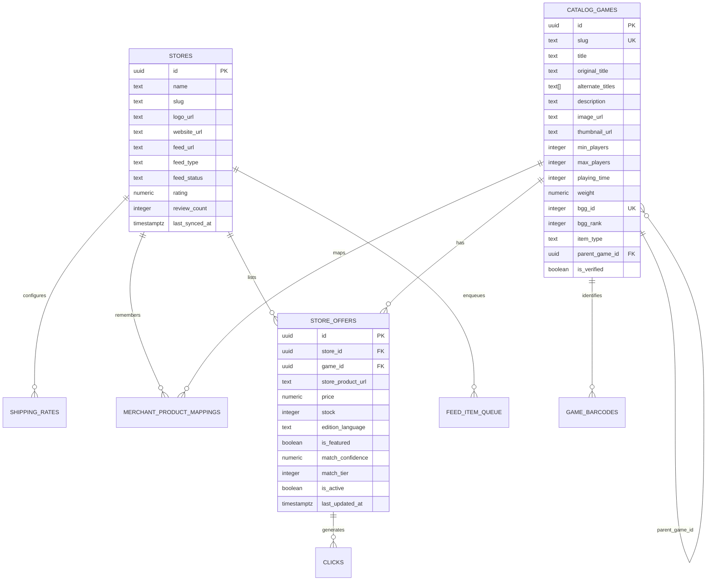
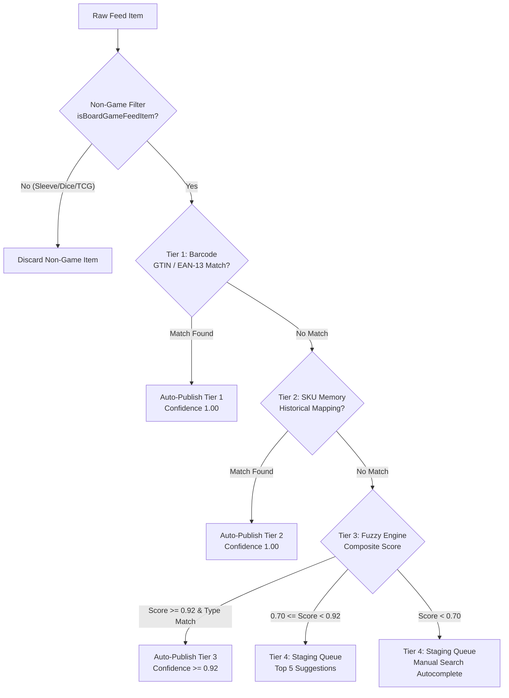
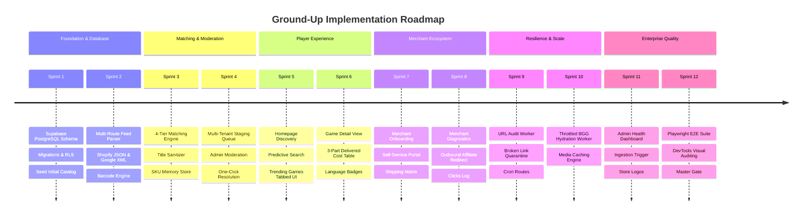

# Ground-Up Rebuild Blueprint & Master Engineering Specification: MeeplePrecios 🇲🇽

> **Author / Role:** Lead Engineering Architect & Principal Product Manager  
> **Target Audience:** Autonomous AI Agents, Senior Full-Stack Engineers & Tabletop E-commerce Integrators  
> **Status:** Authoritative Architectural Blueprint & Canonical Reference  

---

## 1. Executive Summary & System Vision 🎲

### 1.1 Commercial Vision
**MeeplePrecios** is Mexico's premier board game price comparison and catalog discovery engine (`MX` / `$ MXN`). The platform eliminates price fragmentation across the Mexican tabletop market by automatically aggregating, parsing, matching, and ranking real-time inventory and pricing from 50+ verified independent Mexican tabletop stores (e.g., *Ficha y Dado, Mundo Meeple Store, Roll Games, Con T de Tlacuache, Quantum Boardgames, Alfa y Delta, Bundaba, Geeky Stuff, Amukiri, Catito Games*).

### 1.2 Core Value Propositions

| Stakeholder | Core Pain Point | MeeplePrecios Systematic Solution |
| :--- | :--- | :--- |
| **Players (Compradores)** | Hidden shipping costs, price variance up to $1,200 MXN across shops, and language confusion (accidentally buying English instead of Spanish). | **3-part total delivered cost ranking** ($\text{Base Price} + \text{Shipping Fee} = \text{Total Cost (\$ MXN)}$), explicit language badges (`Español (ES)`, `Inglés (EN)`, `Multilingüe (MULTI)`), and zero dead links. |
| **Store Owners (Merchants)** | High marketplace commissions (15–20% on Amazon/Mercado Libre) and prohibitive manual catalog maintenance. | Zero-commission direct traffic, automated inventory sync via Shopify JSON & Google Shopping XML, and a self-service SKU mapping portal. |
| **Platform Admins** | Data drift, unmapped SKUs, dead URLs, and rate-limit bans from external APIs. | Automated 4-tier waterfall matching, a multi-candidate staging queue, background URL audit crons, and throttled BGG hydration. |
| **Autonomous AI Agents** | Ambiguous requirements, brittle schemas, and hallucinated fixes. | Strict canonical contracts, TDD test suites, deterministic database sequencing, and Chrome DevTools visual browser verification. |

### 1.3 The 3-Part Delivered Cost Law
In Mexican tabletop e-commerce, **ranking by list price alone is deceptive**. Domestic shipping ranges from flat fees of \$99 to \$180 MXN, while many stores offer free shipping thresholds between \$1,200 and \$2,000 MXN.
$$\text{Total Delivered Cost} = \text{Base Item Price} + \begin{cases} 0 & \text{if } \text{Base Price} \ge \text{Free Shipping Threshold} \\ \text{Flat Domestic Shipping Fee} & \text{otherwise} \end{cases}$$
All comparison tables, sorting algorithms, and deal badges MUST rank offers strictly by this formula.

### 1.4 Modular Architecture: Core MVP vs. Discrete Extension Projects
MeeplePrecios is divided into a standalone **Core MVP (Project 0)** and **5 discrete extension projects**:
1. **Project 0: Core Tabletop Comparison MVP (The Foundation):** Canonical catalog, initial feed ingestion, core 4-tier matching engine, homepage predictive search, Top 10 BGG / Trending MX tabs, game detail page with 3-part price breakdown, and outbound affiliate redirect (`US-01` to `US-05`, `US-10` to `US-13`, `US-15` to `US-17`, `US-25`).
2. **Project 1: Merchant Self-Serve & Mapping Ecosystem (Extension Alpha):** Store onboarding, flat shipping configuration, self-service SKU mapping portal, and sponsored placement flags (`US-06` to `US-09`, `US-18`).
3. **Project 2: Multi-Tenant Staging & Moderation Queue (Extension Beta):** Staging queue RLS, cross-store admin queue UI, top 5 candidate suggestions, and one-click approvals (`US-14`, `US-19`).
4. **Project 3: Scaled 51-Store Ingestion & Fallbacks (Extension Gamma):** 3-tier multi-route fallback engine (`/products.json` $\to$ category XML $\to$ global XML), 51-store tabletop directory, store logo sync, and live ingestion triggers (`US-23`, `US-24`, `US-26`).
5. **Project 4: Catalog Resilience, URL Audit & Diagnostics (Extension Delta):** Background URL 404 audit worker, throttled BGG metadata hydration worker ($\ge 1,200\text{ ms}$ delay), and admin catalog health dashboard (`US-20`, `US-21`, `US-22`).
6. **Project 5: Tabletop Intelligence & Mobile Experience (Extension Epsilon):** Price drop alerts, historical price charts, mobile camera barcode scanner PWA, and merchant conversion analytics.

---

## 2. Engineering Post-Mortem: Questioning Past Decisions & Critical Lessons 🔍

As an Engineering Lead, a successful rebuild requires ruthlessly dissecting past failures and architectural bottlenecks to design the best possible version.

### 2.1 Critique 1: The BGG ID Integer Dependency Trap
* **What went wrong previously:** The initial database schema used `bgg_id INTEGER PRIMARY KEY` for games and foreign keys. When Mexican stores stocked local independent games, Spanish-only localized games, accessories, or new releases not yet indexed by BoardGameGeek, the ingestion pipeline broke with foreign key violations. The previous fix was an ad-hoc hack: generating synthetic IDs (`bgg_id = 900000 + N`), followed by patching a second `internal_games` table with UUIDs. This caused architectural schizophrenia (some tables joined on `bgg_id`, others on UUID).
* **The Best Version Resolution:** **A Unified Canonical Games Catalog (`catalog_games`).**
  - Primary Key is always `id UUID DEFAULT gen_random_uuid()`.
  - An SEO-friendly `slug TEXT UNIQUE NOT NULL` (e.g. `catan`, `wingspan`, `terraforming-mars`).
  - `bgg_id INTEGER UNIQUE NULL` is an *optional external reference attribute*, indexed for fast lookups.
  - BGG is strictly an asynchronous *enrichment provider*, never an operational bottleneck or database primary key.

### 2.2 Critique 2: In-Memory Mock Repository vs. Production PostgreSQL
* **What went wrong previously:** Portions of the codebase relied on an in-memory repository (`db.ts` with local JavaScript arrays) while other parts targeted Supabase PostgreSQL. This caused state desynchronization, lost mappings on server restarts, and non-scalable memory usage when parsing large feeds.
* **The Best Version Resolution:** **Supabase PostgreSQL as the Single Source of Truth.**
  - All operations run directly against PostgreSQL via Supabase client with strong TypeScript typing and connection pooling.
  - For unit testing in Vitest, use lightweight in-memory SQL or deterministic mock client fixtures that mirror the exact PostgreSQL schema and RLS policies.

### 2.3 Critique 3: Database Write Sequencing & Foreign Key Violations
* **What went wrong previously:** Ingestion workers frequently attempted to insert child offers (`store_offers`) before parent games were persisted to the catalog, throwing foreign key constraint errors.
* **The Best Version Resolution:** **Strict Two-Phase Transactional Flushing:**
  1. *Phase 1 (Parent Entity Resolution):* Normalize incoming feed item titles. Check barcodes and SKU memory. If a new game must be created, insert it into `catalog_games` first and wait for the returned ID.
  2. *Phase 2 (Child Offer Upsert):* Upsert child offers into `store_offers` referencing the guaranteed parent UUID.

### 2.4 Critique 4: Batch Ingestion vs. Loop-Based N+1 Query Timeouts
* **What went wrong previously:** Crawling 50 feeds with 1,000+ items each and executing single SQL queries per variant caused Supabase connection pool exhaustion, HTTP 504 Gateway Timeouts, and sluggish syncs.
* **The Best Version Resolution:** **In-Memory Buffering & Chunked Bulk Upserts.**
  - Parse and map feed items in memory chunks of 200–500 items.
  - Use PostgreSQL `INSERT INTO ... ON CONFLICT (...) DO UPDATE` batch operations.

### 2.5 Critique 5: Shopify Anti-Bot Protection & Cloudflare HTTP 403s
* **What went wrong previously:** Automated scrapers directly requesting `https://<store>/collections/all.atom` frequently encountered HTTP 403 Forbidden or Cloudflare challenge pages.
* **The Best Version Resolution:** **The 3-Tier Multi-Route Fallback Ladder.**
  1. *Route 1 (Primary):* Public Shopify JSON API (`/products.json?limit=250&page=N`). It provides structured JSON, variant-level GTIN barcodes, and multiple image assets without Cloudflare XML blocking.
  2. *Route 2 (Category XML):* `/collections/juegos-de-mesa/all.atom` (Category-filtered Atom XML, avoiding accessories and clothes).
  3. *Route 3 (Global Atom XML):* `/collections/all.atom` with browser-like headers (`User-Agent: Mozilla/5.0...`).

### 2.6 Critique 6: BGG XMLAPI2 Aggressive Rate-Limiting (HTTP 429)
* **What went wrong previously:** Ingestion routines made inline XMLAPI2 calls to BGG during feed ingestion. BGG immediately blocked the server IP with HTTP 429.
* **The Best Version Resolution:** **Asynchronous Throttled Sync Queue.**
  - Feed ingestion NEVER makes real-time external BGG API calls.
  - Missing metadata jobs are enqueued into `bgg_sync_queue`.
  - A dedicated background worker (`/api/cron/process-bgg-queue`) processes the queue with a hard rate-limit delay of $\ge 1,200\text{ ms}$ per request and exponential backoff.

### 2.7 Critique 7: TypeScript Pollution from Next.js Build Artifacts
* **What went wrong previously:** Running custom build scripts that set temporary directories caused Next.js to append `.next-build/types/**/*.ts` to `tsconfig.json`. When deleted, IDEs threw dozens of orphaned type errors.
* **The Best Version Resolution:** Clean, standard Next.js build lifecycle (`next build`), keeping `tsconfig.json` immutable.

---

## 3. Production Database Architecture & Data Contracts 🗄️



### 3.1 PostgreSQL DDL & Production Schemas

```sql
-- Extensions
CREATE EXTENSION IF NOT EXISTS "uuid-ossp";
CREATE EXTENSION IF NOT EXISTS "pg_trgm";
CREATE EXTENSION IF NOT EXISTS "pgcrypto";

-- 1. Merchant Stores Table
CREATE TABLE IF NOT EXISTS public.stores (
  id UUID PRIMARY KEY DEFAULT gen_random_uuid(),
  name TEXT NOT NULL,
  slug TEXT NOT NULL UNIQUE,
  logo_url TEXT,
  website_url TEXT NOT NULL,
  country TEXT NOT NULL DEFAULT 'MX',
  is_domestic BOOLEAN NOT NULL DEFAULT true,
  rating NUMERIC(3,2) DEFAULT 4.85 CHECK (rating >= 0.00 AND rating <= 5.00),
  review_count INTEGER DEFAULT 50 CHECK (review_count >= 0),
  feed_url TEXT,
  feed_type TEXT CHECK (feed_type IN ('google_xml', 'shopify_json', 'shopify_atom')),
  feed_status TEXT DEFAULT 'pending' CHECK (feed_status IN ('pending', 'success', 'error')),
  feed_last_processed_count INTEGER DEFAULT 0,
  feed_last_matched_count INTEGER DEFAULT 0,
  feed_last_synced_at TIMESTAMPTZ,
  created_at TIMESTAMPTZ DEFAULT NOW()
);

-- 2. Shipping Rates Table (Destination Market Normalized)
CREATE TABLE IF NOT EXISTS public.shipping_rates (
  id UUID PRIMARY KEY DEFAULT gen_random_uuid(),
  store_id UUID NOT NULL REFERENCES public.stores(id) ON DELETE CASCADE,
  destination_country TEXT NOT NULL DEFAULT 'MX',
  flat_rate NUMERIC(10,2) NOT NULL DEFAULT 120.00 CHECK (flat_rate >= 0),
  free_shipping_threshold NUMERIC(10,2) DEFAULT 1499.00 CHECK (free_shipping_threshold >= 0),
  created_at TIMESTAMPTZ DEFAULT NOW(),
  UNIQUE(store_id, destination_country)
);

-- 3. Master Catalog Games Table (Unified & Autonomous)
CREATE TABLE IF NOT EXISTS public.catalog_games (
  id UUID PRIMARY KEY DEFAULT gen_random_uuid(),
  slug TEXT NOT NULL UNIQUE,
  title TEXT NOT NULL,
  original_title TEXT,
  alternate_titles TEXT[] DEFAULT '{}',
  description TEXT,
  image_url TEXT,
  thumbnail_url TEXT,
  min_players INTEGER CHECK (min_players >= 1),
  max_players INTEGER CHECK (max_players >= min_players),
  playing_time INTEGER CHECK (playing_time >= 0),
  weight NUMERIC(3,2) CHECK (weight >= 0.00 AND weight <= 5.00),
  bgg_id INTEGER UNIQUE,
  bgg_rank INTEGER,
  search_popularity INTEGER DEFAULT 100,
  item_type TEXT DEFAULT 'boardgame' CHECK (item_type IN ('boardgame', 'expansion', 'accessory', 'spinoff')),
  parent_game_id UUID REFERENCES public.catalog_games(id) ON DELETE SET NULL,
  is_verified BOOLEAN NOT NULL DEFAULT true,
  created_at TIMESTAMPTZ DEFAULT NOW(),
  updated_at TIMESTAMPTZ DEFAULT NOW()
);

-- 4. Multi-Barcode GTIN/EAN Registry (Tier 1 Matcher)
CREATE TABLE IF NOT EXISTS public.game_barcodes (
  id UUID PRIMARY KEY DEFAULT gen_random_uuid(),
  barcode TEXT NOT NULL UNIQUE,
  game_id UUID NOT NULL REFERENCES public.catalog_games(id) ON DELETE CASCADE,
  edition_language TEXT NOT NULL DEFAULT 'es' CHECK (edition_language IN ('es', 'en', 'multi')),
  publisher_name TEXT,
  created_at TIMESTAMPTZ DEFAULT NOW()
);

-- 5. Merchant SKU Mapping Memory (Tier 2 Matcher)
CREATE TABLE IF NOT EXISTS public.merchant_product_mappings (
  id UUID PRIMARY KEY DEFAULT gen_random_uuid(),
  store_id UUID NOT NULL REFERENCES public.stores(id) ON DELETE CASCADE,
  merchant_sku TEXT NOT NULL,
  game_id UUID NOT NULL REFERENCES public.catalog_games(id) ON DELETE CASCADE,
  is_verified BOOLEAN NOT NULL DEFAULT true,
  mapped_at TIMESTAMPTZ DEFAULT NOW(),
  UNIQUE(store_id, merchant_sku)
);

-- 6. Store Inventory & Comparison Offers
CREATE TABLE IF NOT EXISTS public.store_offers (
  id UUID PRIMARY KEY DEFAULT gen_random_uuid(),
  store_id UUID NOT NULL REFERENCES public.stores(id) ON DELETE CASCADE,
  game_id UUID NOT NULL REFERENCES public.catalog_games(id) ON DELETE CASCADE,
  store_product_url TEXT NOT NULL,
  price NUMERIC(10,2) NOT NULL CHECK (price >= 0),
  stock INTEGER NOT NULL DEFAULT 1 CHECK (stock >= 0),
  edition_language TEXT NOT NULL DEFAULT 'es' CHECK (edition_language IN ('es', 'en', 'multi')),
  is_featured BOOLEAN NOT NULL DEFAULT false,
  match_confidence NUMERIC(3,2) DEFAULT 1.00 CHECK (match_confidence >= 0.00 AND match_confidence <= 1.00),
  match_tier INTEGER DEFAULT 1 CHECK (match_tier BETWEEN 1 AND 4),
  is_active BOOLEAN NOT NULL DEFAULT true,
  last_updated_at TIMESTAMPTZ DEFAULT NOW(),
  UNIQUE(store_id, game_id, store_product_url)
);

-- 7. Multi-Candidate Staging Queue (Multi-Tenant Moderation)
CREATE TABLE IF NOT EXISTS public.feed_item_queue (
  id UUID PRIMARY KEY DEFAULT gen_random_uuid(),
  store_id UUID NOT NULL REFERENCES public.stores(id) ON DELETE CASCADE,
  sku TEXT,
  barcode TEXT,
  raw_title TEXT NOT NULL,
  clean_title TEXT NOT NULL,
  price NUMERIC(10,2) NOT NULL DEFAULT 0,
  store_product_url TEXT NOT NULL,
  image_url TEXT,
  status TEXT DEFAULT 'pending' CHECK (status IN ('pending', 'approved', 'rejected')),
  match_confidence NUMERIC(3,2) DEFAULT 0.00,
  suggested_candidates JSONB DEFAULT '[]'::jsonb,
  resolved_game_id UUID REFERENCES public.catalog_games(id) ON DELETE SET NULL,
  created_at TIMESTAMPTZ DEFAULT NOW()
);

-- 8. Outbound Affiliate Clicks Tracking
CREATE TABLE IF NOT EXISTS public.clicks (
  id UUID PRIMARY KEY DEFAULT gen_random_uuid(),
  offer_id UUID REFERENCES public.store_offers(id) ON DELETE SET NULL,
  store_id UUID NOT NULL REFERENCES public.stores(id) ON DELETE CASCADE,
  game_id UUID NOT NULL REFERENCES public.catalog_games(id) ON DELETE CASCADE,
  destination_url TEXT NOT NULL,
  user_ip_hash TEXT,
  user_agent TEXT,
  referrer TEXT,
  clicked_at TIMESTAMPTZ DEFAULT NOW()
);

-- 9. Background BGG Metadata Hydration Queue
CREATE TABLE IF NOT EXISTS public.bgg_sync_queue (
  id UUID PRIMARY KEY DEFAULT gen_random_uuid(),
  game_id UUID NOT NULL REFERENCES public.catalog_games(id) ON DELETE CASCADE,
  bgg_id INTEGER,
  search_query TEXT,
  status TEXT DEFAULT 'pending' CHECK (status IN ('pending', 'processing', 'completed', 'failed')),
  attempts INTEGER DEFAULT 0,
  last_error TEXT,
  created_at TIMESTAMPTZ DEFAULT NOW(),
  updated_at TIMESTAMPTZ DEFAULT NOW()
);

-- Performance Indexes
CREATE INDEX IF NOT EXISTS idx_catalog_games_slug ON public.catalog_games(slug);
CREATE INDEX IF NOT EXISTS idx_catalog_games_bgg_id ON public.catalog_games(bgg_id);
CREATE INDEX IF NOT EXISTS idx_catalog_games_title_trgm ON public.catalog_games USING GIN(title gin_trgm_ops);
CREATE INDEX IF NOT EXISTS idx_game_barcodes_barcode ON public.game_barcodes(barcode);
CREATE INDEX IF NOT EXISTS idx_merchant_mappings_sku ON public.merchant_product_mappings(store_id, merchant_sku);
CREATE INDEX IF NOT EXISTS idx_store_offers_lookup ON public.store_offers(game_id, is_active);
CREATE INDEX IF NOT EXISTS idx_store_offers_store ON public.store_offers(store_id);
CREATE INDEX IF NOT EXISTS idx_feed_queue_lookup ON public.feed_item_queue(store_id, status);
CREATE INDEX IF NOT EXISTS idx_clicks_store_date ON public.clicks(store_id, clicked_at DESC);
```

### 3.2 Row Level Security (RLS) Policies

```sql
-- Enable RLS across all tables
ALTER TABLE public.stores ENABLE ROW LEVEL SECURITY;
ALTER TABLE public.shipping_rates ENABLE ROW LEVEL SECURITY;
ALTER TABLE public.catalog_games ENABLE ROW LEVEL SECURITY;
ALTER TABLE public.game_barcodes ENABLE ROW LEVEL SECURITY;
ALTER TABLE public.merchant_product_mappings ENABLE ROW LEVEL SECURITY;
ALTER TABLE public.store_offers ENABLE ROW LEVEL SECURITY;
ALTER TABLE public.feed_item_queue ENABLE ROW LEVEL SECURITY;
ALTER TABLE public.clicks ENABLE ROW LEVEL SECURITY;
ALTER TABLE public.bgg_sync_queue ENABLE ROW LEVEL SECURITY;

-- Public Read Policies
CREATE POLICY "Public Read Stores" ON public.stores FOR SELECT USING (true);
CREATE POLICY "Public Read Shipping" ON public.shipping_rates FOR SELECT USING (true);
CREATE POLICY "Public Read Catalog" ON public.catalog_games FOR SELECT USING (true);
CREATE POLICY "Public Read Barcodes" ON public.game_barcodes FOR SELECT USING (true);
CREATE POLICY "Public Read Offers" ON public.store_offers FOR SELECT USING (is_active = true);

-- Public Insert for Clicks
CREATE POLICY "Public Click Insertion" ON public.clicks FOR INSERT WITH CHECK (true);

-- Multi-Tenant Feed Item Queue Policies
-- 1. Store Owners can only see and manage their own queue items
CREATE POLICY "Store Owner Queue Isolation" ON public.feed_item_queue
  FOR ALL
  USING (
    store_id = (SELECT (auth.jwt() -> 'app_metadata' ->> 'store_id')::UUID)
  );

-- 2. Platform Admins have full moderation access
CREATE POLICY "Admin Full Queue Access" ON public.feed_item_queue
  FOR ALL
  USING (
    (auth.jwt() -> 'app_metadata' ->> 'role') = 'admin'
  );
```

---

## 4. The 4-Tier Matching Engine & Ingestion Pipeline ⚙️

The 4-tier waterfall matching engine resolves unstructured store feed titles to canonical catalog games with $99.9\%$ precision.



### 4.1 Step 0: Non-Game Pre-Classifier (`isBoardGameFeedItem`)
Mexican board game stores sell thousands of accessories, card protectors, and merchandise. These MUST be excluded before reaching the matching algorithm:
* **Exclusion Keywords (Regex Word Boundaries):**
  `/\b(fundas?|sleeves?|inserto|dice|dados|monedas|playmats?|tapete|deck box|caja protectora|tokens?|sobres?|booster pack|cargador|álbum|album|binder|counter)\b/i`
* **Exception Rule:** If the item title explicitly contains `juego de cartas` or matches a known game named with dice (e.g. *Roll for the Galaxy*, *Dice Throne*), it is preserved.

### 4.2 Step 0.5: Base Game vs. Expansion & Spin-off Classifier
* **Expansion Marker Regex:** `/\b(expansión|expansion|ampliación|extension|extensión|pack de escenario)\b/i`
* **Spin-Off Variant Rule:** Variants such as *Spot It! Catan*, *Dobble Catan*, or *Catan Junior* MUST NOT be grouped into the base *Catan* page. They receive `item_type = 'spinoff'` and unique slug identifiers.
* **Type Parity Guard:** If a feed item is classified as an `expansion` but the candidate match is a `boardgame`, the match is rejected from auto-publishing and sent to the staging queue.

### 4.3 Tier 1: GTIN / EAN-13 Barcode Matcher
* **Speed:** $O(1)$ indexed hash lookup in `public.game_barcodes`.
* **Confidence:** `1.00`.
* **Behavior:** Deterministic match. Bypasses all text normalization.

### 4.4 Tier 2: Merchant SKU Memory Lookup
* **Speed:** $O(1)$ composite index lookup `(store_id, merchant_sku)` in `public.merchant_product_mappings`.
* **Confidence:** `1.00`.
* **Behavior:** Every manual approval or re-mapping by an admin or merchant permanently records the mapping. Daily syncs match on SKU instantly.

### 4.5 Tier 3: Tokenized Fuzzy Matcher Math & Normalization
When barcodes and SKU memory are absent:
1. **Title Sanitization:**
   Remove Mexican retail noise patterns:
   `/\b(juego de mesa|juego base|edición especial|edición en español|edicion espanol|en español|ingles|inglés|preventa|nuevo|original|devir|asmodee|tcg)\b/gi`
   Strip diacritics and special characters, retaining alphanumeric tokens.
2. **Composite Score Formula:**
   $$\text{Score} = (0.50 \times \text{JaroWinkler}) + (0.30 \times \text{TokenOverlap}) + (0.20 \times \text{LevenshteinSimilarity})$$
3. **Penalties:**
   - Standalone keyword mismatch (e.g., feed title contains *Duelo*, *Viaje*, *Big Box*, *Legacy* but catalog title does not): apply $-0.40$ penalty.
   - Token count imbalance: if feed has extra significant words not present in the catalog game, apply $-0.25$ penalty.
4. **Auto-Publish Threshold:** $\text{Score} \ge 0.92$.

### 4.6 Tier 4: Multi-Tenant Staging Queue & Candidate Generation
* For scores between $0.70$ and $0.91$, compute the top 5 highest-scoring candidate games from `catalog_games`.
* Attach candidate payload into `suggested_candidates: [{ game_id, title, confidence, image_url }]`.
* Route to `feed_item_queue`. Merchants resolve their storefront's queue on `/merchant/dashboard`; admins moderate cross-store on `/admin/queue`.

---

## 5. Multi-Route Store Ingestion & Feed Registry 🌐

### 5.1 The 3-Tier Multi-Route Fallback Algorithm
```ts
export async function fetchStoreFeedWithFallback(storeDomain: string, primaryRoute: string) {
  const routes = [
    `${storeDomain}/products.json?limit=250`,
    `${storeDomain}/collections/juegos-de-mesa/all.atom`,
    primaryRoute
  ];

  for (const route of routes) {
    try {
      const res = await fetch(route, {
        headers: {
          'User-Agent': 'Mozilla/5.0 (Macintosh; Intel Mac OS X 10_15_7) AppleWebKit/537.36...',
          'Accept': 'application/json, application/atom+xml, text/xml, */*'
        }
      });
      if (!res.ok) continue;
      const text = await res.text();
      const items = text.startsWith('{') 
        ? parseShopifyJson(JSON.parse(text)) 
        : parseAtomXml(text);
      if (items.length > 0) return { ok: true, route, items };
    } catch {}
  }
  return { ok: false, items: [] };
}
```

### 5.2 Canonical Mexican Store Registry Sample

| Store Name | Slug | Primary Feed Route | Flat Shipping (MXN) | Free Shipping Threshold (MXN) |
| :--- | :--- | :--- | :---: | :---: |
| **Ficha y Dado** | `ficha-y-dado` | `https://fichaydado.com/products.json` | $110.00 | $1,399.00 |
| **Mundo Meeple Store** | `mundo-meeple` | `https://mundomeeplestore.com/products.json` | $120.00 | $1,499.00 |
| **Roll Games** | `roll-games` | `https://rollgames.mx/products.json` | $99.00 | $1,299.00 |
| **Con T de Tlacuache** | `con-t-de-tlacuache` | `https://tdetlacuache.com/products.json` | $115.00 | $1,500.00 |
| **Quantum Boardgames** | `quantum-boardgames`| `https://quantumboardgames.com/products.json` | $130.00 | $1,600.00 |
| **Alfa y Delta** | `alfa-y-delta` | `https://alfaydelta.com/products.json` | $125.00 | $1,400.00 |
| **Bundaba** | `bundaba` | `https://bundaba.com.mx/products.json` | $105.00 | $1,200.00 |
| **Geeky Stuff** | `geeky-stuff` | `https://geekystuff.com.mx/products.json` | $120.00 | $1,500.00 |

---

## 6. Complete REST API Specifications 🔌

| Endpoint | Method | Scope | Payload / Parameters | Success Response (200/201) | Purpose |
| :--- | :--- | :--- | :--- | :--- | :--- |
| `/api/search` | `GET` | Public | `?q=catan&language=es&limit=20` | `{ games: CatalogGame[], total: number }` | Real-time predictive search across games catalog |
| `/api/games/[slug]` | `GET` | Public | None | `{ game: CatalogGame, offers: CalculatedOffer[] }` | Full game details and sorted 3-part price comparison |
| `/api/redirect` | `GET` | Public | `?offer_id=uuid&url=https...` | HTTP 302 Redirect with UTM parameters | Affiliate tracking and safe merchant redirection |
| `/api/merchant/onboard` | `POST` | Merchant | `{ name, website_url, feed_url, flat_rate, free_shipping_threshold }` | `{ success: true, store_id: UUID }` | Self-serve merchant onboarding |
| `/api/merchant/queue` | `GET` | Merchant | `?store_id=UUID` | `{ items: QueueItem[] }` | Fetch pending queue items for authenticated store |
| `/api/merchant/queue/resolve` | `POST` | Merchant | `{ queue_id, action: 'approve'\|'remap'\|'reject', game_id }` | `{ success: true }` | Map feed item to catalog game and record SKU memory |
| `/api/admin/stores` | `GET` | Admin | None | `{ stores: StoreWithDiagnostics[] }` | Admin store health, error rates, and sync triggers |
| `/api/admin/queue` | `GET` | Admin | `?status=pending&page=1` | `{ items: QueueItem[], total: number }` | Cross-store moderation staging queue |
| `/api/cron/sync-feeds` | `POST` | `CRON_SECRET` | Header `Authorization: Bearer <SECRET>` | `{ processed: number, new_offers: number }` | Daily scheduled store feed synchronization |
| `/api/cron/process-bgg-queue`| `POST` | `CRON_SECRET` | Header `Authorization: Bearer <SECRET>` | `{ hydrated: number, errors: number }` | Throttled background BGG enrichment worker |
| `/api/cron/audit-urls` | `POST` | `CRON_SECRET` | Header `Authorization: Bearer <SECRET>` | `{ audited: number, quarantined: number }` | Periodic HTTP 404/500 dead link quarantine worker |

---

## 7. Frontend Architecture, UI Tokens & Cognitive UX 🎨

### 7.1 Visual Tokens & Color Palette
The design system reflects the warmth of tabletop gaming with high-contrast accessibility:

| Token Name | Hex Code | Tailwind Equivalent | Semantic Purpose |
| :--- | :--- | :--- | :--- |
| **Blanco roto** | `#F5F0E9` | `bg-[#F5F0E9]` | Global application background (warm, paper-like) |
| **Carbón suave** | `#3A3A3A` | `text-[#3A3A3A]` | Typography, headers, dark UI elements |
| **Malva suave** | `#8367C7` | `bg-[#8367C7] text-white` | Primary action buttons, active navigation states |
| **Turquesa pastel** | `#73D8D4` | `bg-[#73D8D4]/20 text-[#207572]` | Badges, stock indicators, secondary accents |
| **Coral deslavado** | `#FF9E8A` | `bg-[#FF9E8A]/25 text-rose-950` | Best price highlights, special deal banners |

### 7.2 Google Sentence Case Mandate
All user-facing text, page titles, table headers, buttons, and badges MUST strictly follow sentence case.
- ✅ Correct: *Comparativa de precios*, *Mejor precio actual*, *Ir a la tienda*, *Añadir tienda*
- ❌ Incorrect: *Comparativa De Precios*, *MEJOR PRECIO ACTUAL*, *Ir A La Tienda*

### 7.3 Accessible Tactile Switch Standard
All boolean filters (e.g. "Solo tiendas nacionales", "Solo en stock") MUST render semantic switches:
```tsx
<label className="flex items-center gap-2 cursor-pointer">
  <input 
    type="checkbox" 
    role="switch" 
    aria-checked={checked} 
    checked={checked}
    onChange={(e) => onChange(e.target.checked)}
    className="sr-only peer"
  />
  <div className="w-11 h-6 bg-gray-200 peer-checked:bg-[#8367C7] rounded-full transition-colors relative after:content-[''] after:absolute after:top-0.5 after:left-[2px] after:bg-white after:border-gray-300 after:border after:rounded-full after:h-5 after:w-5 after:transition-all peer-checked:after:translate-x-full peer-checked:after:border-white" />
  <span className="text-sm font-medium text-[#3A3A3A]">Solo tiendas nacionales</span>
</label>
```

### 7.4 Explicit Edition & Language Badges
Every offer in the comparison table MUST render a high-contrast badge:
* `Español (ES)`: `bg-amber-100 text-amber-900 border border-amber-300`
* `Inglés (EN)`: `bg-blue-100 text-blue-900 border border-blue-300`
* `Multilingüe (MULTI)`: `bg-purple-100 text-purple-900 border border-purple-300`

---

## 8. Automated Testing, Verification Gates & DevTools Browser QA 🧪

### 8.1 Test-Driven Development (TDD) Workflow
1. Write failing unit/integration tests in `src/__tests__/` before writing production code.
2. Implement the minimal logic to make tests pass.
3. Run unit tests: `npm run test`.
4. Run end-to-end tests: `npm run test:e2e`.

### 8.2 Compulsory DevTools for Agents Browser Verification
Before declaring any task, route, or feature complete, agents MUST visually and interactively audit `http://localhost:3001` using Chrome DevTools MCP tools:
1. `navigate_page({ url: "http://localhost:3001" })`
2. `wait_for({ selector: "h1" })`
3. `take_snapshot({})` to verify the accessibility tree and interactive element UIDs.
4. `click({ uid: "..." })` to test search bars, filters, and modals.
5. `take_screenshot({ filePath: "public/qa_audit.png" })` to visually verify layout tokens and responsiveness.
6. `list_console_messages({})` to ensure zero React hydration warnings or uncaught JavaScript exceptions exist.

### 8.3 The Verification Gate (`npm run verify`)
The repository includes a single meta-verification command:
```bash
npm run verify # Runs: npm run lint && npm run test && next build
```
Any PR or ground-up milestone must achieve 100% green status on this gate.

---

## 9. Ground-Up Execution Roadmap (Sprints 1–12) 🚀



### Sprint Breakdown & Deliverables

#### Sprint 1: Unified Database Setup & RLS DDL
* **Goal:** Initialize PostgreSQL with UUID canonical catalog, multi-barcode tables, and RLS policies.
* **Acceptance Criteria:** `catalog_games`, `stores`, `shipping_rates`, `game_barcodes`, `store_offers`, and `feed_item_queue` tables created with zero foreign key sequence errors.

#### Sprint 2: Multi-Route Feed Parser & Pre-Classifier
* **Goal:** Implement Shopify JSON, Atom XML, and Google Shopping parsers with the 3-route fallback ladder.
* **Acceptance Criteria:** Successfully parses product lists from live store endpoints and discards non-game accessories (sleeves, dice, playmats).

#### Sprint 3: The 4-Tier Waterfall Matching Engine
* **Goal:** Implement barcode lookup, SKU memory, and tokenized fuzzy similarity scoring with title sanitization.
* **Acceptance Criteria:** Test suite in `matching-engine.test.ts` passes with $\ge 99\%$ accuracy on canonical test cases (e.g. Catan base vs expansions, spin-offs like Dobble Catan).

#### Sprint 4: Multi-Tenant Staging Queue & Candidate Suggestion Engine
* **Goal:** Route ambiguous items ($0.70 \dots 0.91$) to the queue with top 5 suggested candidates.
* **Acceptance Criteria:** Merchants see only their own storefront items; admins see cross-store items. One-click resolution records SKU memory.

#### Sprint 5: Homepage & Predictive Search Bar
* **Goal:** Build the player landing page with tabbed BGG Top 10 / Trending in Mexico and responsive predictive search.
* **Acceptance Criteria:** Search queries return instant results filtered by Spanish and English availability. Google sentence case strictly applied.

#### Sprint 6: Game Detail Page & 3-Part Delivered Price Table
* **Goal:** Implement `/game/[slug]` with box art header, typographic stats, language badges, and delivered price calculation.
* **Acceptance Criteria:** Offers sorted strictly by delivered price ($\text{Base} + \text{Shipping}$). Domestic store toggle implements accessible `role="switch"`.

#### Sprint 7: Merchant Self-Service Onboarding & Shipping Matrix
* **Goal:** Build `/merchant/onboard` and `/merchant/shipping`.
* **Acceptance Criteria:** Store owners can configure flat shipping rates and free shipping thresholds in MXN.

#### Sprint 8: Outbound Affiliate Redirect Engine & Diagnostics
* **Goal:** Build `/api/redirect` with UTM tracking and asynchronous click logging.
* **Acceptance Criteria:** Clicking "Ir a la tienda" logs a click to `public.clicks` and redirects browser via HTTP 302.

#### Sprint 9: Automated URL Audit & Dead Link Quarantine Worker
* **Goal:** Implement `/api/cron/audit-urls`.
* **Acceptance Criteria:** Background worker pings offer URLs and automatically sets `is_active = false` on HTTP 404/500 responses.

#### Sprint 10: Asynchronous BGG Metadata Hydration Worker
* **Goal:** Implement `/api/cron/process-bgg-queue`.
* **Acceptance Criteria:** Throttled worker fetches missing player count, weight, and high-res cover art with a $\ge 1,200\text{ ms}$ inter-request delay.

#### Sprint 11: Admin Health Dashboard & Real Store Directory
* **Goal:** Build `/admin/diagnostics` and `/admin/stores` with real store brand logos and manual re-sync buttons.
* **Acceptance Criteria:** Displays live feed error rates, total active offers, and broken link statistics.

#### Sprint 12: Comprehensive QA, Playwright E2E & DevTools Audit
* **Goal:** Run complete test suites and visual browser checks.
* **Acceptance Criteria:** Vitest test suite 100% green, Playwright E2E passing, Chrome DevTools visual audit verified on `http://localhost:3001`, and `npm run verify` passing.

---

## 10. Rules of Engagement for Future AI Agents 🤖

1. **Quarantine Compliance:** NEVER inspect, read, search (`grep`, `view_file`), copy, or import files from `legacy/`.
2. **Canonical Indexing:** NEVER reference deprecated GitHub issue numbers. Refer exclusively to the User Story index (`US-01` through `US-26`) and this blueprint.
3. **Root Cause Diagnosis:** When fixing bugs, diagnose the fundamental upstream cause and document:
   - Why the issue happened.
   - How the systematic code solution resolves it permanently.
4. **Sentence Case Enforcement:** Every button, heading, and badge must use Google sentence case.
5. **Browser QA Sign-Off:** Never declare a feature done without running DevTools for Agents on `http://localhost:3001` and inspecting console logs.

