# Master specification and ground-up implementation blueprint: MeeplePrecios 🇲🇽

> [!IMPORTANT]
> **Monolithic All-in-One Ground-Up Blueprint:** For the complete, 100% self-contained engineering blueprint containing all schemas, configurations, agent skills, matching math, 51-store registry, and 12-sprint execution guide, see [COMPLETE_GROUND_UP_SPECIFICATION.md](file:///Users/joseluiszapata/Documents/GitHub/elmeeple-stores/COMPLETE_GROUND_UP_SPECIFICATION.md) and [GROUND_UP_REBUILD_BLUEPRINT.md](file:///Users/joseluiszapata/Documents/GitHub/elmeeple-stores/GROUND_UP_REBUILD_BLUEPRINT.md).
>
> **Specification Purpose:** This document is the definitive, pure functional blueprint for constructing **MeeplePrecios**, Mexico's board game price comparison engine, from the ground up. It defines the commercial requirements, database schemas, Row-Level Security (RLS) policies, REST API contracts, 4-tier waterfall matching algorithms, UI design system tokens, and acceptance criteria. It focuses strictly on *what* the system must achieve, giving any future developer or AI agent complete freedom to choose their preferred file organization, framework structure, and component architecture.

---

## 1. Executive summary and core purpose 🎲

### 1.1 Commercial vision
**MeeplePrecios** is the primary tabletop price comparison engine for Mexico (`MX` / `$ MXN`). The platform aggregates real-time inventory, pricing, and shipping data from independent Mexican board game e-commerce stores (for example, *Ficha y Dado, Mundo Meeple Store, Roll Games, Con T de Tlacuache, Quantum Boardgames, Alfa y Delta, Bundaba*).

### 1.2 Core value proposition
- **For Players:** Eliminates price and stock fragmentation by providing a single portal that ranks store offers by **3-part total delivered cost** ($\text{Base Price} + \text{Shipping} = \text{Total Cost (\$ MXN)}$) with explicit language and edition badges (`Español (ES)`, `Inglés (EN)`, `Multilingüe (MULTI)`).
- **For Store Owners (Merchants):** Drives high-intent organic and affiliate checkout traffic without manual listing maintenance by automatically syncing Google Shopping XML and Shopify JSON feeds, backed by self-service mapping override tools.

### 1.3 Mandatory engineering & debugging directive: Root cause diagnosis
> [!IMPORTANT]
> **Root Cause Diagnosis & Communication Mandate:** Every time an issue, bug, broken link, or failing route is reported, developers and AI agents MUST NOT apply superficial patches, hide errors, or return fallback placeholders. The system implementation MUST resolve the fundamental root cause and explicitly document:
> 1. **Why the issue occurred:** Trace the upstream data provider, schema mismatch, or parsing flaw.
> 2. **How the fix resolves it:** Implement a systematic, robust code solution that prevents recurrence.

---

## 2. Target personas and user journeys 👥

### 2.1 Persona 1: The Mexican board game buyer (Player / Comprador)
* **Demographics:** Board game enthusiasts, casual gamers, and collectors across Mexico (CDMX, Guadalajara, Monterrey, Puebla).
* **Primary Goals:**
  1. Locate specific games in stock at the lowest total delivered cost in Mexican Pesos ($ MXN).
  2. Differentiate between Spanish (`ES`) and English (`EN`) editions.
  3. Ensure that clicking an offer leads directly to the merchant product page without broken links or expansion mis-attributions.
* **Key User Journey:**
  `Homepage (Search / BGG Hotness) -> Game Detail Page -> Compare Total Delivered Costs -> Click "Ir a la tienda" -> Affiliate Checkout Redirect`

### 2.2 Persona 2: The independent store partner (Merchant / Socio)
* **Demographics:** Owners and e-commerce managers of independent Mexican tabletop shops.
* **Primary Goals:**
  1. Increase online sales and customer acquisition without paying marketplace commission fees.
  2. Keep stock and price listings in sync automatically without manual data entry.
  3. Access a self-service SKU mapping portal to map unmatched feed products directly to BGG IDs.
  4. Feature store deals (sponsored placements) to gain top visibility on high-demand games.
* **Key User Journey:**
  `Merchant Portal -> Register Store & Flat Shipping Rates in MXN -> Submit Feed URL -> Map Unmatched SKUs -> View Diagnostics`

### 2.3 Persona 3: The platform administrator (Admin)
* **Primary Goals:**
  1. Monitor merchant feed health, failed fetch logs, and un-indexed BoardGameGeek (BGG) queue items.
  2. Review medium-confidence feed items in the **Admin Staging Queue** and approve/re-map candidates with live BGG autocomplete.
  3. Verify new merchant registrations and manage sponsored placement flags.
  4. Trigger automated catalog audits to purge broken links and mis-attributed expansions.

### 2.4 Persona 4: The autonomous AI developer (Agent persona)
* **Primary Goals:**
  1. Execute feature requests using test-driven development (TDD), atomic user stories, and single-persona branch isolation.
  2. Enforce Google sentence case governance, brand visual tokens, and tactile switch components.
  3. Run full verification gates (`npm run verify`) before merging pull requests.

---

## 3. Comprehensive user stories inventory 📜

> [!NOTE]
> **Canonical User Story Index:** All previous GitHub issue numbers (e.g. Issues #1 through #209) are DEPRECATED and MUST NOT be referenced or cited. Features in this project are identified exclusively by the canonical User Story index below (`US-01` through `US-26`).

### Epic A: Discovery and comparison (Player persona)
- **[US-01] Homepage Search and Hotness:** `As a Player, I want to search for board games on the homepage or view live BGG Hotness trends, so that I can quickly locate games available in Mexico.`
- **[US-02] Hero Comparative UI:** `As a Player, I want to see a full-width box art header, typographic stats, and a 3-part price comparison table on /game/[slug], so that I can evaluate total delivered costs at a glance.`
- **[US-03] Explicit Language Badges:** `As a Player, I want store offers to display clear language badges (Español (ES), Inglés (EN), Multilingüe (MULTI)), so that I don't accidentally buy a game in a language I don't want.`
- **[US-04] Direct Affiliate Checkout:** `As a Player, I want clicking "Ir a la tienda" to redirect me to the store's exact product page with UTM tracking, so that I can complete my purchase immediately.`
- **[US-05] Spin-Off Game Variant Cataloging:** `As a Player, I want spin-off variants like Spot It! Catan or Dobble Catan to be cataloged as distinct game entries rather than merged into base game pages, so that I can view accurate price comparisons for both base games and spin-offs independently.`
- **[US-25] BGG Top 10 & Most Searched Tabbed Landing UI:** `As a Player, I want tabbed switching on the homepage between the BGG Top 10 games and the most searched games in Mexico, so that I can discover top-rated global titles and trending local tabletop games effortlessly.`

### Epic B: Merchant self-serve portal (Merchant persona)
- **[US-06] Merchant Onboarding:** `As a Store Owner, I want to register my storefront name, logo, and XML/JSON feed URL on /merchant/onboard, so that my inventory is automatically listed on MeeplePrecios.`
- **[US-07] Shipping Rate Matrix:** `As a Store Owner, I want to set my flat-rate domestic shipping fee and free shipping threshold in MXN, so that player total cost calculations are accurate.`
- **[US-08] Sponsored Placement Toggles:** `As a Store Owner, I want to toggle sponsored featuring for my store on /merchant/dashboard, so that my offers appear at the top of comparison tables with a "★ Tienda recomendada" badge.`
- **[US-09] Merchant Self-Service Feed Mapping Portal:** `As a Store Owner, I want a self-service product mapping portal on /merchant/dashboard to view unmatched feed items and bind them to canonical game IDs, so that I can maximize my catalog coverage on MeeplePrecios.`
- **[US-18] Store-Isolated Candidate Suggestion Staging Queue:** `As a Store Owner, I want to see a list of top candidate game suggestions for my store's unmatched feed items on /merchant/dashboard and bind them with one click, so that I can quickly resolve feed ambiguities for my own storefront.`
- **[US-23] Extended Mexican Tabletop Store Directory Expansion:** `As a Player, I want MeeplePrecios to aggregate offers from 50+ verified Mexican tabletop stores (including Geeky Stuff, 2 Tomatoes MX, Amukiri, Avalon Store, Catito Games, Demon Juegos, Día D Juegos, Eximia Games, GameSmart, Hobbiton Games, La Casa de la Educadora, La Mazmorra, Meeple Planet, Otter Space, Tablerazo, etc.), so that I have 100% complete coverage of board game pricing and stock across Mexico.`
- **[US-26] Automated Store Feed Ingestion & Merchant Admin Portal:** `As an Admin and Store Owner, I want an admin store settings portal on /admin/stores to manage store logos, flat shipping rates, free shipping thresholds, and feed URLs, view live ingestion data and mismatch statistics, and trigger real-time multi-route feed ingestion across all 51 stores, so that the platform displays 100% live real data with store brand logos.`

### Epic C: Ingestion, barcode registry & catalog integrity (Developer / Admin persona)
- **[US-10] Multi-Format Feed Processing:** `As a Developer, I want feed ingestion to parse both Shopify JSON and Google Shopping XML feeds, so that all Mexican stores can be integrated without custom scrapers.`
- **[US-11] EAN/GTIN Multi-Barcode Registry Table:** `As a Developer, I want a dedicated EAN/GTIN multi-barcode registry table (public.game_barcodes) linking barcodes to game editions and canonical game IDs, so that feed ingestion achieves 100% deterministic matching without string ambiguities.`
- **[US-12] Historical Merchant SKU Mapping Memory Table:** `As a Developer, I want a historical merchant SKU mapping memory table (public.merchant_product_mappings), so that manual merchant and admin re-mappings permanently persist across daily automated feed re-syncs.`
- **[US-13] 4-Tier Waterfall Feed Matching Engine:** `As a Developer, I want a 4-tier waterfall matching engine (EAN Barcode -> SKU Memory -> Tokenized Fuzzy Match -> Manual Queue) with confidence scoring (>=0.92 auto-publish, 0.70-0.91 queue), so that product ingestion operates with 99.9% accuracy.`
- **[US-14] Admin Staging and Moderation Queue UI:** `As an Admin, I want a staging queue UI on /admin/queue for medium-confidence feed items (confidence 0.70 to 0.91), so that I can review, approve, or re-map uncertain catalog matches across all stores.`
- **[US-15] Independent Internal Game Catalog & XML Media Persistence:** `As a Developer, I want an internal master game catalog table (public.catalog_games) that extracts and persists game metadata, box art images, and media directly from store XML/JSON feeds independently of third-party BGG APIs, so that catalog integrity is self-contained and resilient.`
- **[US-16] Automated Non-Game Feed Classifier:** `As a Developer, I want an automated XML/JSON feed classifier to identify and exclude non-game merchandise (sleeves, playmats, dice, TCG booster packs, deck boxes) during ingestion before matching, so that non-game noise never pollutes the comparison engine.`
- **[US-17] Base Game & Expansion Entity Classification:** `As a Developer, I want XML feed items to be automatically classified as either base games or expansions and linked to parent game entities during ingestion, so that base games and expansion offers are cataloged cleanly.`
- **[US-19] Multi-Tenant Store & Admin Queue Authorization (RLS):** `As a Developer, I want Supabase RLS policies and API access controls on the staging queue to restrict store owners to their own store's pending queue items while granting admins full cross-store queue moderation capabilities, so that store data privacy and administrative control are enforced.`
- **[US-24] Multi-Route Shopify Feed Fallback Engine:** `As a Developer, I want automated feed ingestion to attempt secondary multi-route fallbacks (/products.json and /collections/juegos-de-mesa/all.atom) when primary /collections/all.atom requests return HTTP 403/404 or non-XML responses, so that catalog coverage increases automatically for protected stores.`

### Epic D: Automated catalog auditing, resilience & admin health monitoring (Developer / Admin persona)
- **[US-20] Automated Catalog Broken Link & Redirect Audit Worker:** `As an Admin, I want an automated background audit route on /api/cron/audit-urls to periodically verify store product URLs, detect broken links or HTTP 404/500 errors, and flag or un-list inactive store offers, so that players never encounter dead links.`
- **[US-21] Automated BGG Metadata Hydration Worker:** `As a Developer, I want a background sync route on /api/cron/process-bgg-queue to throttled-fetch missing BGG metadata, weight, player counts, and high-res cover images for internal catalog items, so that game pages stay enriched with complete specifications.`
- **[US-22] Admin Catalog Health & Feed Diagnostics Dashboard:** `As an Admin, I want a comprehensive catalog health and feed sync diagnostics dashboard on /admin/diagnostics displaying feed error rates, total active offers, broken link counts, and manual feed re-sync triggers, so that platform stability and store feed integrity can be monitored in real time.`

---

## 4. System architecture & data contract specification 🛠️

```mermaid
flowchart TD
    subgraph Frontend["Presentation Layer"]
        UI["User Interface Components"]
        Theme["Brand Tokens & Styling"]
    end

    subgraph CoreEngine["4-Tier Matching Engine & Core Services"]
        Tier1["Tier 1: EAN / GTIN Barcode Matcher"]
        Tier2["Tier 2: Historical SKU Memory Lookup"]
        Tier3["Tier 3: Tokenized Fuzzy Match & Subtitle Isolator"]
        Tier4["Tier 4: Staging Queue & Merchant Override Portal"]
        FeedParser["Multi-Format Feed Parser<br/>(Shopify JSON & Google Atom XML)"]
        LanguageDetector["Language & Publisher Engine"]
        AuditWorker["Automated Catalog Audit Worker"]
        RedirectEngine["Outbound Affiliate Redirect Engine"]
    end

    subgraph DataLayer["Persistence Layer (PostgreSQL / Supabase)"]
        StoresDB[("stores Table")]
        ShippingDB[("shipping_rates Table")]
        CatalogGames[("catalog_games Table")]
        GameBarcodes[("game_barcodes Table")]
        MerchantMappings[("merchant_product_mappings Table")]
        StoreOffers[("store_offers Table")]
        ClicksLog[("clicks Table")]
        FeedQueue[("feed_item_queue Table")]
        BggSyncQueue[("bgg_sync_queue Table")]
        IngestionJobs[("ingestion_jobs Table")]
    end

    Frontend -->|Queries & Actions| CoreEngine
    CoreEngine -->|Reads / Writes| DataLayer
```



### 4.1 Required environment configuration
```ini
# Database Configuration
NEXT_PUBLIC_SUPABASE_URL=http://localhost:54321
NEXT_PUBLIC_SUPABASE_ANON_KEY=your-supabase-anon-key
SUPABASE_SERVICE_ROLE_KEY=your-supabase-service-role-key

# Authentication Configuration
NEXTAUTH_SECRET=fallback-secret-for-development-and-tests
NEXTAUTH_URL=http://localhost:3001

# Cron Authorization Secret
CRON_SECRET=your-secure-cron-secret-token
```

### 4.2 Core data contracts
```ts
export interface Store {
  id: string;
  name: string;
  slug: string;
  logo_url?: string | null;
  website_url: string;
  country: string;
  is_domestic: boolean;
  rating?: number;
  review_count?: number;
  feed_url?: string | null;
  feed_type?: 'google_xml' | 'shopify_json' | 'shopify_atom';
  feed_status?: 'pending' | 'success' | 'failed';
  feed_last_processed_count?: number;
  feed_last_matched_count?: number;
  feed_last_synced_at?: string | null;
  promo_code?: string | null;
}

export interface ShippingRate {
  id?: string;
  store_id: string;
  destination_country: string;
  flat_rate: number;
  free_shipping_threshold?: number | null;
}

export interface CatalogGame {
  id: string;
  slug: string;
  title: string;
  original_title?: string | null;
  alternate_titles?: string[];
  description?: string | null;
  image_url?: string | null;
  thumbnail_url?: string | null;
  min_players?: number | null;
  max_players?: number | null;
  playing_time?: number | null;
  weight?: number | null;
  bgg_id?: number | null;
  bgg_rank?: number | null;
  search_popularity?: number;
  item_type?: 'boardgame' | 'expansion' | 'accessory' | 'spinoff';
  parent_game_id?: string | null;
  is_verified: boolean;
}

export interface StoreOffer {
  id: string;
  store_id: string;
  game_id: string;
  store_product_url: string;
  price: number;
  stock: number;
  edition_language: 'es' | 'en' | 'multi';
  is_featured: boolean;
  match_confidence: number;
  match_tier: number;
  is_active: boolean;
  last_updated_at?: string;
}

export interface IngestionJob {
  id: string;
  store_id: string;
  status: 'pending' | 'processing' | 'completed' | 'failed';
  items_processed: number;
  items_matched: number;
  error_log?: string | null;
  started_at?: string | null;
  completed_at?: string | null;
}
```

### 4.3 Recommended full-stack TypeScript tech stack
* **Framework:** Next.js (App Router, React 19, TypeScript). Combines React Server Components (RSC) for zero-bundle server rendering with Server Actions for direct form mutations and Route Handlers for background ingestion crons and redirects.
* **Persistence & Auth:** Supabase (Managed PostgreSQL 15+). Leverages `pg_trgm` for instant trigram fuzzy searching, `pgcrypto` for UUID generation, and Row-Level Security (RLS) for multi-tenant merchant data isolation.
* **Styling & Design System:** Tailwind CSS v4 configured with MeeplePrecios brand tokens (`Blanco roto #F5F0E9`, `Carbón suave #3A3A3A`, `Malva suave #8367C7`, `Turquesa pastel #73D8D4`, `Coral deslavado #FF9E8A`).
* **Testing & Verification:** Vitest for rapid ESM unit testing, Playwright for end-to-end browser journeys, and Chrome DevTools MCP for visual rendering and console audits.

---

## 5. Production database DDL, integrity constraints & RLS specification 🗄️

### 5.1 Expert database design & SQL DDL

```sql
-- Extensions Setup (Enables Fast Trigram Fuzzy Searching & Cryptographic UUIDs)
CREATE EXTENSION IF NOT EXISTS "uuid-ossp";
CREATE EXTENSION IF NOT EXISTS "pg_trgm";
CREATE EXTENSION IF NOT EXISTS "pgcrypto";

-- Table 1: Merchant Stores
CREATE TABLE IF NOT EXISTS public.stores (
  id UUID PRIMARY KEY DEFAULT gen_random_uuid(),
  name TEXT NOT NULL,
  slug TEXT NOT NULL UNIQUE,
  logo_url TEXT,
  website_url TEXT NOT NULL,
  country TEXT NOT NULL DEFAULT 'MX',
  is_domestic BOOLEAN NOT NULL DEFAULT true,
  rating NUMERIC(3,2) DEFAULT 4.85 CHECK (rating >= 0.00 AND rating <= 5.00),
  review_count INTEGER DEFAULT 50 CHECK (review_count >= 0),
  feed_url TEXT,
  feed_type TEXT CHECK (feed_type IN ('google_xml', 'shopify_json', 'shopify_atom')),
  feed_status TEXT DEFAULT 'pending' CHECK (feed_status IN ('pending', 'success', 'failed')),
  feed_last_processed_count INTEGER DEFAULT 0 CHECK (feed_last_processed_count >= 0),
  feed_last_matched_count INTEGER DEFAULT 0 CHECK (feed_last_matched_count >= 0),
  feed_last_synced_at TIMESTAMPTZ,
  promo_code TEXT,
  created_at TIMESTAMPTZ DEFAULT NOW()
);

-- Table 2: Shipping Rates (1-to-Many Normalized per Destination Market)
CREATE TABLE IF NOT EXISTS public.shipping_rates (
  id UUID PRIMARY KEY DEFAULT gen_random_uuid(),
  store_id UUID NOT NULL REFERENCES public.stores(id) ON DELETE CASCADE,
  destination_country TEXT NOT NULL DEFAULT 'MX',
  flat_rate NUMERIC(10,2) NOT NULL DEFAULT 120.00 CHECK (flat_rate >= 0),
  free_shipping_threshold NUMERIC(10,2) DEFAULT 1499.00 CHECK (free_shipping_threshold >= 0),
  created_at TIMESTAMPTZ DEFAULT NOW(),
  UNIQUE(store_id, destination_country)
);

-- Table 3: Master Canonical Games Catalog (BGG-Independent Entity Store) [US-15]
CREATE TABLE IF NOT EXISTS public.catalog_games (
  id UUID PRIMARY KEY DEFAULT gen_random_uuid(),
  slug TEXT NOT NULL UNIQUE,
  title TEXT NOT NULL,
  original_title TEXT,
  alternate_titles TEXT[] DEFAULT '{}',
  description TEXT,
  image_url TEXT,
  thumbnail_url TEXT,
  min_players INTEGER CHECK (min_players >= 1),
  max_players INTEGER CHECK (max_players >= min_players),
  playing_time INTEGER CHECK (playing_time >= 0),
  weight NUMERIC(3,2) CHECK (weight >= 0.00 AND weight <= 5.00),
  bgg_id INTEGER UNIQUE,
  bgg_rank INTEGER,
  search_popularity INTEGER DEFAULT 100,
  item_type TEXT DEFAULT 'boardgame' CHECK (item_type IN ('boardgame', 'expansion', 'accessory', 'spinoff')),
  parent_game_id UUID REFERENCES public.catalog_games(id) ON DELETE SET NULL,
  is_verified BOOLEAN NOT NULL DEFAULT true,
  created_at TIMESTAMPTZ DEFAULT NOW(),
  updated_at TIMESTAMPTZ DEFAULT NOW()
);

-- Table 4: Multi-Barcode GTIN/EAN Registry (Tier 1 Matcher) [US-11]
CREATE TABLE IF NOT EXISTS public.game_barcodes (
  id UUID PRIMARY KEY DEFAULT gen_random_uuid(),
  barcode TEXT NOT NULL UNIQUE,
  game_id UUID NOT NULL REFERENCES public.catalog_games(id) ON DELETE CASCADE,
  edition_language TEXT NOT NULL DEFAULT 'es' CHECK (edition_language IN ('es', 'en', 'multi')),
  publisher_name TEXT,
  created_at TIMESTAMPTZ DEFAULT NOW()
);

-- Table 5: Merchant SKU Mapping Memory (Tier 2 Matcher) [US-12]
CREATE TABLE IF NOT EXISTS public.merchant_product_mappings (
  id UUID PRIMARY KEY DEFAULT gen_random_uuid(),
  store_id UUID NOT NULL REFERENCES public.stores(id) ON DELETE CASCADE,
  merchant_sku TEXT NOT NULL,
  game_id UUID NOT NULL REFERENCES public.catalog_games(id) ON DELETE CASCADE,
  is_verified BOOLEAN NOT NULL DEFAULT true,
  mapped_at TIMESTAMPTZ DEFAULT NOW(),
  UNIQUE(store_id, merchant_sku)
);

-- Table 6: Store Inventory & Comparison Offers
CREATE TABLE IF NOT EXISTS public.store_offers (
  id UUID PRIMARY KEY DEFAULT gen_random_uuid(),
  store_id UUID NOT NULL REFERENCES public.stores(id) ON DELETE CASCADE,
  game_id UUID NOT NULL REFERENCES public.catalog_games(id) ON DELETE CASCADE,
  store_product_url TEXT NOT NULL,
  price NUMERIC(10,2) NOT NULL CHECK (price >= 0),
  stock INTEGER NOT NULL DEFAULT 1 CHECK (stock >= 0),
  edition_language TEXT NOT NULL DEFAULT 'es' CHECK (edition_language IN ('es', 'en', 'multi')),
  is_featured BOOLEAN NOT NULL DEFAULT false,
  match_confidence NUMERIC(3,2) DEFAULT 1.00 CHECK (match_confidence >= 0.00 AND match_confidence <= 1.00),
  match_tier INTEGER DEFAULT 1 CHECK (match_tier BETWEEN 1 AND 4),
  is_active BOOLEAN NOT NULL DEFAULT true,
  last_updated_at TIMESTAMPTZ DEFAULT NOW(),
  UNIQUE(store_id, game_id, store_product_url)
);

-- Table 7: Outbound Affiliate Click Analytics
CREATE TABLE IF NOT EXISTS public.clicks (
  id UUID PRIMARY KEY DEFAULT gen_random_uuid(),
  offer_id UUID REFERENCES public.store_offers(id) ON DELETE SET NULL,
  store_id UUID NOT NULL REFERENCES public.stores(id) ON DELETE CASCADE,
  game_id UUID NOT NULL REFERENCES public.catalog_games(id) ON DELETE CASCADE,
  destination_url TEXT NOT NULL,
  user_ip_hash TEXT,
  user_agent TEXT,
  referrer TEXT,
  clicked_at TIMESTAMPTZ DEFAULT NOW()
);

-- Table 8: Multi-Candidate Staging Queue (Multi-Tenant Store & Admin Queue) [US-18, US-19]
CREATE TABLE IF NOT EXISTS public.feed_item_queue (
  id UUID PRIMARY KEY DEFAULT gen_random_uuid(),
  store_id UUID NOT NULL REFERENCES public.stores(id) ON DELETE CASCADE,
  sku TEXT,
  barcode TEXT,
  raw_title TEXT NOT NULL,
  clean_title TEXT NOT NULL,
  price NUMERIC(10,2) NOT NULL DEFAULT 0,
  store_product_url TEXT NOT NULL,
  image_url TEXT,
  status TEXT DEFAULT 'pending' CHECK (status IN ('pending', 'approved', 'rejected')),
  match_confidence NUMERIC(3,2) DEFAULT 0.00 CHECK (match_confidence >= 0.00 AND match_confidence <= 1.00),
  suggested_candidates JSONB DEFAULT '[]'::jsonb, -- Array of [{ game_id, name, confidence_score, image_url }]
  resolved_game_id UUID REFERENCES public.catalog_games(id) ON DELETE SET NULL,
  created_at TIMESTAMPTZ DEFAULT NOW()
);

-- Table 9: Background BGG Metadata Hydration Queue [US-21]
CREATE TABLE IF NOT EXISTS public.bgg_sync_queue (
  id UUID PRIMARY KEY DEFAULT gen_random_uuid(),
  game_id UUID NOT NULL REFERENCES public.catalog_games(id) ON DELETE CASCADE,
  bgg_id INTEGER,
  search_query TEXT,
  status TEXT DEFAULT 'pending' CHECK (status IN ('pending', 'processing', 'completed', 'failed')),
  attempts INTEGER DEFAULT 0,
  last_error TEXT,
  created_at TIMESTAMPTZ DEFAULT NOW(),
  updated_at TIMESTAMPTZ DEFAULT NOW()
);

-- Table 10: Ingestion Batch Jobs (Serverless Chunking State Machine)
CREATE TABLE IF NOT EXISTS public.ingestion_jobs (
  id UUID PRIMARY KEY DEFAULT gen_random_uuid(),
  store_id UUID NOT NULL REFERENCES public.stores(id) ON DELETE CASCADE,
  status TEXT DEFAULT 'pending' CHECK (status IN ('pending', 'processing', 'completed', 'failed')),
  items_processed INTEGER DEFAULT 0,
  items_matched INTEGER DEFAULT 0,
  error_log TEXT,
  started_at TIMESTAMPTZ,
  completed_at TIMESTAMPTZ,
  created_at TIMESTAMPTZ DEFAULT NOW()
);

-- Performance Indexing Strategy
CREATE INDEX IF NOT EXISTS idx_stores_country ON public.stores(country);
CREATE INDEX IF NOT EXISTS idx_shipping_rates_store_id ON public.shipping_rates(store_id);
CREATE INDEX IF NOT EXISTS idx_catalog_games_slug ON public.catalog_games(slug);
CREATE INDEX IF NOT EXISTS idx_catalog_games_bgg_id ON public.catalog_games(bgg_id);
CREATE INDEX IF NOT EXISTS idx_catalog_games_title_trgm ON public.catalog_games USING GIN(title gin_trgm_ops);
CREATE INDEX IF NOT EXISTS idx_catalog_games_alternate_names ON public.catalog_games USING GIN(alternate_titles);
CREATE INDEX IF NOT EXISTS idx_catalog_games_parent_id ON public.catalog_games(parent_game_id);
CREATE INDEX IF NOT EXISTS idx_game_barcodes_barcode ON public.game_barcodes(barcode);
CREATE INDEX IF NOT EXISTS idx_merchant_mappings_sku ON public.merchant_product_mappings(store_id, merchant_sku);
CREATE INDEX IF NOT EXISTS idx_store_offers_lookup ON public.store_offers(game_id, is_active);
CREATE INDEX IF NOT EXISTS idx_store_offers_store ON public.store_offers(store_id);
CREATE INDEX IF NOT EXISTS idx_feed_queue_lookup ON public.feed_item_queue(store_id, status);
CREATE INDEX IF NOT EXISTS idx_clicks_store_date ON public.clicks(store_id, clicked_at DESC);
CREATE INDEX IF NOT EXISTS idx_clicks_game_id ON public.clicks(game_id);
CREATE INDEX IF NOT EXISTS idx_ingestion_jobs_status ON public.ingestion_jobs(status, created_at);
```

### 5.2 Row level security (RLS) policies

```sql
-- Enable RLS across all tables
ALTER TABLE public.stores ENABLE ROW LEVEL SECURITY;
ALTER TABLE public.shipping_rates ENABLE ROW LEVEL SECURITY;
ALTER TABLE public.catalog_games ENABLE ROW LEVEL SECURITY;
ALTER TABLE public.game_barcodes ENABLE ROW LEVEL SECURITY;
ALTER TABLE public.merchant_product_mappings ENABLE ROW LEVEL SECURITY;
ALTER TABLE public.store_offers ENABLE ROW LEVEL SECURITY;
ALTER TABLE public.feed_item_queue ENABLE ROW LEVEL SECURITY;
ALTER TABLE public.clicks ENABLE ROW LEVEL SECURITY;
ALTER TABLE public.bgg_sync_queue ENABLE ROW LEVEL SECURITY;
ALTER TABLE public.ingestion_jobs ENABLE ROW LEVEL SECURITY;

-- Public Read Policies
CREATE POLICY "Public Read Stores" ON public.stores FOR SELECT USING (true);
CREATE POLICY "Public Read Shipping" ON public.shipping_rates FOR SELECT USING (true);
CREATE POLICY "Public Read Catalog" ON public.catalog_games FOR SELECT USING (true);
CREATE POLICY "Public Read Barcodes" ON public.game_barcodes FOR SELECT USING (true);
CREATE POLICY "Public Read Offers" ON public.store_offers FOR SELECT USING (is_active = true);
CREATE POLICY "Public Read Mappings" ON public.merchant_product_mappings FOR SELECT USING (true);
CREATE POLICY "Public Read Sync Queue" ON public.bgg_sync_queue FOR SELECT USING (true);

-- Public Insert for Clicks
CREATE POLICY "Public Click Insertion" ON public.clicks FOR INSERT WITH CHECK (true);

-- Policy 1: Store owners can only view & update their own store's pending queue items [US-19]
CREATE POLICY store_owner_queue_isolation ON public.feed_item_queue
  FOR ALL
  USING (
    store_id = (SELECT (auth.jwt() -> 'app_metadata' ->> 'store_id')::UUID)
  );

-- Policy 2: Admins can view & moderate all queues across all stores [US-19]
CREATE POLICY admin_full_queue_access ON public.feed_item_queue
  FOR ALL
  USING (
    (auth.jwt() -> 'app_metadata' ->> 'role') = 'admin'
  );
```

---

## 6. Complete REST API contract inventory 🔌

| Endpoint Path | Method | Auth Scope | Payload / Parameters | Success Response (200/201) |
| :--- | :--- | :--- | :--- | :--- |
| `/api/search` | `GET` | Public | `?q=query_string` | `{ games: [...], stores: [...] }` |
| `/api/games/[slug]` | `GET` | Public | Path `slug` | `{ game: CatalogGame, offers: StoreOffer[] }` |
| `/api/redirect` | `GET` | Public | `?offer_id=uuid&url=http...` | HTTP 302 Redirect to merchant URL with UTM tags (<100ms non-blocking) |
| `/api/offers/verify` | `GET` / `POST` | Public / Edge | `?offer_id=uuid` | `{ verified: boolean, price: number, stock: number, updated: boolean }` |
| `/api/merchant/onboard` | `POST` | Public / Merchant | `{ name, website_url, feed_url, flat_rate, free_shipping_threshold }` | `{ success: true, store_id: uuid }` |
| `/api/merchant/mapping` | `GET` | Merchant | `?store_id=uuid` | `{ items: [ UnmatchedItem, ... ] }` |
| `/api/merchant/mapping` | `POST` | Merchant | `{ store_id, merchant_sku, game_id }` | `{ success: true, mapped_game_id: ... }` |
| `/api/merchant/shipping` | `POST` | Merchant | `{ store_id, flat_rate, free_shipping_threshold }` | `{ success: true }` |
| `/api/merchant/featured` | `POST` | Merchant | `{ store_id, offer_id, is_featured }` | `{ success: true, is_featured: boolean }` |
| `/api/admin/stores` | `GET` / `POST` | Admin | GET: none; POST: `{ store_id, name, logo_url, feed_url, ... }` | `{ stores: [...] }` or `{ success: true }` |
| `/api/admin/feed-queue` | `GET` | Admin | None | `{ items: [ QueueItem, ... ] }` |
| `/api/admin/feed-queue` | `POST` | Admin | `{ id, action: 'approve'/'remap'/'reject', game_id }` | `{ success: true, message: '...' }` |
| `/api/admin/diagnostics` | `GET` | Admin | None | `{ feed_status: [...], broken_links_count: N, total_active_offers: M }` |
| `/api/cron/sync-feeds` | `POST` | `CRON_SECRET` | `?batch_size=3` & `Bearer <CRON_SECRET>` | `{ success: true, enqueued_jobs: N, processed_stores: M }` |
| `/api/cron/sync-worker` | `POST` | `CRON_SECRET` | Header `Authorization: Bearer <CRON_SECRET>` | `{ processed_job_id: uuid, items_matched: N }` |
| `/api/cron/process-bgg-queue` | `POST` | `CRON_SECRET` | Header `Authorization: Bearer <CRON_SECRET>` | `{ processed: N, resolved: M }` |
| `/api/cron/audit-urls` | `POST` | `CRON_SECRET` | Header `Authorization: Bearer <CRON_SECRET>` | `{ audited: N, broken_links: M, misattributions: K }` |

---

## 7. The 4-tier waterfall ingestion & affiliate engines ⚙️

### 7.1 Title sanitization algorithm (`cleanBoardGameTitle`)
```ts
export function cleanBoardGameTitle(rawTitle: string): string {
  if (!rawTitle) return '';
  let title = rawTitle.toLowerCase();

  const noisePatterns = [
    /juego de mesa/gi, /edición especial/gi, /edición en español/gi,
    /edicion espanol/gi, /en español/gi, /ingles/gi, /inglés/gi,
    /preventa/gi, /nuevo/gi, /original/gi, /devir/gi, /asmodee/gi
  ];

  for (const pattern of noisePatterns) {
    title = title.replace(pattern, '');
  }

  title = title.replace(/[^\w\s\u00C0-\u024F]/gi, ' ');
  return title.replace(/\s+/g, ' ').trim();
}
```

### 7.2 Language detection algorithm (`detectLanguage`)
```ts
export function detectLanguage(title: string, description: string = ''): 'es' | 'en' | 'multi' {
  const text = `${title} ${description}`.toLowerCase();
  
  if (/\b(multilingüe|multilenguaje|multi-language)\b/i.test(text)) return 'multi';
  if (/\b(inglés|ingles|english|en)\b/i.test(text) && !/\b(español|espanol)\b/i.test(text)) return 'en';
  return 'es'; // Default to Spanish for Mexican store feeds
}
```

### 7.3 Composite similarity score math
$$\text{Score} = (0.5 \times \text{JaroWinkler}) + (0.3 \times \text{TokenOverlap}) + (0.2 \times \text{Levenshtein})$$

Exclusion keyword penalty: If title contains standalone word boundaries for `/\bfundas?\b/i`, `/\bprimer\b/i`, `/\bpuzzles?\b/i`, `/\bsleeves?\b/i`, `/\bexpansion\b/i` not present in catalog game title, apply `-0.35` penalty.

### 7.4 Multi-format feed parsers (Shopify JSON & Google Atom XML)
- **Shopify JSON Ingestion:** Fetches `/products.json?limit=250&page=N` up to 100 pages, extracting `title`, `vendor`, `variants` (`id`, `sku`, `barcode`, `price`, `available`), `images`.
- **Google Atom XML Ingestion:** Parses `<item>` or `<entry>`, extracting `<title>`, `<link>`, `<g:gtin>`, `<g:price>`, `<g:availability>`.

### 7.5 Outbound affiliate redirect engine (`/api/redirect`)
When a user clicks **Ir a la tienda**:
1. Extracts `offer_id`, `store_id`, `url`.
2. Asynchronously logs an outbound click row to `public.clicks`.
3. Appends UTM tracking query params (`?utm_source=meepleprecios&utm_medium=affiliate&utm_campaign=price_comparison`).
4. Responds with HTTP `302 Found` redirecting the browser to the merchant's target product page.

### 7.6 Verified store XML & JSON feed registry (Mexican stores 🇲🇽)

| Store Name | Country | Atom / XML Feed Endpoint | Shopify JSON Feed Endpoint | Base Website | Validation Status |
| :--- | :---: | :--- | :--- | :--- | :---: |
| **Ficha y Dado** | 🇲🇽 MX | `https://fichaydado.com/collections/all.atom` | `https://fichaydado.com/products.json` | `https://fichaydado.com` | 🟢 Live Validated |
| **Mundo Meeple Store** | 🇲🇽 MX | `https://mundomeeplestore.com/collections/all.atom` | `https://mundomeeplestore.com/products.json` | `https://mundomeeplestore.com` | 🟢 Live Validated |
| **Roll Games** | 🇲🇽 MX | `https://rollgames.mx/collections/all.atom` | `https://rollgames.mx/products.json` | `https://rollgames.mx` | 🟢 Live Validated |
| **Con T de Tlacuache** | 🇲🇽 MX | `https://tdetlacuache.com/collections/all.atom` | `https://tdetlacuache.com/products.json` | `https://tdetlacuache.com` | 🟢 Live Validated |
| **Quantum Boardgames** | 🇲🇽 MX | `https://quantumboardgames.com/collections/all.atom` | `https://quantumboardgames.com/products.json` | `https://quantumboardgames.com` | 🟢 Live Validated |
| **Alfa y Delta** | 🇲🇽 MX | `https://alfaydelta.com/collections/all.atom` | `https://alfaydelta.com/products.json` | `https://alfaydelta.com` | 🟢 Live Validated |
| **Bundaba** | 🇲🇽 MX | `https://bundaba.com.mx/collections/all.atom` | `https://bundaba.com.mx/products.json` | `https://bundaba.com.mx` | 🟢 Live Validated |

### 7.7 Direct collection-filtered XML feed strategy (Excluding accessories & expansions)

To directly fetch feed items containing **only base games** without custom server-side parsing or noise from accessories, sleeves, or TCG cards:

1. **Category-Specific Shopify Atom Feeds (`/collections/<handle>/all.atom`):**
   Shopify automatically generates dedicated RSS/Atom XML feeds for individual collections. By targeting the base game collection handle instead of `all`:
   - `https://<store-domain>/collections/juegos-de-mesa/all.atom` (Base Board Games only)
   - `https://<store-domain>/collections/juegos-base/all.atom`
   - *Result:* Items belonging exclusively to the targeted collection are returned in XML, excluding `/collections/accesorios`, `/collections/expansiones`, and `/collections/fundas`.

2. **Category-Specific Shopify JSON Feeds (`/collections/<handle>/products.json`):**
   - `https://<store-domain>/collections/juegos-de-mesa/products.json`

3. **Google Shopping XML Feed Filtering (`g:google_product_category`):**
   - For custom XML/Google Shopping feeds, filter items where `<g:google_product_category>` matches `Toys & Games > Games > Board Games` (Category ID `3781`) or where `<g:product_type>` contains `Juegos de Mesa > Base`.

### 7.8 Automated non-game feed classifier (Sleeves, TCGs & accessories exclusion) [US-16]

Before feed items enter the 4-tier matching engine, they pass through an automated non-game classifier (`isBoardGameFeedItem`):
- **Exclusion Criteria:** If an item title, category path, or feed type matches non-game keywords (`fundas`, `sleeves`, `playmat`, `caja protectora`, `booster pack`, `sobre de mejora`, `dado`, `cargador`, `album`), it is flagged as `is_game = false` and discarded from offer indexing.
- **Image Extraction & Local Persistence:** For valid game items, the parser extracts `<g:image_link>` or `images[0].src` from the store XML/JSON and persists it directly into `public.catalog_games.image_url` independently of third-party APIs.

### 7.9 Base game vs. expansion entity classifier [US-17]

The feed ingestion pipeline evaluates feed titles and tags to categorize valid game items:
- **Base Game Classification (`item_type = 'boardgame'`):** Assigned when title contains standalone base game naming without expansion markers.
- **Expansion Classification (`item_type = 'expansion'`):** Assigned when title contains expansion markers (`expansión`, `expansion`, `extension`, `añadido`, `pack de escenario`).
- **Parent Game Linking:** Expansions are automatically linked to their parent base game entity in `public.catalog_games` via `parent_game_id`.

### 7.10 Multi-candidate suggestion engine & store/admin queue authorization matrix [US-18, US-19]

When a feed item's matching confidence is below auto-publish threshold ($\text{score} < 0.92$), it is routed to the staging queue (`public.feed_item_queue`):
1. **Candidate Generator:** The engine computes similarity scores against the master games catalog (`public.catalog_games`) and attaches a JSONB array of up to 5 top candidate suggestions (`suggested_candidates: [{ game_id, name, confidence_score, image_url }]`).
2. **Multi-Tenant Queue Authorization Matrix (RLS & Access Control):**
   - **Store Owners (Merchants):** Can view and resolve **ONLY** their own store's pending queue items on `/merchant/dashboard` (`WHERE store_id = auth.jwt() -> store_id`).
   - **Admins:** Can view, filter, and resolve **ALL** pending queue items across all stores on `/admin/queue` (`WHERE role = 'admin'`).
3. **One-Click Binding Resolution:** Selecting a candidate suggestion binds the feed SKU to `public.merchant_product_mappings`, creates the active offer row in `public.store_offers`, and marks the queue item as `approved`.

### 7.11 3-Party consensus architectural invariants ⚖️

Through a rigorous 3-party adversarial examination (Systems Architect vs. Mexican Retail Merchant vs. Tabletop Gamer & UX Purist), the following 5 systemic invariants are codified into the architecture:

1. **Unified Autonomous Catalog Law (`catalog_games` UUID + SEO Slug):**
   - Primary key is ALWAYS `id UUID DEFAULT gen_random_uuid()`.
   - BGG integer (`bgg_id`) is strictly a nullable external lookup key, NEVER a foreign key dependency or primary key.
   - User-facing routes use clean, canonical SEO slugs (`/game/[slug]`, e.g. `/game/catan`).
2. **Serverless Cursor-Based Chunked Ingestion State Machine:**
   - Ingestion jobs are enqueued into `public.ingestion_jobs`.
   - The master cron invokes `/api/cron/sync-feeds?batch_size=3`, which processes 3 stores per invocation ordered by `feed_last_synced_at ASC NULLS FIRST`.
   - Eliminates monolithic 51-store synchronous execution timeouts on serverless runtimes.
3. **Dynamic Stale Price Shield (Non-Blocking Freshness Check):**
   - Outbound clicks (`/api/redirect`) remain blazing fast (<100ms) with zero synchronous blocking pings.
   - On `/game/[slug]`, if an offer is older than 6 hours, an asynchronous client-side background call triggers `/api/offers/verify?offer_id=...` to re-verify price and stock against the store's endpoint without blocking UX.
4. **Localized Spanish Title & Alternate Name Trigram Resolution:**
   - GIN Trigram index (`idx_catalog_games_alternate_names`) on `catalog_games(alternate_titles)` enables sub-second fuzzy matching for translated titles (e.g. *Ticket to Ride* vs *Aventureros al Tren*).
   - Game identity (`game_id`) and edition language (`edition_language: 'es' | 'en' | 'multi'`) remain decoupled.
5. **Zero-Friction Mexican Merchant Monetization & Tracking:**
   - Universal clean UTM tagging (`utm_source=meepleprecios&utm_medium=affiliate`) with click logging in `public.clicks`.
   - Direct store promo codes (`public.stores.promo_code`, e.g., `MEEPLE5` or `MEEPLE10`) rendered directly in comparison rows for immediate player savings.
   - Flat-fee sponsored store toggles (`is_featured = true`) granting top-tier `★ Tienda recomendada` placement.

---

## 8. Feed processing, database sequencing & testing gotchas ⚡

### 8.1 Database write sequence integrity
Inserting `store_offers` rows referencing parent `game_id`s before parent rows exist in `catalog_games` causes foreign key violations.
- **Rule:** Always flush new parent game entries to `catalog_games` *before* inserting rows into `store_offers`.

### 8.2 Buffered batch upserts
Executing individual SQL queries in large loops causes timeouts during feed syncs.
- **Rule:** Buffer discovered games in memory (`newGamesToUpsert`) and execute bulk upserts in batches of up to 500 records.

### 8.3 Disk cache fallback
When remote crawls fail or return 0 items due to status 429 rate-limiting:
- **Rule:** Load existing store offers from disk cache and upsert them to database to preserve comparison table continuity.

### 8.4 BGG XMLAPI2 rate-limiting & pseudo-game resolution
When resolving missing game metadata:
- **Rule:** Throttle requests with `delayMs >= 1200` between consecutive XMLAPI2 fetches to avoid HTTP 429 rate limits. Enqueue missing metadata into `public.bgg_sync_queue`.

---

## 9. UI design system and token specification 🎨

### 9.1 Color palette
| Purpose | Color Name | Hex Code | Tailwind / CSS Class |
| :--- | :--- | :--- | :--- |
| Base / Background | Blanco roto | `#F5F0E9` | `bg-[#F5F0E9]` |
| Dark UI / Headers | Carbón suave | `#3A3A3A` | `text-[#3A3A3A]` |
| Primary Accent / CTAs | Malva suave | `#8367C7` | `bg-[#8367C7] text-white` |
| Secondary Accent / Badges | Turquesa pastel | `#73D8D4` | `bg-[#73D8D4]/20 text-[#2B8C88]` |
| Price Highlights | Coral deslavado | `#FF9E8A` | `bg-[#FF9E8A]/25 text-rose-950` |

### 9.2 Google sentence case governance
All headings (`h1`, `h2`, `h3`), buttons, and table labels MUST strictly follow sentence case (for example, *Comparativa de ofertas por tienda*, *★ Tienda recomendada*, *Mejor precio actual*).

### 9.3 Tactile switch component standard (`role="switch"`)
All boolean toggles (for example, Domestic Store Toggle `onlyDomestic`) MUST use accessible switch controls:
```tsx
<input 
  type="checkbox" 
  role="switch" 
  aria-checked={isDomesticOnly} 
  onChange={(e) => { e.stopPropagation(); setIsDomesticOnly(e.target.checked); }} 
/>
```

### 9.4 Modern web standards architecture (Modern Web Guidance integration)

To minimize third-party JavaScript dependencies while maximizing Core Web Vitals (LCP, INP, CLS), MeeplePrecios strictly implements Baseline modern web standards:

#### 9.4.1 Seamless page transitions (View Transitions API)
When navigating from a game card on the homepage (`/`) or search results to `/game/[slug]`, the box art thumbnail morphs into the full-bleed hero banner using native `document.startViewTransition()`:
```css
.game-thumbnail {
  view-transition-name: game-hero-art;
}
@media (prefers-reduced-motion: reduce) {
  ::view-transition-group(*),
  ::view-transition-old(*),
  ::view-transition-new(*) {
    animation: none !important;
  }
}
```

#### 9.4.2 LCP optimization & resource prioritization
- The game detail page hero box art specifies `fetchpriority="high"`, AVIF/WebP automatic next-gen format negotiation, and `decoding="async"`.
- Off-screen carousel thumbnails and merchant brand logos specify native `loading="lazy"`.

#### 9.4.3 Native HTML overlays (Popover API & `<dialog>`)
- Merchant SKU mapping dialogs on `/merchant/dashboard` use native HTML `<dialog>` with `.showModal()`, eliminating external modal packages.
- Filter dropdowns and promo code tooltips use the native HTML `popover` attribute (`popover="auto"`), getting automatic top-layer rendering, backdrop styling, and `Esc` key dismissal for free.

#### 9.4.4 Responsive component layouts via CSS Container Queries
The 3-part price comparison offer card uses `@container (min-width: ...)` queries and `:has()` rather than viewport `@media` breakpoints:
- In wide containers: expands into a 4-column comparative table row (Merchant, Edition Badge, Base + Shipping Math, Affiliate CTA).
- In narrow containers (mobile drawer / compact sidebar): smoothly folds into a stacked mobile card.

#### 9.4.5 Modern accessible form validation
- Form fields on `/merchant/onboard` and `/merchant/shipping` use `:user-valid` and `:user-invalid` pseudo-classes to avoid premature validation errors before user input.
- Numeric pricing inputs specify `inputmode="numeric"`.
- Domestic shipping toggles implement `role="switch"` and `aria-checked`.

---

## 10. Functional page views & acceptance criteria 🗺️

| Page View | Core Functionality | Functional Acceptance Criteria |
| :--- | :--- | :--- |
| **Homepage** | Search & BGG Hotness Trends | Predictive search input + grid/carousel of trending games available in Mexican shops. |
| **Game Detail** | Delivered Price Comparison | Full-width box art header, typographic stats, language badges, and 3-part price table ($\text{Base} + \text{Shipping} = \text{Total Cost}$). |
| **Search Results** | Product Search Results | Paginated list of catalog games matching query. |
| **Store Profile** | Merchant Store Profile | Store description, rating, flat shipping fee display, official website link, and store inventory list. |
| **Login** | Persona Switcher | Authentication form with role-based access for Admin, Merchant, and Player. |
| **Merchant Onboarding** | Store Registration | Registration form for store name, logo URL, XML/JSON feed URL, and flat domestic shipping rate in MXN. |
| **Merchant Dashboard** | Self-Service Portal | Feed status diagnostic metrics, unmatched feed item binding portal, shipping rate configuration link, and click analytics. |
| **Merchant Shipping** | Shipping Rate Matrix | Configuration matrix for domestic flat-rate shipping fee and free shipping threshold in MXN. |
| **Merchant Diagnostics**| Feed Validation | Feed parser validator showing last sync time, item counts, and parsing errors. |
| **Admin Dashboard** | Catalog & Merchant Management| Store verification list, BGG games catalog browser, and moderation queue link. |
| **Admin Queue** | Staging & Moderation Queue | Interactive queue listing medium-confidence matches ($0.70 \dots 0.91$) with suggested game thumbnails, one-click approval, and live BGG autocomplete. |

---

## 11. Verification and quality assurance gate 🧪

```bash
# 1. Type Check & Lint
npm run lint

# 2. Production Build Check
npm run build

# 3. Unit & Integration Test Suite
npm run test

# 4. End-to-End Browser Test Suite
npm run test:e2e

# 5. DevTools for Agents Visual & Interactive Audit (chrome-devtools / browser_subagent)
# Audit live browser endpoints on http://localhost:3001, capture screenshots, check console logs

# 6. Master Verification Gate
npm run verify
```

---

## 12. Ground-up execution roadmap (Sprint Sequence) 🚀

```mermaid
timeline
    title MeeplePrecios Ground-Up Development Timeline
    section Phase 1: Core Foundation
        Sprint 1 : Database Setup : Supabase RLS DDL : Seed Initial Games
        Sprint 2 : Ingestion Engine : Language & Publisher Engine : Feed Parsers
    section Phase 2: Integrity & UI
        Sprint 3 : URL & Title Audit Worker : Auto-Healing Cron : API Route
        Sprint 4 : Comparative UI : Predictive SearchBar : Store Comparison Table
    section Phase 3: Commercial MVP
        Sprint 5 : Merchant Dashboard : Self-Serve Onboarding : Affiliate Redirects
        Sprint 6 : E2E Browser Suite : CI/CD Gate : Verification Meta-Command
    section Phase 4: Enterprise Precision
        Sprint 7 : Multi-Barcode Registry : Merchant SKU Memory Table : Barcode Engine
        Sprint 8 : 4-Tier Matching Engine : Admin Staging Queue : Merchant Self-Mapping Portal
    section Phase 5: Independent Ingestion & Multi-Tenant Moderation
        Sprint 9 : Internal Games Catalog (US-15) : Non-Game Feed Classifier (US-16) : Base vs Expansion Classifier (US-17)
        Sprint 10 : Candidate Suggestion Engine (US-18) : Multi-Tenant Store & Admin Queue RLS (US-19)
    section Phase 6: Catalog Audit, Resilience & Health Diagnostics
        Sprint 11 : Automated URL Audit Worker (US-20) : BGG Metadata Hydration Worker (US-21)
        Sprint 12 : Admin Health & Diagnostics Dashboard (US-22)
```

---

## 13. Autonomous AI agent operating guide 🤖

When executing tasks on this project, an autonomous AI agent MUST:
1. **STRICT LEGACY FOLDER ISOLATION:** Never inspect, read, search (`grep`, `view_file`), copy, or peek into the `legacy/` directory under any circumstances. All implementation details MUST be derived exclusively from `MASTER_SPECIFICATION.md`.
2. **WORKSPACE SKILLS COMPLIANCE:** Actively invoke and follow the 5 specialized skills in `.agents/skills/`:
   - `backlog_auditor`: Use when planning backlogs or user stories (enforce Three-Point Compliance Filter).
   - `github_issue_solve`: Use when starting an issue (create feature branch `feature/us-<num>-<title>` and write TDD plan).
   - `ux_expert`: Use when designing UI components (enforce Google sentence case, brand tokens, and `role="switch"`).
   - `github_issue_complete`: Use when completing features (run `npm run verify`, commit, open PR, merge into `main`).
   - `document_sync`: Use after merging features to synchronize `HANDOFF.md`, `DESIGN.md`, `AGENTS.md`, and `MASTER_SPECIFICATION.md`.
3. Create a dedicated feature branch matching the canonical user story (`git checkout -b feature/us-<num>-<title>`).
4. Write tests first (TDD), implement minimal code to pass them, and enforce Google sentence case.
5. Run full verification gates (`npm run verify`) before merging into `main`.
6. Keep living documentation (`HANDOFF.md`, `DESIGN.md`, `AGENTS.md`, `MASTER_SPECIFICATION.md`) updated in real-time.
