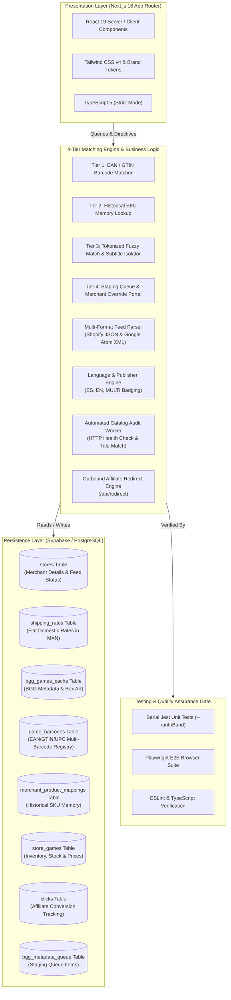
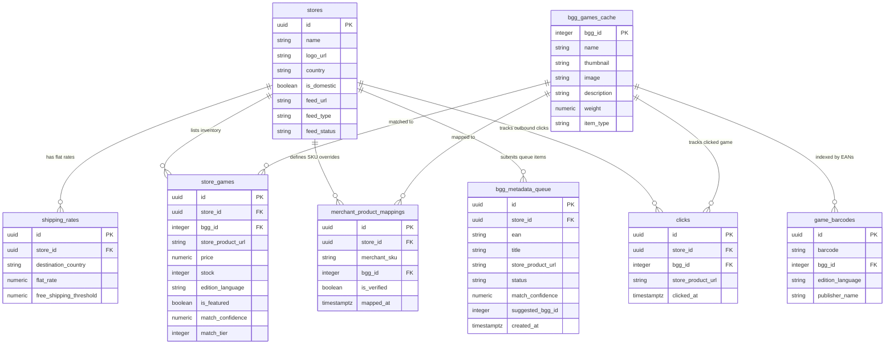
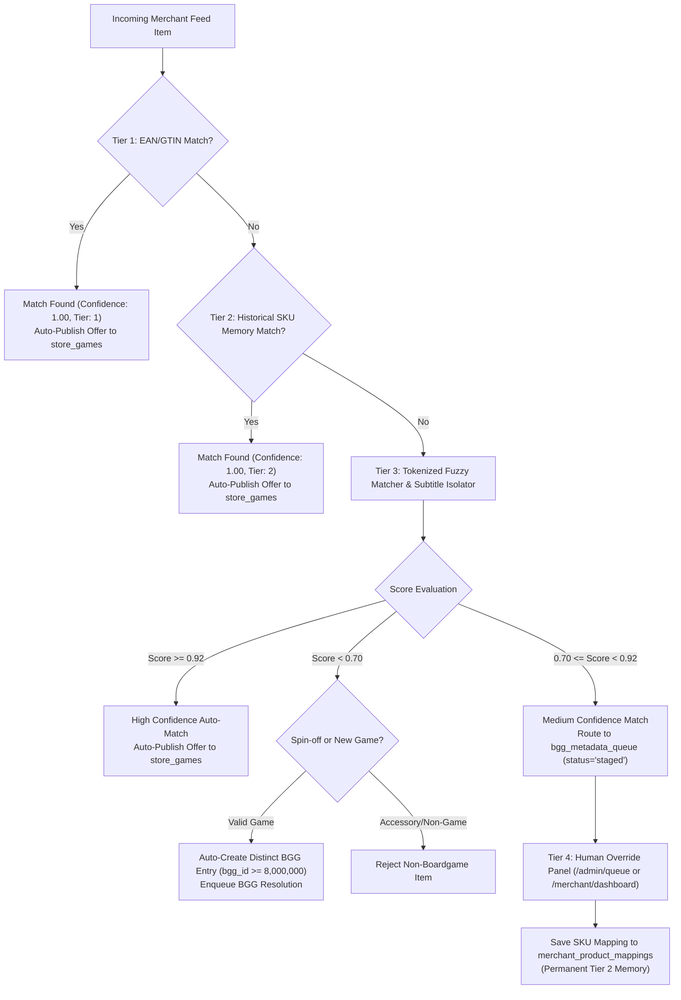

# Master specification and ground-up implementation blueprint: MeeplePrecios 🇲🇽

> [!IMPORTANT]
> **Specification Purpose:** This document is the definitive, self-contained master blueprint for constructing **MeeplePrecios**, Mexico's board game price comparison engine, from the ground up. It contains the complete technical architecture, Supabase DDL scripts, RLS policies, 4-tier waterfall ingestion algorithms, feed parsing gotchas, UI design system tokens, page route maps, and AI agent execution rules. An engineer or autonomous AI agent can build the entire system from scratch using this blueprint without architectural drift or cataloguing errors.

---

## 1. Executive summary and core purpose 🎲

### 1.1 Commercial vision
**MeeplePrecios** is the primary tabletop price comparison engine for Mexico (`MX` / `$ MXN`). The platform aggregates real-time inventory, pricing, and shipping data from independent Mexican board game e-commerce stores (for example, *El Duende CDMX, La Caravana Gamelab, Dungeoneers México, Roll Games, Con T de Tlacuache, Quantum Boardgames, Alfa y Delta, Bundaba*).

### 1.2 Core value proposition
- **For Players:** Eliminates price and stock fragmentation by providing a single portal that ranks store offers by **3-part total delivered cost** ($\text{Base Price} + \text{Shipping} = \text{Total Cost (\$ MXN)}$) with explicit language and edition badges (`Español (ES)`, `Inglés (EN)`, `Multilingüe (MULTI)`).
- **For Store Owners (Merchants):** Drives high-intent organic and affiliate checkout traffic without manual listing maintenance by automatically syncing Google Shopping XML and Shopify JSON feeds, backed by self-service mapping override tools.

---

## 2. Target personas and user journeys 👥

### 2.1 Persona 1: The Mexican board game buyer (Player / Comprador)
* **Demographics:** Board game enthusiasts, casual gamers, and collectors across Mexico (CDMX, Guadalajara, Monterrey, Puebla).
* **Primary Goals:**
  1. Locate specific games in stock at the lowest total delivered cost in Mexican Pesos ($ MXN).
  2. Differentiate between Spanish (`ES`) and English (`EN`) editions.
  3. Ensure that clicking an offer leads directly to the merchant product page without broken links or expansion mis-attributions.
* **Key User Journey:**
  `Homepage (Search / BGG Hotness) -> Game Detail Page (/game/[id]) -> Compare Total Delivered Costs -> Click "Ir a la tienda" -> Affiliate Checkout Redirect (/api/redirect)`

### 2.2 Persona 2: The independent store partner (Merchant / Socio)
* **Demographics:** Owners and e-commerce managers of independent Mexican tabletop shops.
* **Primary Goals:**
  1. Increase online sales and customer acquisition without paying marketplace commission fees.
  2. Keep stock and price listings in sync automatically without manual data entry.
  3. Access a self-service SKU mapping portal to map unmatched feed products directly to BGG IDs.
  4. Feature store deals (sponsored placements) to gain top visibility on high-demand games.
* **Key User Journey:**
  `Merchant Portal (/merchant/onboard) -> Register Store & Flat Shipping Rates in MXN -> Submit Feed URL -> Map Unmatched SKUs (/merchant/dashboard) -> View Diagnostics`

### 2.3 Persona 3: The platform administrator (Admin)
* **Primary Goals:**
  1. Monitor merchant feed health, failed fetch logs, and un-indexed BoardGameGeek (BGG) queue items.
  2. Review medium-confidence feed items in the **Admin Staging Queue** (`/admin/queue`) and approve/re-map candidates with one click.
  3. Verify new merchant registrations and manage sponsored placement flags.
  4. Trigger automated catalog audits (`/api/admin/audit-urls`) to purge broken links and mis-attributed expansions.

### 2.4 Persona 4: The autonomous AI developer (Agent persona)
* **Primary Goals:**
  1. Execute feature requests using test-driven development (TDD), atomic user stories, and single-persona branch isolation.
  2. Enforce Google sentence case governance, brand visual tokens, and tactile switch components.
  3. Run the four-tier verification gate (`npm run verify`) before merging pull requests into `main`.

---

## 3. Comprehensive user stories inventory 📜

Every feature in the platform is decomposed into single-persona, single-feature Agile User Stories:

### Epic A: Discovery and comparison (Player persona)
- **[US-01] Homepage Search and Hotness:** `As a Player, I want to search for board games on the homepage or view live BGG Hotness trends, so that I can quickly locate games available in Mexico.`
- **[US-02] Hero Comparative UI:** `As a Player, I want to see a full-width box art header, typographic stats, and a 3-part price comparison table on /game/[id], so that I can evaluate total delivered costs at a glance.`
- **[US-03] Explicit Language Badges:** `As a Player, I want store offers to display clear language badges (Español (ES), Inglés (EN), Multilingüe (MULTI)), so that I don't accidentally buy a game in a language I don't want.`
- **[US-04] Direct Affiliate Checkout:** `As a Player, I want clicking "Ir a la tienda" to redirect me to the store's exact product page with UTM tracking, so that I can complete my purchase immediately.`
- **[US-05] Scope Lock:** `MeeplePrecios is locked strictly to Mexico (MX / $ MXN), making all participating stores domestic Mexican shops by default.`
- **[US-102] Spin-Off Game Variant Cataloging:** `As a Player, I want spin-off variants like Spot It! Catan or Dobble Catan to be cataloged as distinct game entries rather than merged into base game pages, so that I can view accurate price comparisons for both base games and spin-offs independently.`

### Epic B: Merchant self-serve portal (Merchant persona)
- **[US-06] Merchant Onboarding:** `As a Store Owner, I want to register my storefront name, logo, and XML/JSON feed URL on /merchant/onboard, so that my inventory is automatically listed on MeeplePrecios.`
- **[US-07] Shipping Rate Matrix:** `As a Store Owner, I want to set my flat-rate domestic shipping fee and free shipping threshold in MXN, so that player total cost calculations are accurate.`
- **[US-08] Sponsored Placement Toggles:** `As a Store Owner, I want to toggle sponsored featuring for my store on /merchant/dashboard, so that my offers appear at the top of comparison tables with a "★ Tienda recomendada" badge.`
- **[US-107] Merchant Self-Service Feed Mapping Portal:** `As a Store Owner, I want a self-service product mapping portal on /merchant/dashboard to view unmatched feed items and bind them to BGG IDs, so that I can maximize my catalog coverage on MeeplePrecios.`

### Epic C: Ingestion, barcode registry & catalog integrity (Developer / Admin persona)
- **[US-09] Multi-Format Feed Processing:** `As a Developer, I want feed ingestion to parse both Shopify JSON and Google Shopping XML feeds, so that all Mexican stores can be integrated without custom scrapers.`
- **[US-10] Automated Catalog Audit Worker:** `As a Developer, I want a background audit worker to scan store_games for HTTP 404 links and expansion/accessory mis-attributions, so that base game pages remain 100% clean.`
- **[US-11] BGG Pseudo-Game Resolution:** `As a Developer, I want auto-created games (bgg_id >= 8,000,000) to automatically resolve their real BGG ID via BGG XMLAPI2, so that buyers never see empty or broken game pages.`
- **[US-103] EAN/GTIN Multi-Barcode Registry Table:** `As a Developer, I want a dedicated EAN/GTIN multi-barcode registry table (public.game_barcodes) linking barcodes to game editions and canonical BGG IDs, so that feed ingestion achieves 100% deterministic matching without string ambiguities.`
- **[US-104] Historical Merchant SKU Mapping Memory Table:** `As a Developer, I want a historical merchant SKU mapping memory table (public.merchant_product_mappings), so that manual merchant and admin re-mappings permanently persist across daily automated feed re-syncs.`
- **[US-105] 4-Tier Waterfall Feed Matching Engine:** `As a Developer, I want a 4-tier waterfall matching engine (EAN Barcode -> SKU Memory -> Tokenized Fuzzy Match -> Manual Queue) with confidence scoring (>=0.92 auto-publish, 0.70-0.91 queue), so that product ingestion operates with 99.9% accuracy.`
- **[US-106] Admin Staging and Moderation Queue UI:** `As an Admin, I want a staging queue UI on /admin/queue for medium-confidence feed items (confidence 0.70 to 0.91), so that I can review, approve, or re-map uncertain catalog matches with live BGG autocomplete.`

---

## 4. Technical stack architecture 🛠️



- **Framework:** Next.js 16 (App Router) using React 19 and TypeScript 5 (Strict Mode).
- **Styling and Design System:** Tailwind CSS v4 + Vanilla CSS custom properties (`Blanco roto #F5F0E9`, `Carbón #3A3A3A`, `Malva #8367C7`, `Turquesa #73D8D4`, `Coral #FF9E8A`).
- **Database and Auth:** Supabase (PostgreSQL) with Row-Level Security (RLS) policies and NextAuth.js (JWT strategy).
- **HTTP Client and Parsing:** `undici` and native `fetch` with `AbortSignal.timeout(3000)`.
- **Testing Gate:** Serial Jest with JSDOM (`npm run test -- --runInBand --forceExit`) and Playwright E2E (`npm run test:e2e`).

---

## 5. Complete database DDL and RLS specification 🗄️

### 5.1 Entity-relationship (ER) diagram



### 5.2 Production SQL DDL specification

```sql
-- Table 1: Merchant Stores
CREATE TABLE IF NOT EXISTS public.stores (
  id UUID PRIMARY KEY DEFAULT gen_random_uuid(),
  name TEXT NOT NULL,
  logo_url TEXT,
  country TEXT NOT NULL DEFAULT 'MX',
  is_domestic BOOLEAN NOT NULL DEFAULT true,
  rating NUMERIC(3,2) DEFAULT 4.80,
  review_count INTEGER DEFAULT 50,
  feed_url TEXT,
  feed_type TEXT CHECK (feed_type IN ('google_xml', 'shopify_json')),
  feed_status TEXT DEFAULT 'pending',
  feed_last_processed_count INTEGER DEFAULT 0,
  feed_last_matched_count INTEGER DEFAULT 0,
  created_at TIMESTAMPTZ DEFAULT NOW()
);

-- Table 2: Shipping Rates
CREATE TABLE IF NOT EXISTS public.shipping_rates (
  id UUID PRIMARY KEY DEFAULT gen_random_uuid(),
  store_id UUID NOT NULL REFERENCES public.stores(id) ON DELETE CASCADE,
  destination_country TEXT NOT NULL DEFAULT 'MX',
  flat_rate NUMERIC(10,2) NOT NULL DEFAULT 105.00,
  free_shipping_threshold NUMERIC(10,2) DEFAULT 1200.00,
  created_at TIMESTAMPTZ DEFAULT NOW(),
  UNIQUE(store_id, destination_country)
);

-- Table 3: Board Games Catalog Cache
CREATE TABLE IF NOT EXISTS public.bgg_games_cache (
  bgg_id INTEGER PRIMARY KEY,
  name TEXT NOT NULL,
  alternate_names TEXT[],
  thumbnail TEXT,
  image TEXT,
  description TEXT,
  weight NUMERIC(3,2),
  min_players INTEGER,
  max_players INTEGER,
  playing_time INTEGER,
  base_price_eur NUMERIC(10,2),
  ean TEXT,
  item_type TEXT DEFAULT 'boardgame',
  last_updated_at TIMESTAMPTZ DEFAULT NOW()
);

-- Table 4: Multi-Barcode GTIN/EAN Registry (Tier 1)
CREATE TABLE IF NOT EXISTS public.game_barcodes (
  id UUID PRIMARY KEY DEFAULT gen_random_uuid(),
  barcode TEXT NOT NULL UNIQUE,
  bgg_id INTEGER NOT NULL REFERENCES public.bgg_games_cache(bgg_id) ON DELETE CASCADE,
  edition_language TEXT NOT NULL DEFAULT 'es',
  publisher_name TEXT,
  created_at TIMESTAMPTZ DEFAULT NOW()
);
CREATE INDEX IF NOT EXISTS idx_game_barcodes_barcode ON public.game_barcodes(barcode);

-- Table 5: Merchant SKU Mapping Memory (Tier 2)
CREATE TABLE IF NOT EXISTS public.merchant_product_mappings (
  id UUID PRIMARY KEY DEFAULT gen_random_uuid(),
  store_id UUID NOT NULL REFERENCES public.stores(id) ON DELETE CASCADE,
  merchant_sku TEXT NOT NULL,
  bgg_id INTEGER NOT NULL REFERENCES public.bgg_games_cache(bgg_id) ON DELETE CASCADE,
  is_verified BOOLEAN NOT NULL DEFAULT true,
  mapped_at TIMESTAMPTZ DEFAULT NOW(),
  UNIQUE(store_id, merchant_sku)
);

-- Table 6: Store Inventory & Comparison Offers
CREATE TABLE IF NOT EXISTS public.store_games (
  id UUID PRIMARY KEY DEFAULT gen_random_uuid(),
  store_id UUID NOT NULL REFERENCES public.stores(id) ON DELETE CASCADE,
  bgg_id INTEGER NOT NULL REFERENCES public.bgg_games_cache(bgg_id) ON DELETE CASCADE,
  store_product_url TEXT NOT NULL,
  price NUMERIC(10,2) NOT NULL,
  stock INTEGER NOT NULL DEFAULT 1,
  edition_language TEXT NOT NULL DEFAULT 'es',
  is_featured BOOLEAN NOT NULL DEFAULT false,
  match_confidence NUMERIC(3,2) DEFAULT 1.00,
  match_tier INTEGER DEFAULT 1,
  last_updated_at TIMESTAMPTZ DEFAULT NOW(),
  UNIQUE(store_id, bgg_id, store_product_url)
);

-- Table 7: Outbound Affiliate Click Analytics
CREATE TABLE IF NOT EXISTS public.clicks (
  id UUID PRIMARY KEY DEFAULT gen_random_uuid(),
  store_id UUID NOT NULL REFERENCES public.stores(id),
  bgg_id INTEGER NOT NULL REFERENCES public.bgg_games_cache(bgg_id),
  store_product_url TEXT NOT NULL,
  clicked_at TIMESTAMPTZ DEFAULT NOW()
);

-- Table 8: Admin & BGG Staging Queue
CREATE TABLE IF NOT EXISTS public.bgg_metadata_queue (
  id UUID PRIMARY KEY DEFAULT gen_random_uuid(),
  store_id UUID NOT NULL REFERENCES public.stores(id) ON DELETE CASCADE,
  ean TEXT,
  title TEXT NOT NULL,
  store_product_url TEXT NOT NULL,
  status TEXT DEFAULT 'pending' CHECK (status IN ('pending', 'staged', 'resolved', 'rejected')),
  match_confidence NUMERIC(3,2) DEFAULT 0.00,
  suggested_bgg_id INTEGER REFERENCES public.bgg_games_cache(bgg_id) ON DELETE SET NULL,
  created_at TIMESTAMPTZ DEFAULT NOW()
);
```

### 5.3 Row level security (RLS) policies

```sql
ALTER TABLE public.stores ENABLE ROW LEVEL SECURITY;
ALTER TABLE public.shipping_rates ENABLE ROW LEVEL SECURITY;
ALTER TABLE public.bgg_games_cache ENABLE ROW LEVEL SECURITY;
ALTER TABLE public.game_barcodes ENABLE ROW LEVEL SECURITY;
ALTER TABLE public.merchant_product_mappings ENABLE ROW LEVEL SECURITY;
ALTER TABLE public.store_games ENABLE ROW LEVEL SECURITY;
ALTER TABLE public.clicks ENABLE ROW LEVEL SECURITY;
ALTER TABLE public.bgg_metadata_queue ENABLE ROW LEVEL SECURITY;

CREATE POLICY "Allow public read access on stores" ON public.stores FOR SELECT USING (true);
CREATE POLICY "Allow public read access on shipping_rates" ON public.shipping_rates FOR SELECT USING (true);
CREATE POLICY "Allow public read access on bgg_games_cache" ON public.bgg_games_cache FOR SELECT USING (true);
CREATE POLICY "Allow public read access on game_barcodes" ON public.game_barcodes FOR SELECT USING (true);
CREATE POLICY "Allow public read access on merchant_product_mappings" ON public.merchant_product_mappings FOR SELECT USING (true);
CREATE POLICY "Allow public read access on store_games" ON public.store_games FOR SELECT USING (true);
CREATE POLICY "Allow public read access on bgg_metadata_queue" ON public.bgg_metadata_queue FOR SELECT USING (true);
CREATE POLICY "Allow public insert on clicks" ON public.clicks FOR INSERT WITH CHECK (true);
```

---

## 6. The 4-tier waterfall ingestion and matching engine ⚙️



### 6.1 Tier 1: EAN / GTIN / UPC barcode matcher
- Queries product GTIN (`<g:gtin>` or `variant.barcode`) against `public.game_barcodes`.
- 100% deterministic, confidence 1.00, Tier 1 match.

### 6.2 Tier 2: Historical merchant SKU mapping memory
- Queries `(store_id, merchant_sku)` against `public.merchant_product_mappings`.
- Persists manual admin and merchant mapping overrides across daily automated feed re-syncs.

### 6.3 Tier 3: Tokenized fuzzy matching & subtitle isolator
- Sanitizes feed title via `cleanBoardGameTitle(title)`:
  - Strips noise terms (`juego de mesa`, `edición especial`, `espanol`, `preventa`, `original`).
  - Uses standalone word boundaries for exclusion keywords (`/\bfundas?\b/i`, `/\bprimer\b/i`, `/\bpuzzles?\b/i`, `/\bsleeves?\b/i`, `/\bexpansion\b/i`). Prevents false positives on Spanish words like *fundamentales* or *primeros*.
- Composite similarity score formula:
  $$\text{Score} = (0.5 \times \text{JaroWinkler}) + (0.3 \times \text{TokenOverlap}) + (0.2 \times \text{Levenshtein})$$
- Applies penalty `-0.35` if feed title contains expansion/spin-off words not present in the catalog title.
- **Threshold Routing:**
  - $\text{Score} \ge 0.92$: Auto-publish to `store_games`.
  - $0.70 \le \text{Score} < 0.92$: Route to `bgg_metadata_queue` (`status = 'staged'`).
  - $\text{Score} < 0.70$: Auto-create distinct game entry if valid game, or reject if accessory.

### 6.4 Tier 4: Human override & merchant self-service portal
- **Admin Staging Queue (`/admin/queue`):** One-click approval, BGG search autocomplete, and rejection.
- **Merchant Self-Service Portal (`/merchant/dashboard`):** Allows store owners to map unmatched products.
- **Permanent Memory Persistence:** Any Tier 4 manual mapping writes a row to `public.merchant_product_mappings` (Tier 2 memory).

---

## 7. Feed processing, database sequencing & testing gotchas ⚡

### 7.1 Database write sequence integrity
Inserting `store_games` rows referencing parent `bgg_id`s before parent rows exist in `bgg_games_cache` causes foreign key violations.
- **Rule:** Always flush new parent game entries to `bgg_games_cache` *before* inserting rows into `store_games`.

### 7.2 Buffered batch upserts
Executing individual SQL queries in large loops causes timeouts during feed syncs.
- **Rule:** Buffer discovered games in memory (`newGamesToUpsert`) and execute bulk upserts in batches of up to 500 records.

### 7.3 Disk cache fallback
When remote crawls fail or return 0 items due to status 429 rate-limiting:
- **Rule:** Load existing store offers from disk cache (`loadLocalCatalogCache`) and upsert them to database to preserve comparison table continuity.

### 7.4 Test isolation & serial Jest execution
- **Rule:** Always run Jest in serial mode (`npm run test -- --runInBand --forceExit`) to prevent JSDOM memory bloat. Wrap disk cache file writes in `process.env.NODE_ENV !== 'test'` checks.

---

## 8. UI design system and token specification 🎨

### 8.1 Color palette
| Purpose | Color Name | Hex Code | Tailwind / CSS Class |
| :--- | :--- | :--- | :--- |
| Base / Background | Blanco roto | `#F5F0E9` | `bg-[#F5F0E9]` |
| Dark UI / Headers | Carbón suave | `#3A3A3A` | `text-[#3A3A3A]` |
| Primary Accent / CTAs | Malva suave | `#8367C7` | `bg-[#8367C7] text-white` |
| Secondary Accent / Badges | Turquesa pastel | `#73D8D4` | `bg-[#73D8D4]/20 text-[#2B8C88]` |
| Price Highlights | Coral deslavado | `#FF9E8A` | `bg-[#FF9E8A]/25 text-rose-950` |

### 8.2 Google sentence case governance
All headings (`h1`, `h2`, `h3`), buttons, and table labels MUST strictly follow sentence case (for example, *Comparativa de ofertas por tienda*, *★ Tienda recomendada*, *Mejor precio actual*).

### 8.3 Tactile switch component standard (`role="switch"`)
All boolean toggles (for example, Domestic Store Toggle `onlyDomestic`) MUST use accessible switch controls:
```tsx
<input 
  type="checkbox" 
  role="switch" 
  aria-checked={isDomesticOnly} 
  onChange={(e) => { e.stopPropagation(); setIsDomesticOnly(e.target.checked); }} 
/>
```

---

## 9. Complete application page routes & UI map 🗺️

| Route Path | Description | Key Components & Links |
| :--- | :--- | :--- |
| `/` | Homepage & Game Discovery | `Toolbar`, `SearchBar`, BGG Hotness Cards, Footer Links (`/merchant/onboard`, `/merchant/dashboard`, `/admin/dashboard`, `/admin/queue`) |
| `/game/[id]` | Hero Comparative Details | Full-width cover art header, typographic stats, `StoreOffersComparisonTable` (3-part total cost calculation & affiliate redirects) |
| `/search` | Dedicated Search Results | `Toolbar`, `SearchBar`, paginated game result grid linking to `/game/[id]` |
| `/store/[id]` | Merchant Store Profile | Store details, official website button (`/api/redirect`), catalog inventory table |
| `/login` | Persona Switcher | Quick login buttons for Admin (`/admin/dashboard`), Merchant (`/merchant/dashboard`), and Player (`/`) |
| `/merchant/onboard` | Store Registration | Onboarding form submitting XML/JSON feed URL & shipping rates |
| `/merchant/dashboard` | Merchant Self-Service | Feed status, KPI cards, `<MerchantMappingPortal>`, `<MerchantFeaturedDealsPanel>`, shipping link (`/merchant/shipping`), diagnostics link (`/merchant/diagnostics`) |
| `/merchant/shipping` | Shipping Rates Matrix | Domestic flat-rate shipping & free threshold configuration in MXN |
| `/merchant/diagnostics` | Feed Sync Diagnostics | Real-time XML/JSON feed validation & raw payload inspection |
| `/admin/dashboard` | Admin Catalog Audit | Store verification table, indexed BGG games catalog, link to `/admin/queue` |
| `/admin/queue` | Admin Staging Queue | `<AdminQueueMonitor>` displaying staged items ($0.70 \dots 0.91$), suggested game thumbnails, one-click approval, and live BGG search autocomplete |
| `/api/redirect` | Outbound Affiliate Engine | Logs click event to `public.clicks` with UTM tracking and redirects buyer to store product page |

---

## 10. Four-tier verification and quality assurance gate 🧪

```bash
# 1. Type Check & ESLint
npx tsc --noEmit && npm run lint

# 2. Production Build Check
npm run build

# 3. Serial Jest Unit & Integration Test Suite
npm run test -- --runInBand --forceExit

# 4. Playwright E2E Browser Test Suite
npm run test:e2e

# 5. Master Verification Meta-Command
npm run verify
```

---

## 11. Ground-up execution roadmap (Sprint Sequence) 🚀

```mermaid
timeline
    title MeeplePrecios Ground-Up Development Timeline
    section Phase 1: Core Foundation
        Sprint 1 : Next.js 16 Setup : Supabase RLS DDL : Seed MOCK_GAMES
        Sprint 2 : Ingestion Engine : Language & Publisher Engine : Feed Parsers
    section Phase 2: Integrity & UI
        Sprint 3 : URL & Title Audit Worker : Auto-Healing Cron : API Route
        Sprint 4 : Full-Width Hero UI : Predictive SearchBar : Store Comparison Table
    section Phase 5: Commercial MVP
        Sprint 5 : Merchant Dashboard : Self-Serve Onboarding : Affiliate Redirects
        Sprint 6 : Playwright E2E Suite : CI/CD Gate : npm run verify
    section Phase 4: Enterprise Precision
        Sprint 7 : Multi-Barcode Registry : Merchant SKU Memory Table : US-103 & US-104
        Sprint 8 : 4-Tier Matching Engine : Admin Staging Queue : Merchant Self-Mapping Portal : US-105 to US-107
```

---

## 12. Autonomous AI agent operating guide 🤖

When executing tasks on this codebase, an autonomous AI agent MUST:
1. Audit the user prompt against the Three-Point Compliance Filter (Persona Atomicity, Scope Atomicity, Agile Syntax).
2. Create a dedicated feature branch matching the active issue (`git checkout -b feature/issue-<num>-<title>`).
3. Write tests first (TDD), implement minimal code to pass them, and enforce Google sentence case.
4. Run the four-tier verification gate (`npm run verify`) before merging into `main`.
5. Keep living documentation (`HANDOFF.md`, `DESIGN.md`, `AGENTS.md`, `MASTER_SPECIFICATION.md`) updated in real-time.
